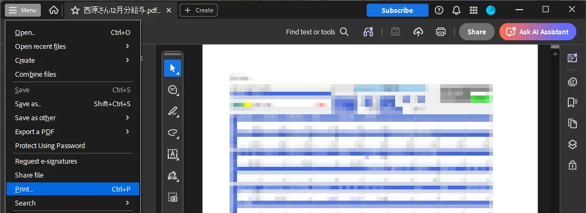
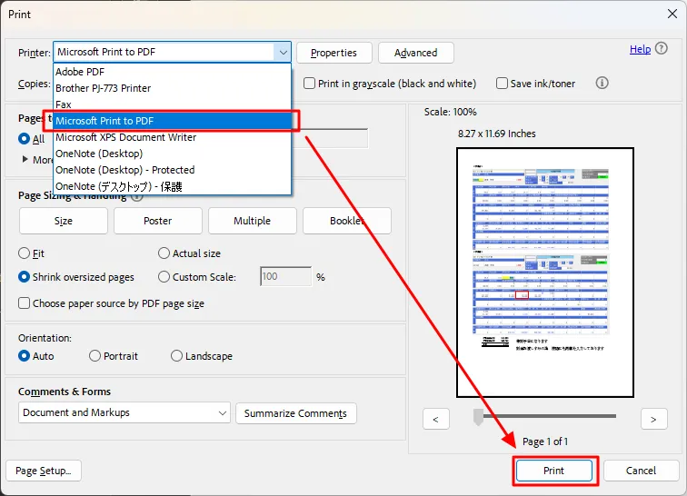

# Remove a PDF Password with Acrobat Reader

> **Note:** This document was generated by Claude Code and has not been reviewed by a human. Please use it as a reference only.

> **Note:** This workaround applies if you only have Acrobat Reader (not Acrobat) and want to stop entering a password every time you open a file. It creates an image-based PDF copy without password protection, rather than removing the password from the original.

1. Click **Menu** → **Print**.

    

1. Select **Microsoft Print to PDF** and click **Print**.

    

1. Save the new PDF with a name of your choice.
