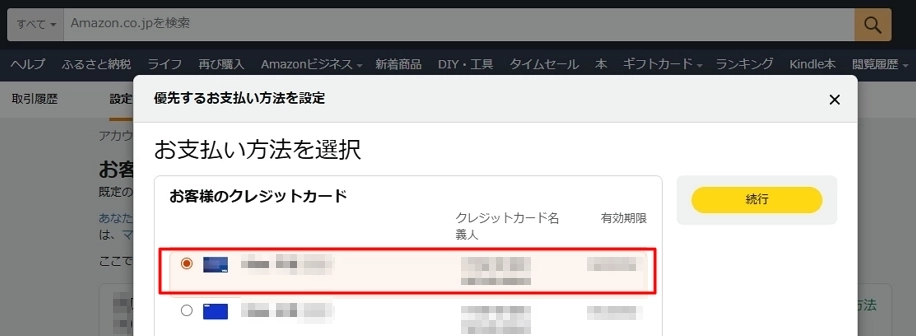

# Change the Default Payment Method on Amazon

> **Note:** This document was generated by Claude Code and has not been reviewed by a human. Please use it as a reference only.

1. Click **Account & Lists** in the top right.

    

1. Click **Your payment methods**.

    

1. Click **Settings**.

    

1. Click **Change settings**.

    

1. Click **Change**.

    

1. Select the payment method you want to set as the default.

    
