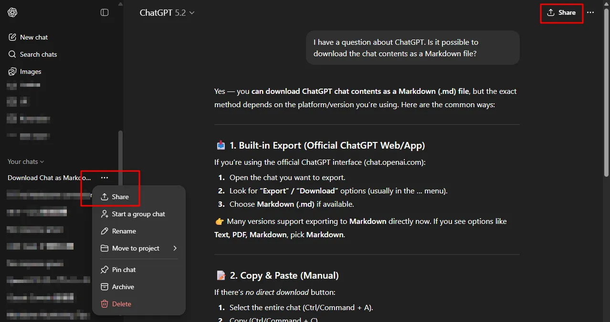
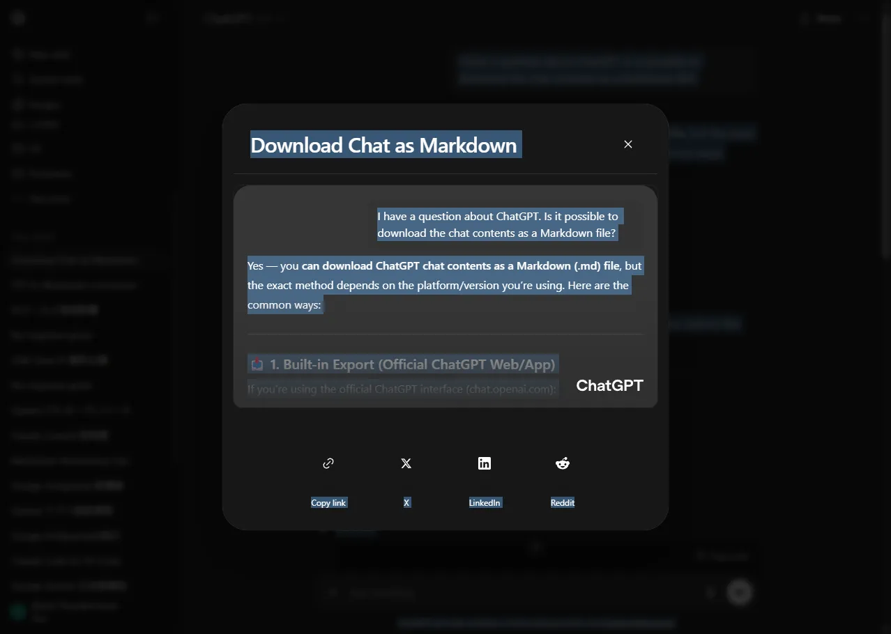

# Convert a ChatGPT Chat to a Word Document

> **Note:** This document was generated by Claude Code and has not been reviewed by a human. Please use it as a reference only.

This method does not require browser extensions and preserves formatting.

1. Use the **Share** feature on the chat.

    

1. Navigate to the sharing options screen.

    

1. Select all and copy the text.

    

1. Paste into a Word document.

    
