# Convert CRW to JPG

1. Read the message.

    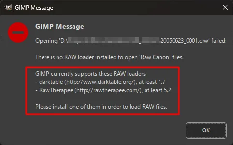 

1. Select **Install**.

     

1. Click the download link.

    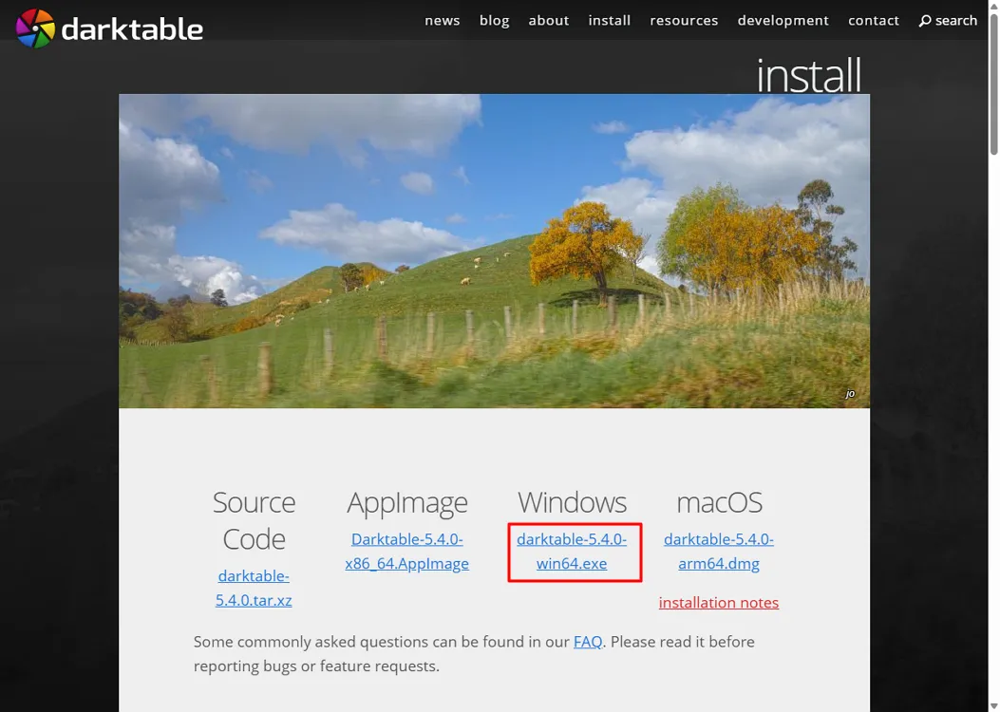 

1. Download the installer.

    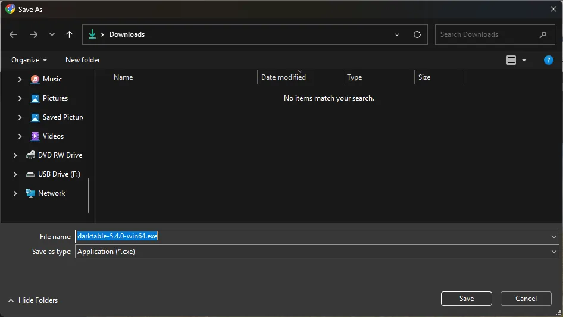

1. Click **More info**.

    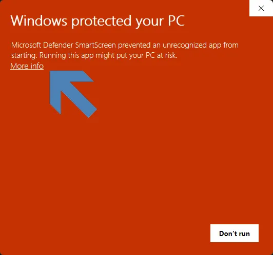

1. Click **Next**.

    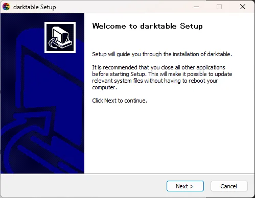

1. Click **Next**.

    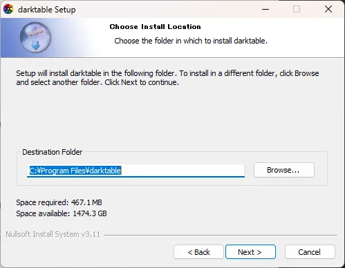

1. Click **Next**.

    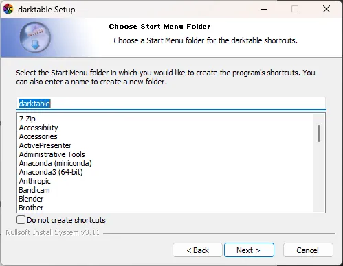

1. Click **Finish**.

    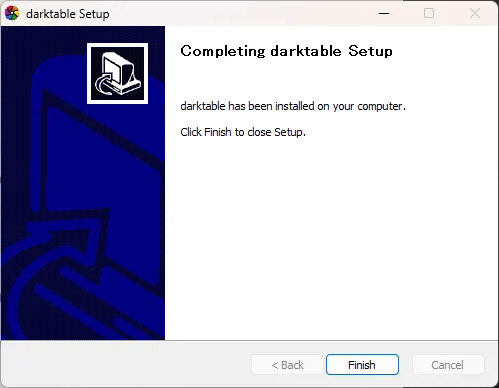

1. Open the **CRW** file.

    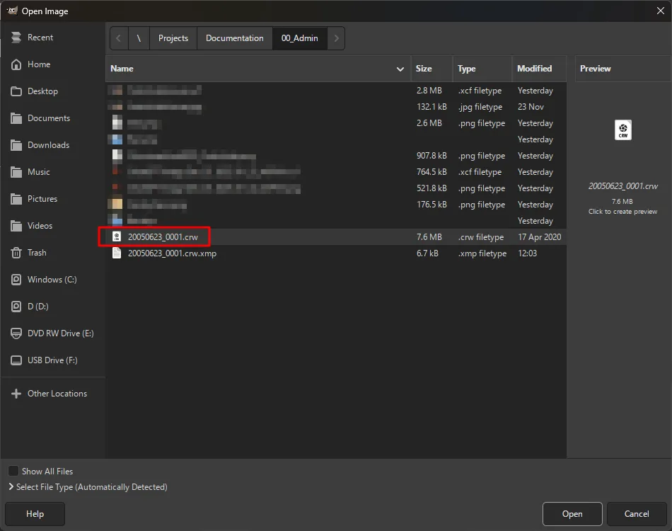

1. Select **Export**.

    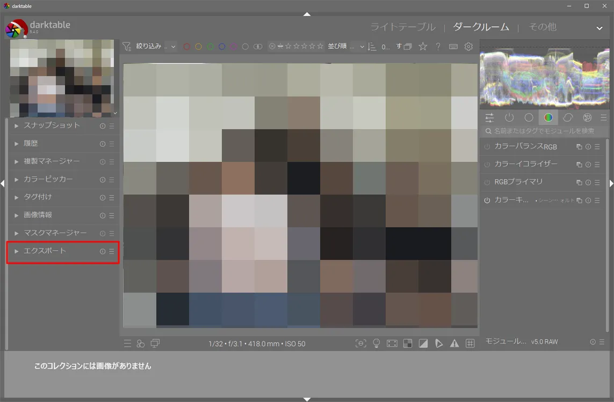

1. Adjust the settings, then export.

    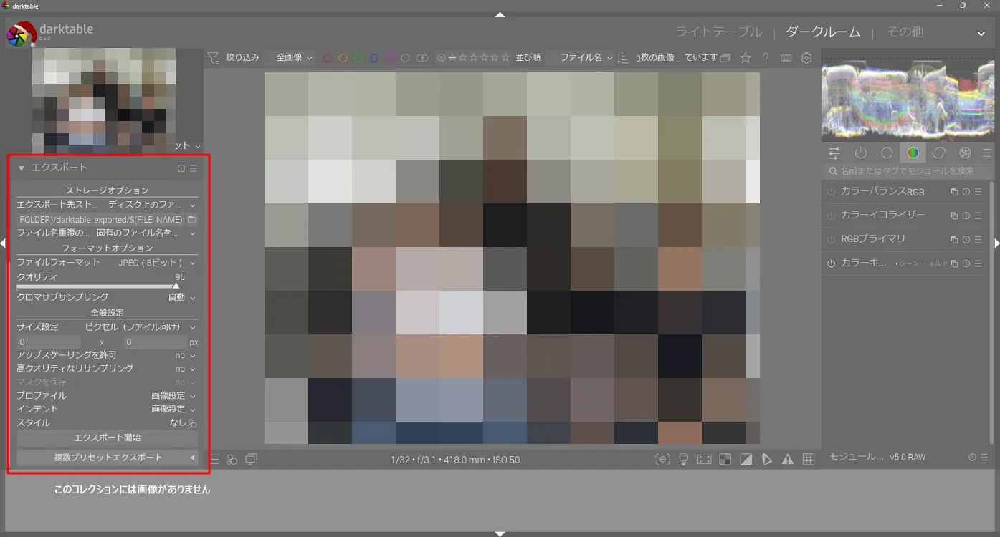

1. The conversion is complete.

    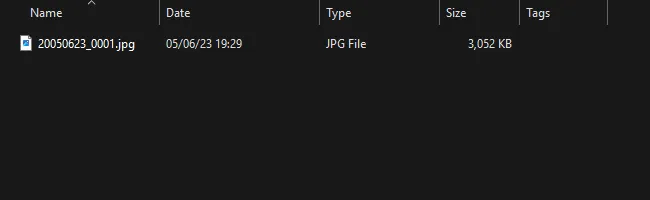