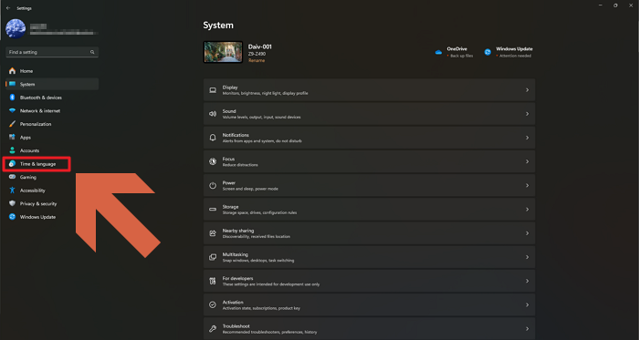
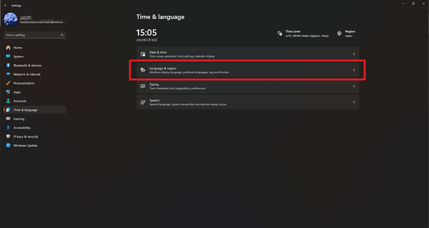
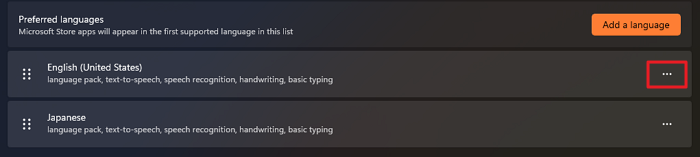
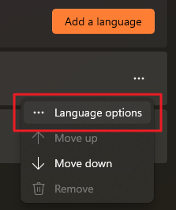
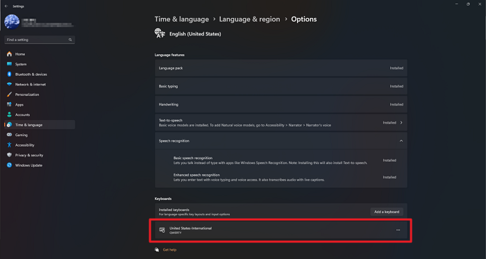
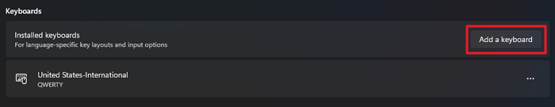
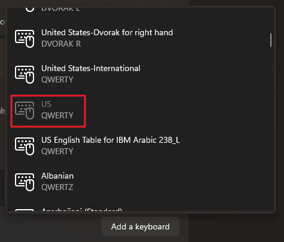
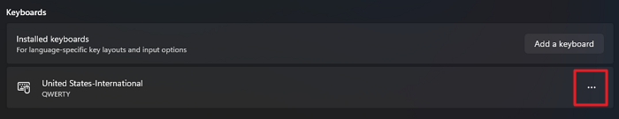
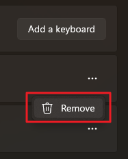

# Enter Quotation Marks on a Keychron Keyboard

> **Note:** This document was generated by Claude Code and has not been reviewed by a human. Please use it as a reference only.

The **United States-International** keyboard layout treats the `"` key as a dead key — pressing it once does nothing until you press it a second time or follow it with a space. To make `"` type immediately, replace that layout with the plain **US** layout in Windows Settings.

## Steps

1. Press `Win + I` to open **Settings**.

2. Click **Time & language**.

    

3. Click **Language & region**.

    

4. Under **Preferred languages**, find **English (United States)** and click its **...** button.

    

5. Click **Language options**.

    

6. On the Options page, confirm that **United States-International** is listed under **Keyboards**.

    

7. Click **Add a keyboard**.

    

8. Select **US** (QWERTY) from the list.

    

9. Click the **...** button next to **United States-International** and click **Remove**.

    

    

> **Note:** You do not need to restart your PC for the change to take effect.
