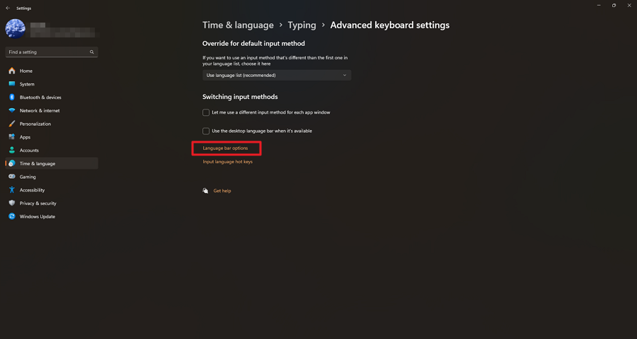
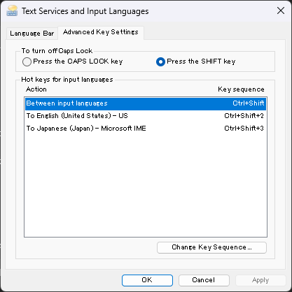

# Set Up Language Switching Shortcuts on Windows

> **Note:** This document was generated by Claude Code and has not been reviewed by a human. Please use it as a reference only.

Assign keyboard shortcuts to switch between input languages (e.g. English and Japanese) directly from Windows Settings.

## Steps

1. Press `Win + I` to open **Settings**.

2. Click **Time & language**.

    

3. Click **Typing**.

    

4. Click **Advanced keyboard settings**.

5. Click **Language bar options**.

    

6. In the **Text Services and Input Languages** dialog, click the **Advanced Key Settings** tab.

7. Select the input language you want to assign a shortcut to, then click **Change Key Sequence...** and assign your preferred key combination.

    

8. Click **OK** to apply.

    

## Result

| Shortcut | Action |
|----------|--------|
| `Ctrl+Shift+2` | Switch to English (United States) – US |
| `Ctrl+Shift+3` | Switch to Japanese (Japan) – Microsoft IME |
