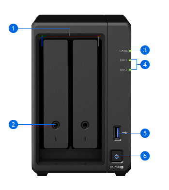
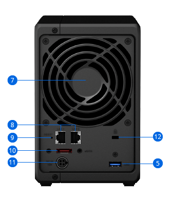

# Review the DS720+ Hardware Layout

> **Note:** This document was generated by Claude Code and has not been reviewed by a human. Please use it as a reference only.

The Synology DiskStation DS720+ is a compact 2-bay NAS solution designed for scalable data storage and multimedia management.

Official reference: [https://www.synology.com/en-global/products/DS720+](https://www.synology.com/en-global/products/DS720+)

---

## Product Overview

The DS720+ is a compact 2-bay NAS designed for scalable storage and multimedia management.

---

## Front Panel

| # | Component |
|---|---|
| 1 | Drive Tray |
| 2 | Drive Tray Lock |
| 3 | Status Indicator |
| 4 | Drive Status Indicator |
| 5 | USB 3.0 Port |
| 6 | Power Button and Power Indicator |

---

## Rear Panel

| # | Component |
|---|---|
| 1 | System Fan |
| 2 | 1GbE RJ-45 Port |
| 3 | RESET Button |
| 4 | eSATA Port |
| 5 | Power Port |
| 6 | Kensington Security Slot |
