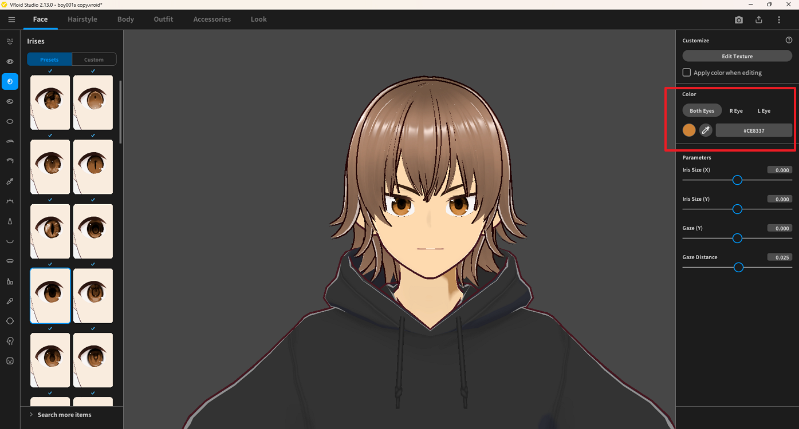

# Change Iris Color

> **Note:** This document was generated by Claude Code and has not been reviewed by a human. Please use it as a reference only.

This guide explains how to change the iris color of a character in VRoid Studio.

## Steps

1. Go to the **Face** tab → **Irises** panel.
2. In the **Color** section on the right panel, select the scope: **Both Eyes**, **R Eye**, or **L Eye**.
3. Click the color swatch to open the color picker and choose a new color.

> **Note:** To set different colors for each eye, switch between the **R Eye** and **L Eye** tabs and pick a color for each.
