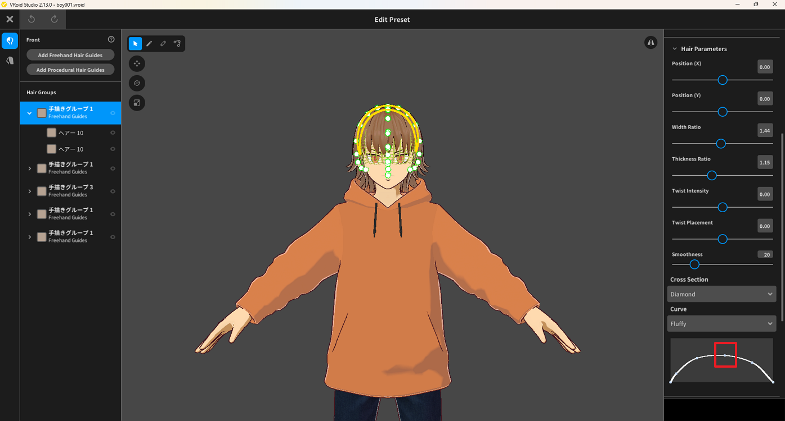

# Delete Hair Curve Control Points

In the **Edit Preset** screen, the curve editor under **Hair Parameters** → **Curve** lets you adjust the curve shape using control points.

- **Add:** Click on the curve line to add a control point.
- **Delete:** Left-click on a control point to delete it.

In the image below, the control point is highlighted with a red square.

