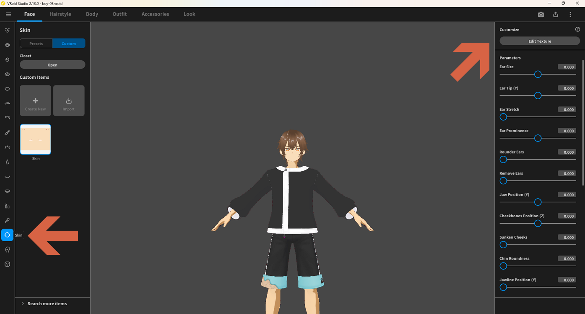
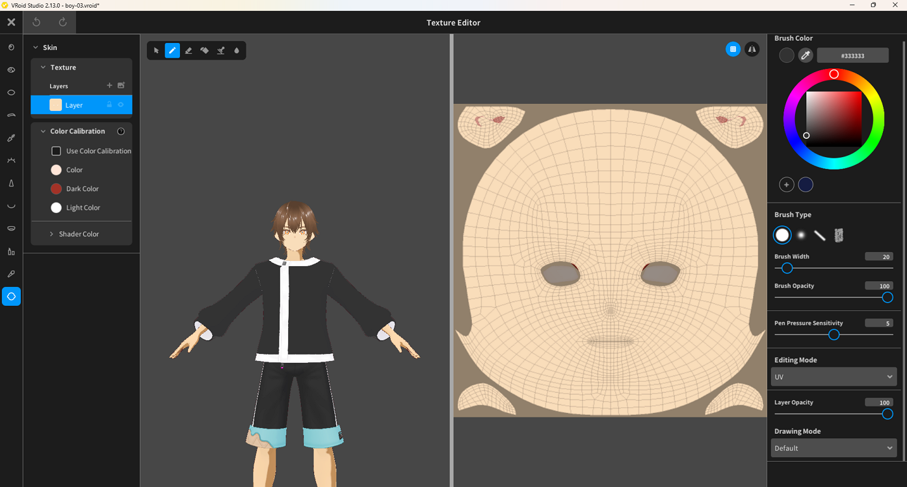

# Edit Face Texture

> **Note:** This document was generated by Claude Code and has not been reviewed by a human. Please use it as a reference only.

## Step 1: Open the Skin Texture Editor

1. Click **Face** in the top menu bar.
2. In the left sidebar, click the **Skin** icon.
3. Under **Custom Items**, select the **Skin** item.
4. Click the **Edit Texture** button in the right panel.

## Step 2: Edit the Texture

The **Texture Editor** opens. It has three main areas:

- **Left panel** — Color Calibration settings: Skin Color, Shin Color, Shadow Color, and Blush Color.
- **Center left** — A live 3D preview of the character's face.
- **Center right** — The texture canvas displaying the face UV map, where you paint directly.

Use the brush settings on the right to adjust Brush Color, Brush Type, Brush Width, Brush Opacity, Pen Pressure Sensitivity, Drawing Style, Layer Opacity, and Drawing Mode. Paint on the texture canvas to customize the face texture.

