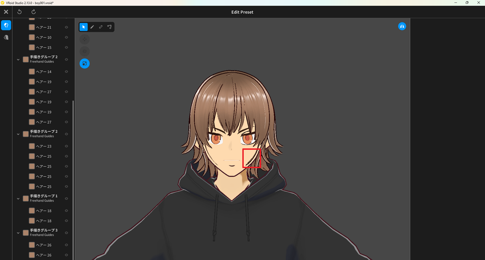
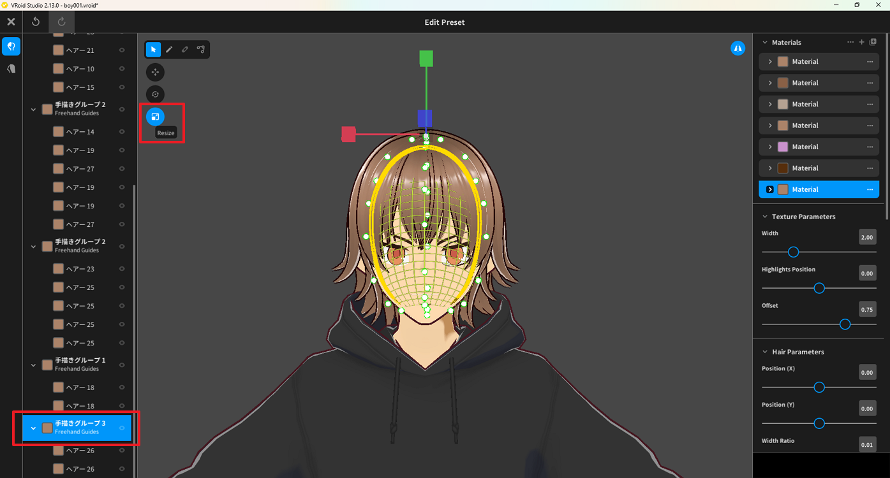
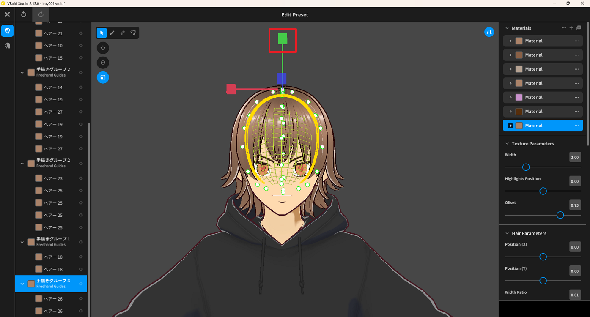
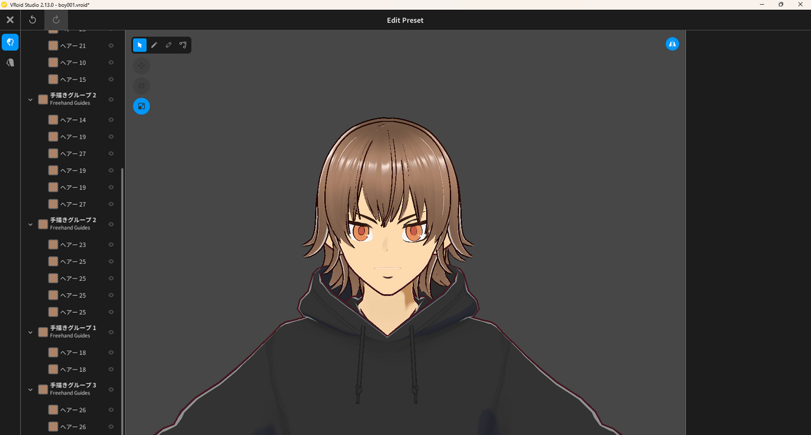

# Resize Hair

> **Note:** This document was generated by Claude Code and has not been reviewed by a human. Please use it as a reference only.

This guide explains how to shorten hair in VRoid Studio using the Resize tool.

## Step 1: Check the Current Hair Length

Open your model in the **Edit Preset** screen. Identify the hair that needs resizing.

## Step 2: Select the Hair Group

In the left panel, select the hair group you want to resize. The selected group is highlighted.

## Step 3: Select the Resize Tool

Click the **Resize** tool in the toolbar. The selection outline and manipulator handles appear around the hair.

## Step 4: Pull Up the Green Manipulator

Drag the green (Y-axis) manipulator upward to shorten the hair.

## Step 5: Confirm the Result

The hair is now shorter. Verify the new length looks natural on the model.

