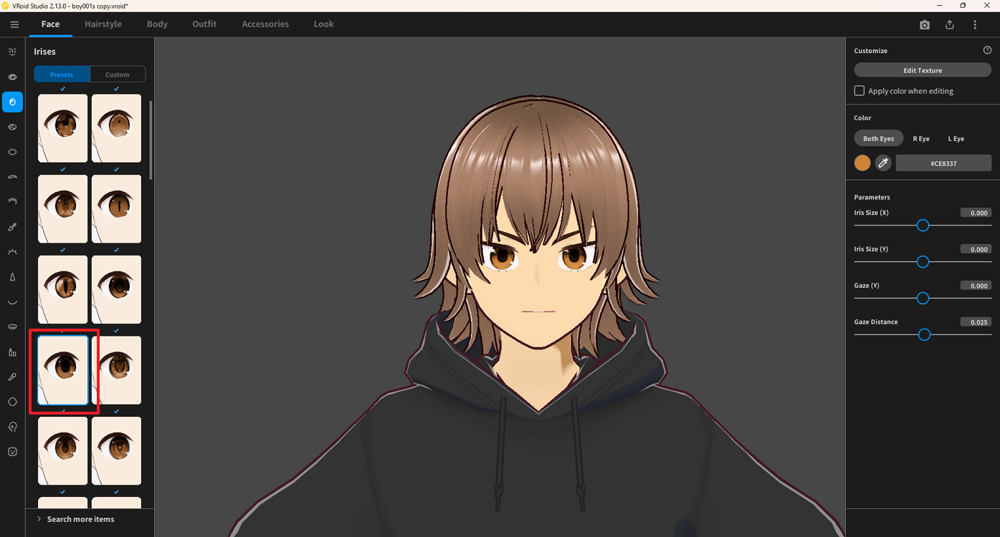

# Resize Pupil

> **Note:** This document was generated by Claude Code and has not been reviewed by a human. Please use it as a reference only.

This guide explains how to resize the pupil of a character in VRoid Studio.

The **Iris Size (X)** and **Iris Size (Y)** sliders in the **Parameters** section control the size of the iris, not the pupil. There is no slider to resize the pupil directly.

To make the pupil bigger or smaller, select a different preset from the left panel in the **Face** tab → **Irises** panel. Each preset has a different pupil size.

