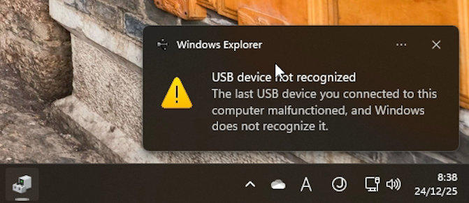
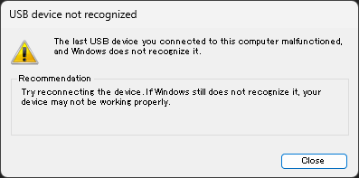
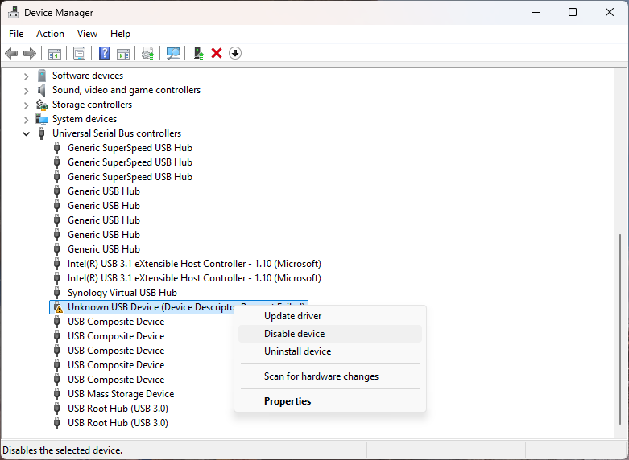

# Disable the Unknown USB Device Error Notification

> **Note:** This document was generated by Claude Code and has not been reviewed by a human. Please use it as a reference only.

## Description

The following error message appears when you connect a USB hub to the USB hub port (front or back) of the ATEN switcher CS1964.

There is no known fix for this error. The USB hub remains functional despite the message. The workaround below suppresses the notification by disabling the unknown device in Device Manager.

## Steps

1. Launch **Device Manager**.

2. Right-click **Unknown USB Device** and select **Disable device**.

    > **Note:** Uninstalling the device does not prevent it from reappearing after a restart. Use **Disable device** instead.

    
