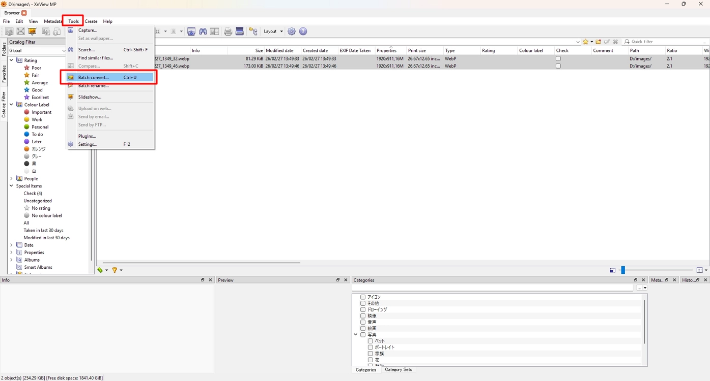
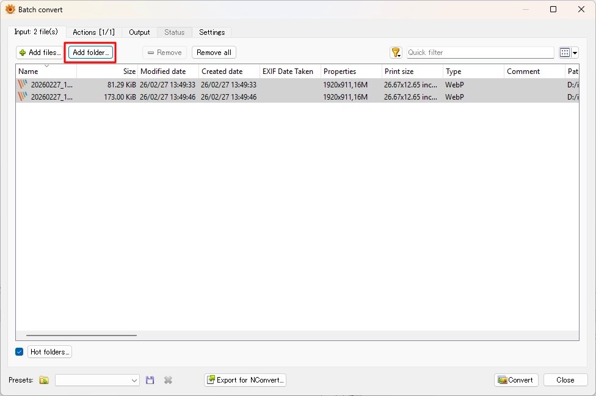
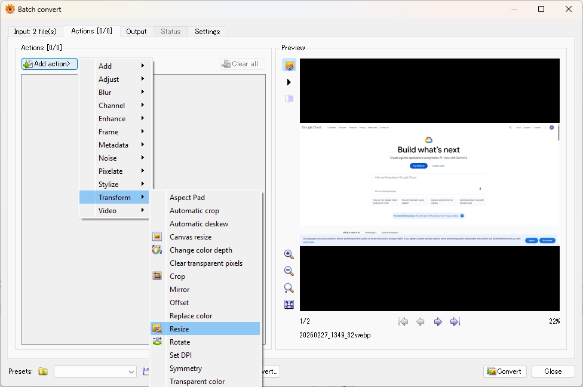
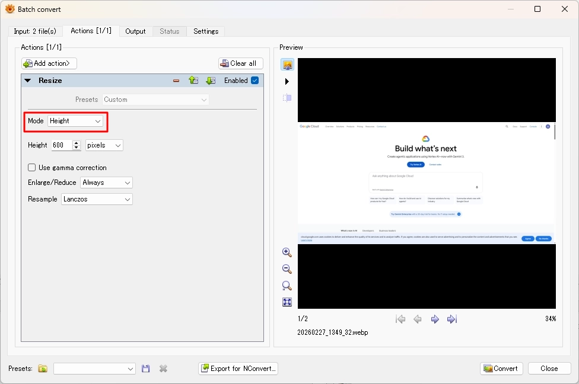
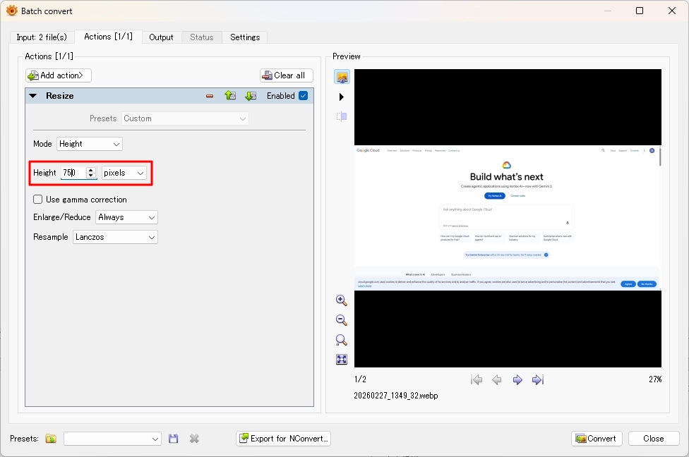
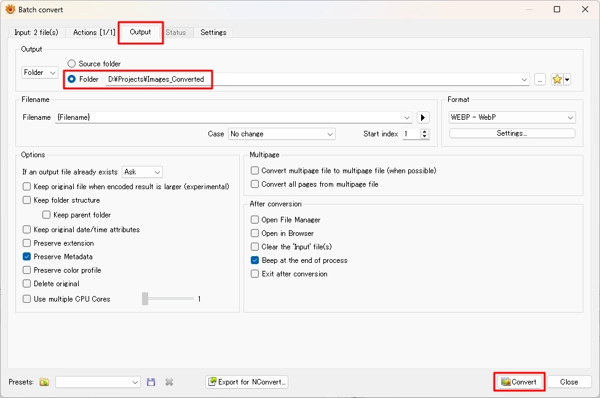

# Resize Image Height

Resize multiple images to a fixed height while preserving aspect ratio.

## Steps

1. Open **Tools** → **Batch convert**.

    

2. Click **Add folder** and select the input folder.

    

3. Open the **Actions** tab.

4. Click **Add action** → **Transform** → **Resize**.

    

5. Set **Mode** to **Height**.

    

6. Enter the desired value in **Height** (for example, `750` pixels).

    

7. Open the **Output** tab.

8. Select the destination folder.

9. Click **Convert**.

    

## Note

* Use **Height** mode to force all images to the same height.
* Use **Fit** mode only when resizing to fit within a width/height boundary.
* Set **Resample** to **Lanczos** for best quality.
