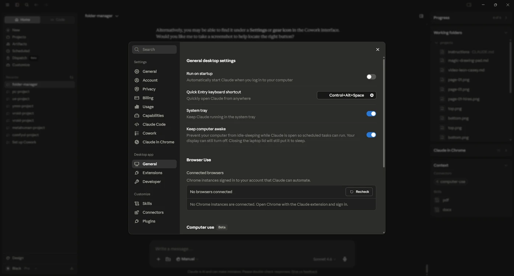
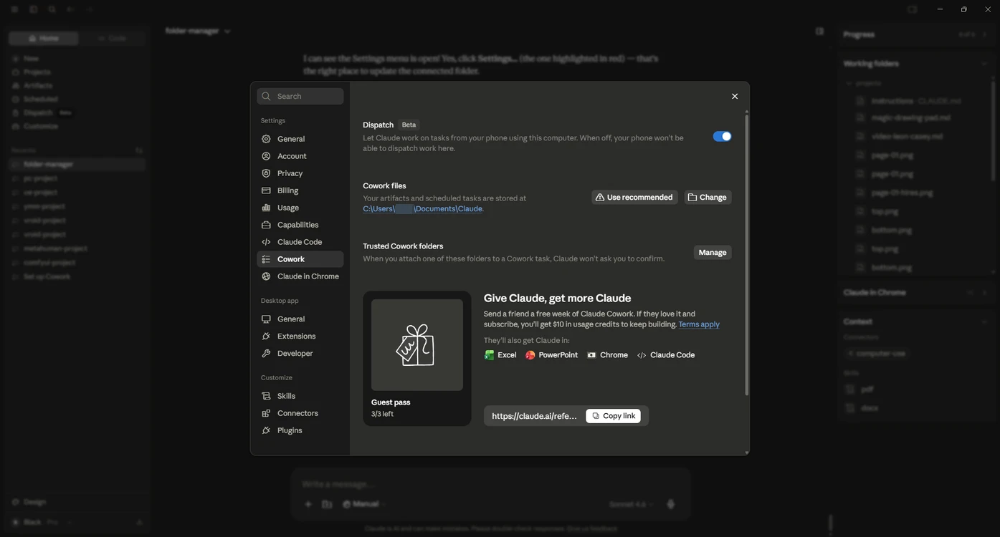
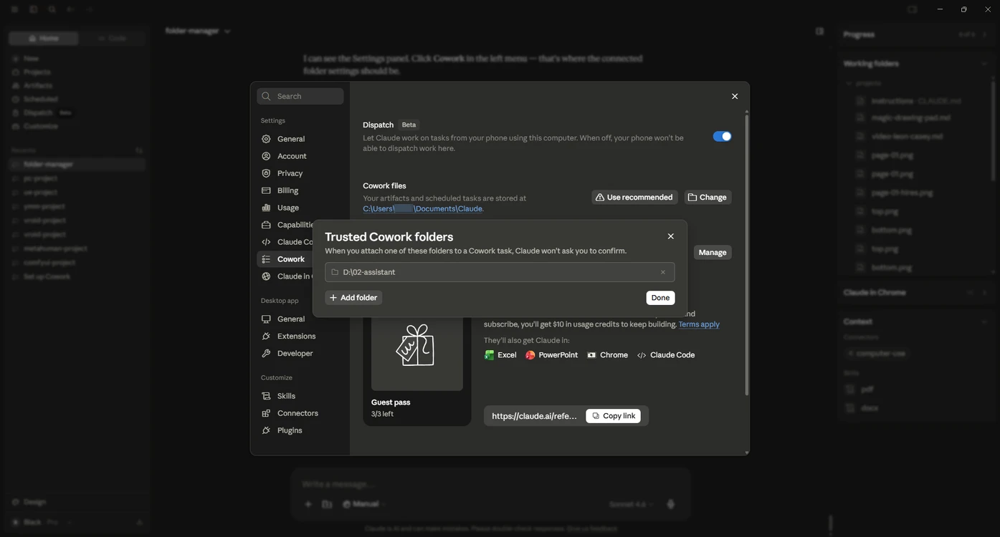
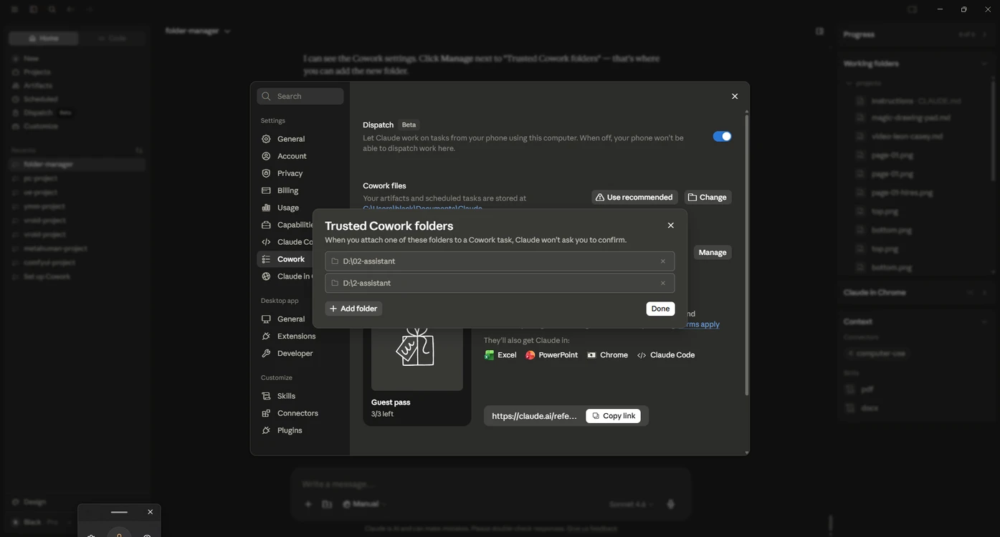
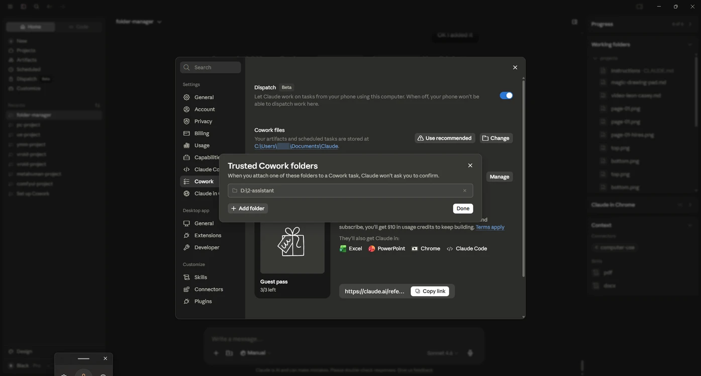

# Specify Trusted Cowork Folders

> **Note:** This document was generated by Claude Code and has not been reviewed by a human. Please use it as a reference only.

Trusted Cowork folders let Claude attach a folder to a Cowork task without asking you to confirm each time.

## Step 1: Open Settings

Open the Claude desktop app and go to **Settings** (the gear icon).

## Step 2: Go to the Cowork Settings Section

In the Settings sidebar, click **Cowork**. Scroll to **Trusted Cowork folders** and click **Manage**.

## Step 3: Add a Folder

The **Trusted Cowork folders** panel opens, listing any folders already trusted. Click **Add folder** and choose the folder you want Claude to access without a confirmation prompt.

## Step 4: Confirm the Folder Was Added

The newly added folder appears in the list alongside any existing ones.

## Step 5: Click Done

Click **Done** to save your changes and close the panel. The folder is now trusted — Claude can attach it to Cowork tasks without asking for confirmation each time.

