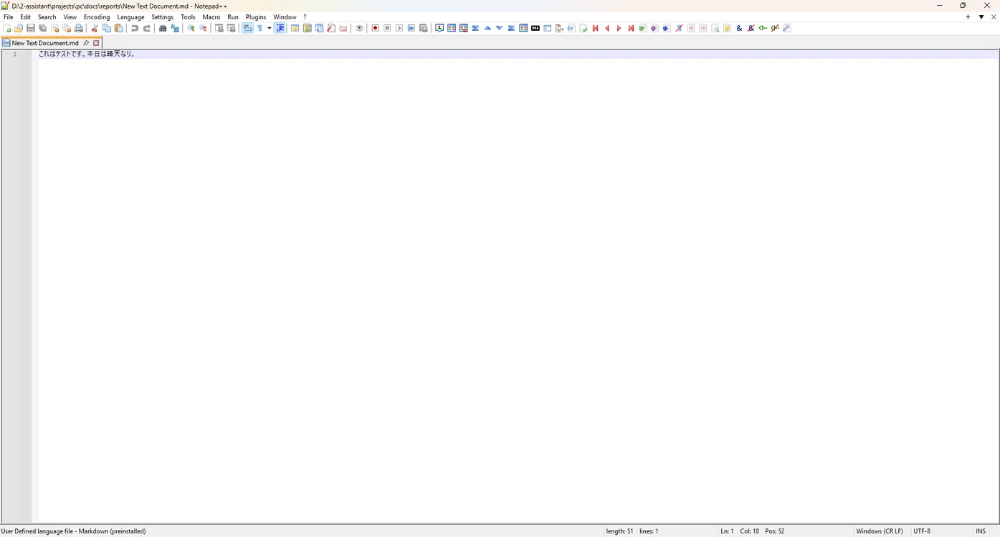
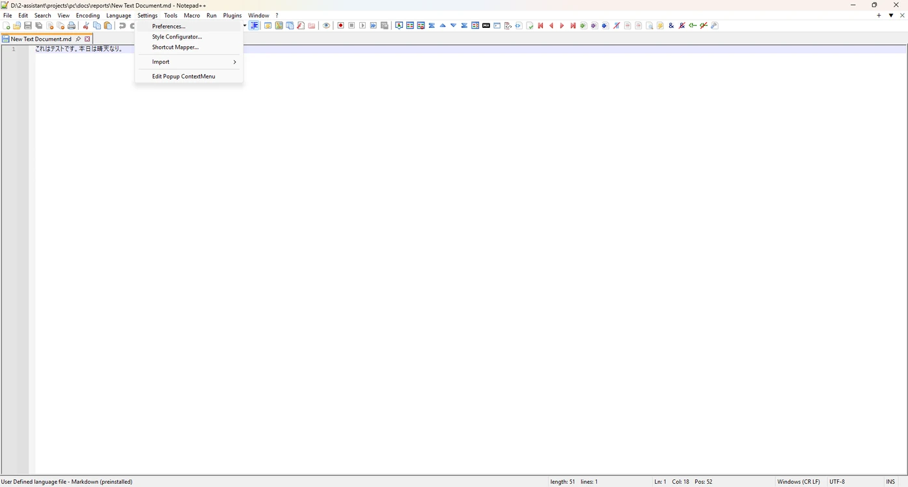
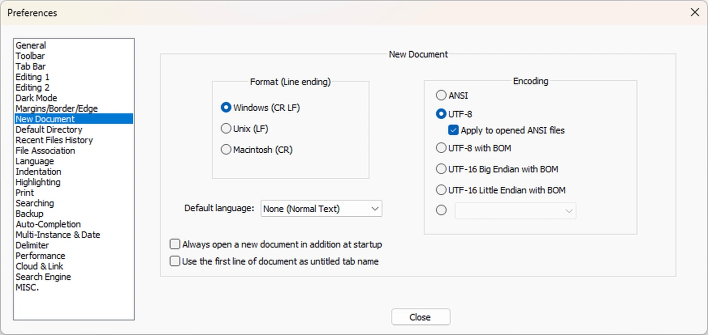

# Set Default Language for New Documents

> **Note:** This document was generated by Claude Code and has not been reviewed by a human. Please use it as a reference only.

By default, every new tab opens as plain text (`.txt`). Notepad++ has a **Default Language** setting that controls the syntax highlighting applied to new, unsaved documents — this guide shows where to find it and where it falls short for languages like Markdown.

## Step 1: Open a New Document

Start with a new document open. Notice the tab is untitled and has no real extension until you save it.

## Step 2: Open Preferences

Go to **Settings** → **Preferences...** in the menu bar.

## Step 3: Go to the New Document Page

In the Preferences dialog, select **New Document** from the left-hand list. Here you can set the default line-ending format, encoding, and — most relevant here — the **Default language** dropdown.

> **Warning:** The **Default language** dropdown only lists Notepad++'s built-in lexers. Some languages — including Markdown in many Notepad++ installs — are implemented as a **User Defined Language (UDL)** instead of a built-in lexer, and UDLs do not appear in this dropdown at all. If your Markdown support shows as "User Defined language file - Markdown (preinstalled)" in the status bar, this setting can't target it.
>
> For Markdown specifically, see [Add a New File Format to the Windows 11 New Menu](../windows/add-new-file-format-windows-11-new-menu.md) for a reliable workaround using the Windows "New" context menu (via PowerToys New+) instead.
