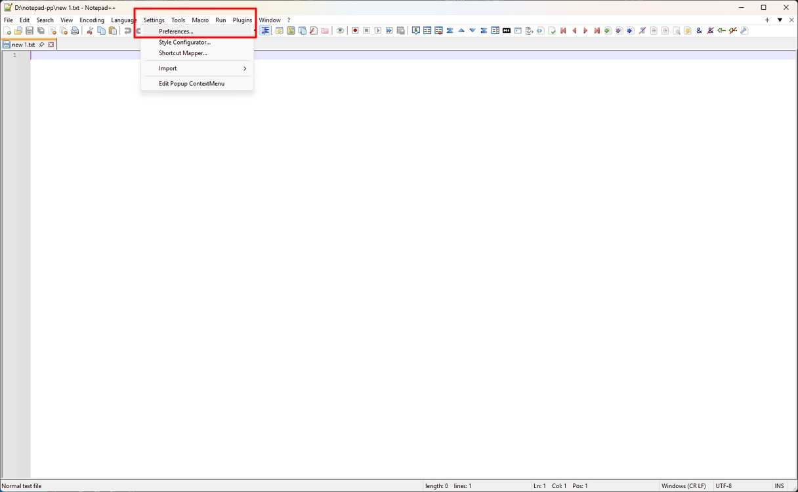
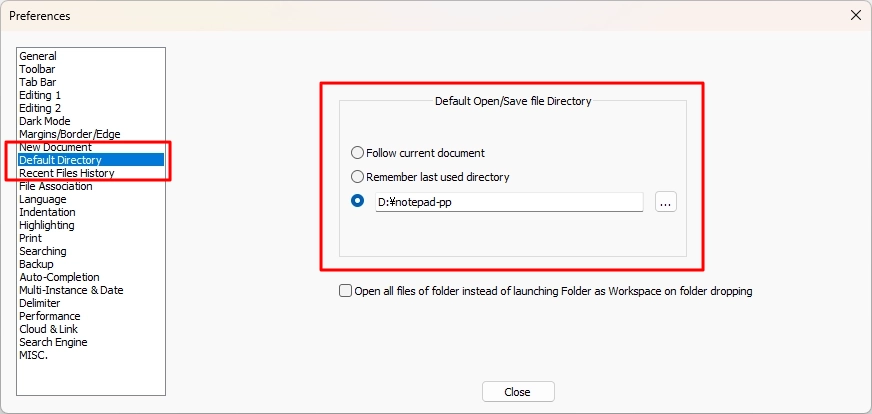

# Set Default Save Folder

Configure a fixed folder for all new files in Notepad++.

## Steps

1. Open **Settings** → **Preferences**.

    

2. Select **Default Directory**.

3. Under **Default Open/Save file Directory**, select the third option (custom directory).

4. Click the **…** button.

5. Choose the target folder (for example, `D:\notepad-pp`).

    

6. Click **Close**.

New files will now default to this folder when you select **Save**.

## Note

If **Follow current document** is selected, Notepad++ saves files in the same folder as the active tab.

If **Remember last used directory** is selected, it uses the most recently saved folder instead.

Use the custom directory option to enforce one fixed location for all files.
