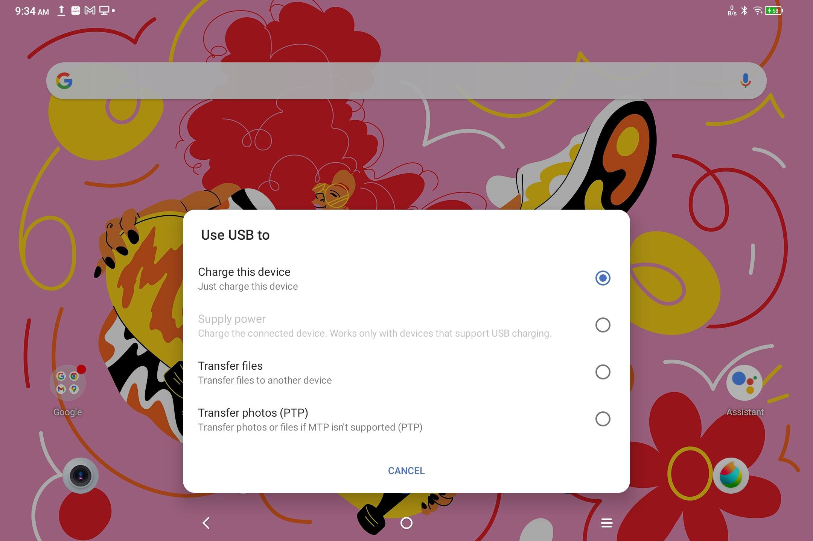

# Charge and Reverse Charge

> **Note:** This document was generated by Claude Code and has not been reviewed by a human. Please use it as a reference only.

## Charge the Tablet

There are three ways to charge the tablet:

1. **Official charger (preferred):** Use the standard charger plug and data cable included with the tablet.
2. **Third-party charger:** Use a charger plug and data cable from another tablet or phone brand. Preferred specifications: 9V2A or 5V3A.
3. **PC charging via USB:**
    1. Connect the tablet to the PC with a Type-C cable (a USB adapter may be required).
    2. On the tablet, select **Charge the device** from the pop-up window.

    

> **Note:** Charge the tablet with the screen off when possible — charging while the screen is on extends the charging time. Use the official charger when available.

## Charge Another Phone in Reverse

The tablet has an 8000 mAh battery when fully charged. You can use it to temporarily charge an Android phone.

1. Connect the tablet to the Android phone using a USB-C to USB-C cable.
2. On the tablet, select **Use as power supply** from the pop-up window.

> **Note:** Reverse charging supports Android phones only — not iOS devices. The output is approximately 2W, which is suitable for emergency use but not for everyday charging.
