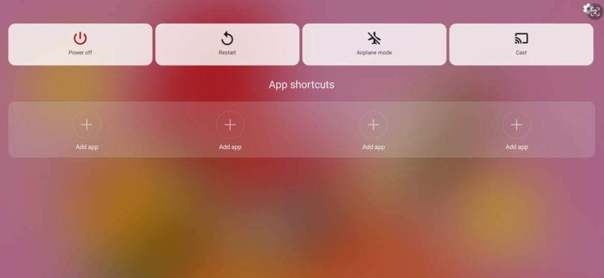

# Power On, Off, and Restart

> **Note:** This document was generated by Claude Code and has not been reviewed by a human. Please use it as a reference only.

## Power On

Press and hold the power button for about 5 seconds. Release the button when the XPPen startup screen appears.

## Shut Down or Restart

Hold the power button for about 2 seconds. When the prompt page appears, select **Power off** or **Restart**.

> **Note:** Restart the tablet regularly to clear the running cache and keep it in good condition. If the tablet is not working properly, try restarting it first.

## Force Shutdown

If the device is unresponsive and cannot be restored by restarting, hold the power button for more than 10 seconds to force a shutdown.
