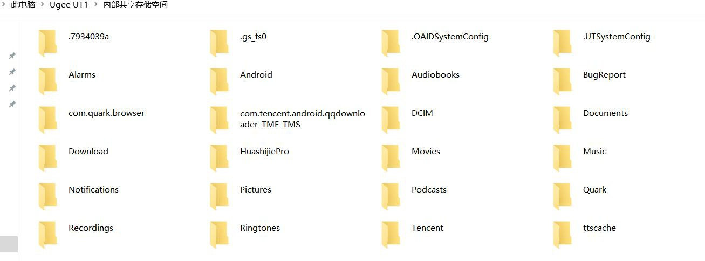
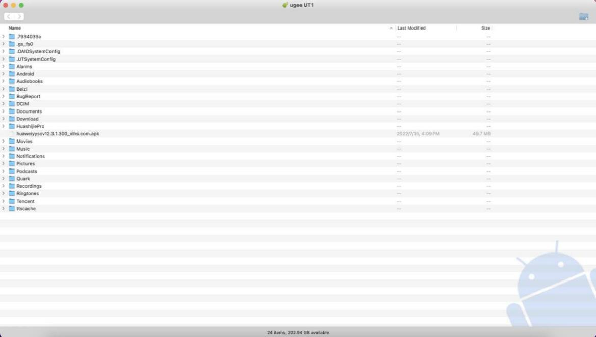
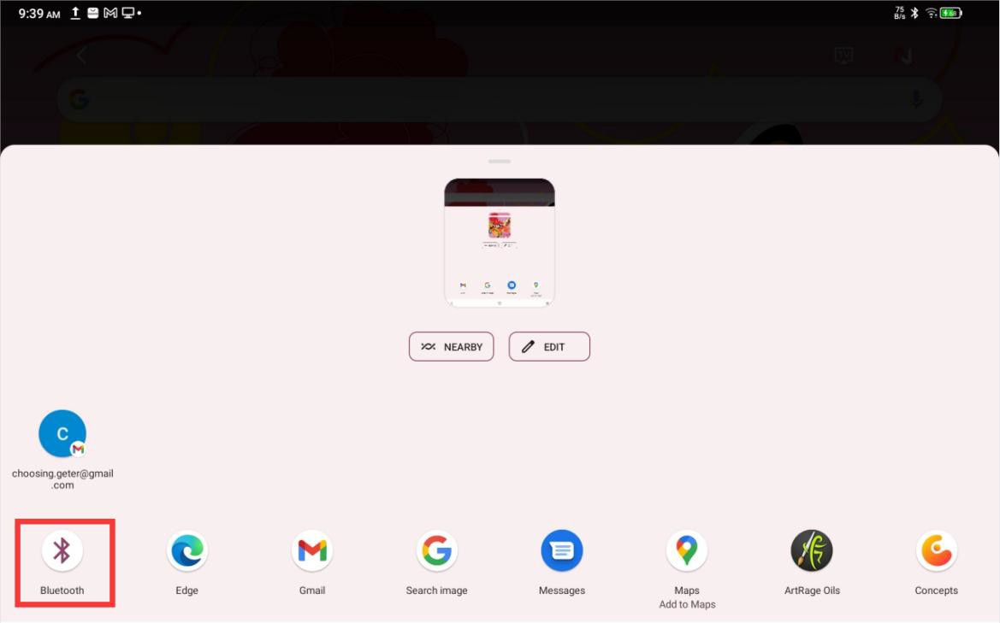

# Transfer Files to a PC

> **Note:** This document was generated by Claude Code and has not been reviewed by a human. Please use it as a reference only.

You can transfer or sync files between the tablet and a PC using a wired or wireless connection.

## Method 1: Wired (USB 2.0 OTG)

1. Connect the tablet to the PC with a USB cable.
2. On the tablet, choose the mode from the pop-up window: **Transfer file** or **Transfer picture**.

    

3. On the PC (Windows or Mac), open File Explorer or Finder. The tablet appears as a disk directory folder.

    **Windows file directory:**

    

    **Mac OS file directory:**

    

> **Note:** Mac computers require the "Android File Transfer" app to be installed first. Computers running Windows XP may not connect properly — install Windows Media Player 11 or later if needed.

## Method 2: Bluetooth Wireless

Bluetooth file transfer supports Android devices to Windows PCs only. It does not support iOS phones or macOS devices.

1. Turn on Bluetooth on both the tablet and the PC.
2. On the Windows PC, open the Bluetooth settings and click **Receive File** to enter the receiving state.
3. On the tablet, select the file to transfer and choose **Bluetooth** to share it.

    

4. Select the PC from the list of Bluetooth devices.
5. On the PC, accept the file and choose a save path. The transfer is complete.
