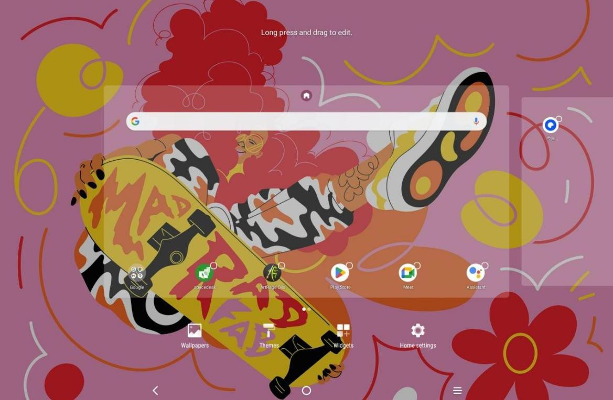

# Understand the Home Screen

> **Note:** This document was generated by Claude Code and has not been reviewed by a human. Please use it as a reference only.

The XPPen Magic Drawing Pad home screen has a simple design for faster operation and a more personalized interface.

**Top status bar:** Displays the drawing pad status and notification messages.

**Bottom Favorites bar:** Holds frequently used apps that you can remove or replace.

## Desktop Settings

To access desktop settings (wallpapers, themes, micro-components, and more), tap and hold a blank area of the home screen. This opens the desktop Settings interface.

You can also configure home screen settings through the main **Settings** app.
