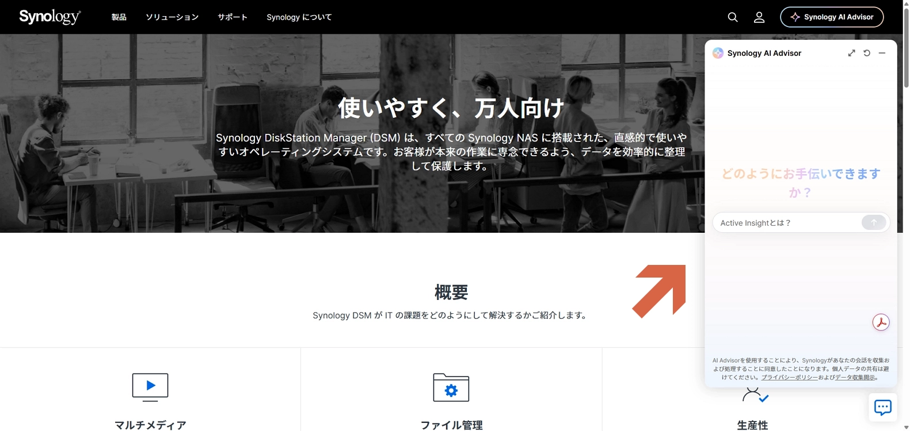

# 製品に関して調べる

公式サイトに**Synology AI Adviser**ってのが追加されている。

試しに、「Web Assistantとは？」と聞いたら、「**Synology Assistant**の旧名称」という答えは返ってこなかった。

ある程度は使えると思うけど、完ぺきではなさそう。

[https://www.synology.com/ja-jp/dsm](https://www.synology.com/ja-jp/dsm)

