# Adding CoeiroInk Voices to AivisSpeech

> **Note:** This document was generated by Claude Code and has not been reviewed by a human. Please use it as a reference only.

[coeiroink-v2-bridge](https://github.com/sevenc-nanashi/coeiroink-v2-bridge) is a third-party VVPP plugin that exposes your installed CoeiroInk voices to AivisSpeech through its multi-engine feature — including whichever character voices you already have set up in CoeiroInk.

**Prerequisites:**

- AivisSpeech installed
- CoeiroInk installed, with the voices you want already set up in it
- Multi-engine function turned on

## Step 1: Download the Bridge Plugin

Go to the [coeiroink-v2-bridge GitHub Releases page](https://github.com/sevenc-nanashi/coeiroink-v2-bridge/releases) and download the latest **-win.vvpp** file.

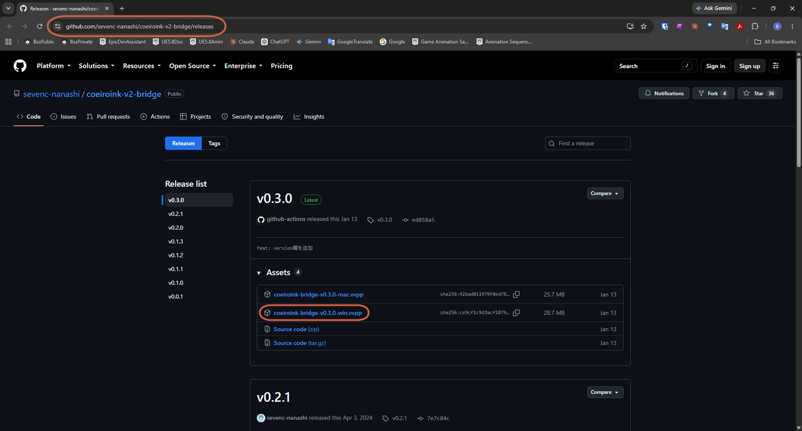

## Step 2: Open Manage Voice Synthesis Engines

In AivisSpeech, go to **音声合成エンジン** (Voice Synthesis Engine) → **音声合成エンジンの管理** (Manage Voice Synthesis Engines).

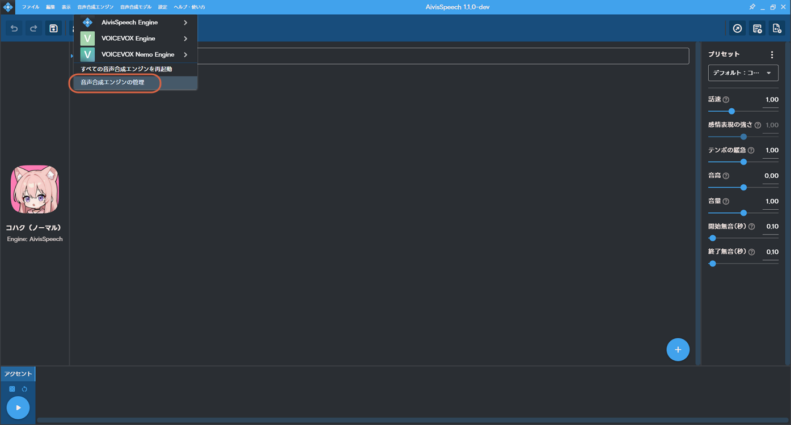

## Step 3: Add a New Engine

Click **＋追加** (Add) in the top right.

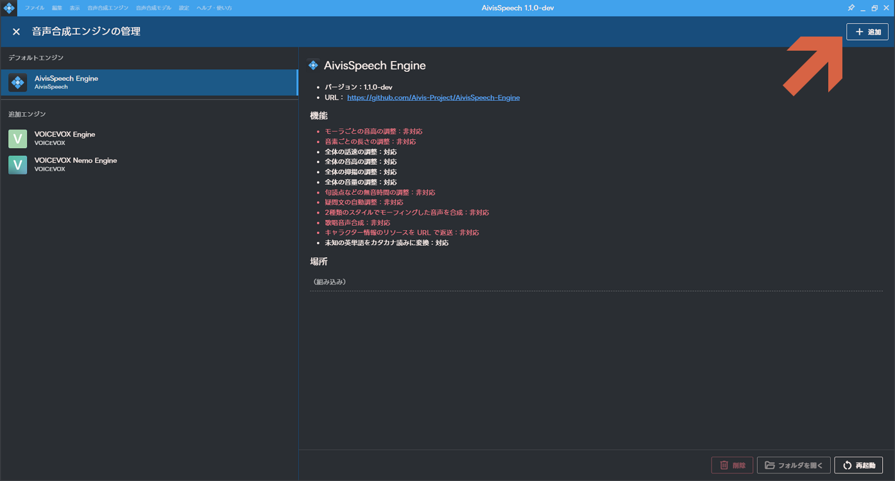

## Step 4: Select the VVPP File

Stay on the **VVPPファイル** (VVPP File) tab (the default), then click the folder icon and select the downloaded bridge file.

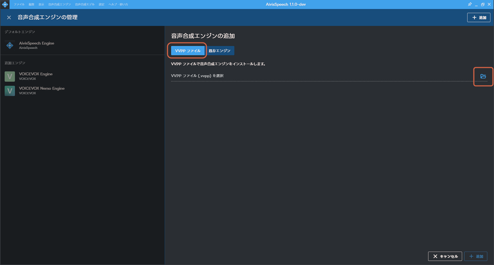

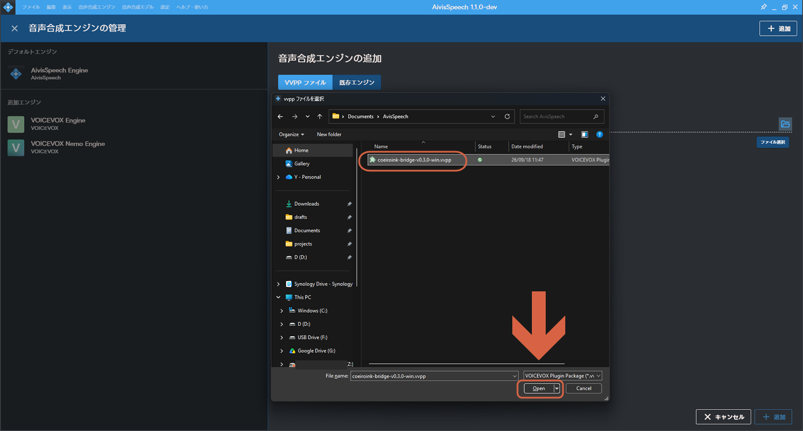

With the file selected, click **＋追加** (Add).

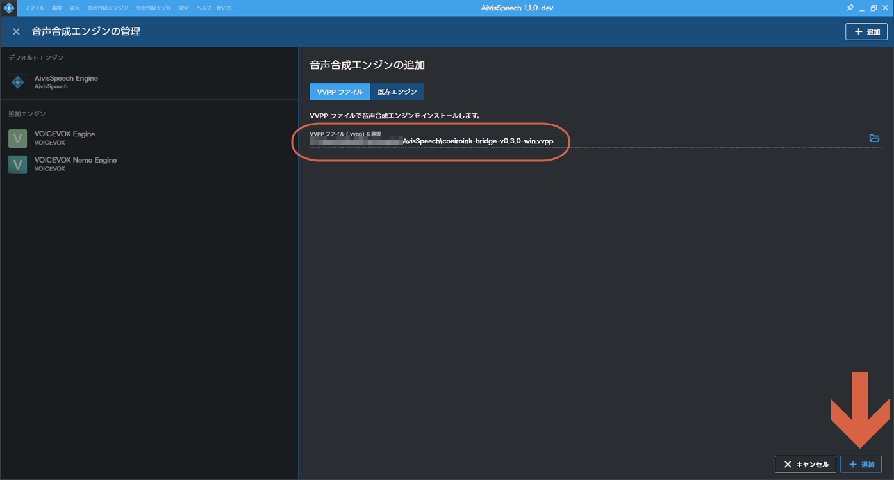

## Step 5: Accept the Security Warning

Click **追加する** (Add) to continue.

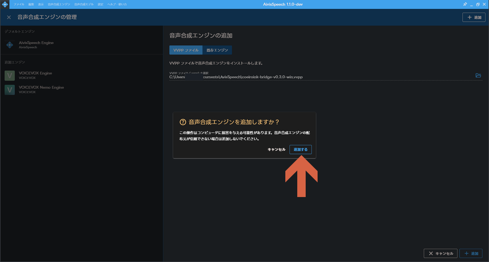

## Step 6: Reload

Click **再読み込みする** (Reload) to apply the change.

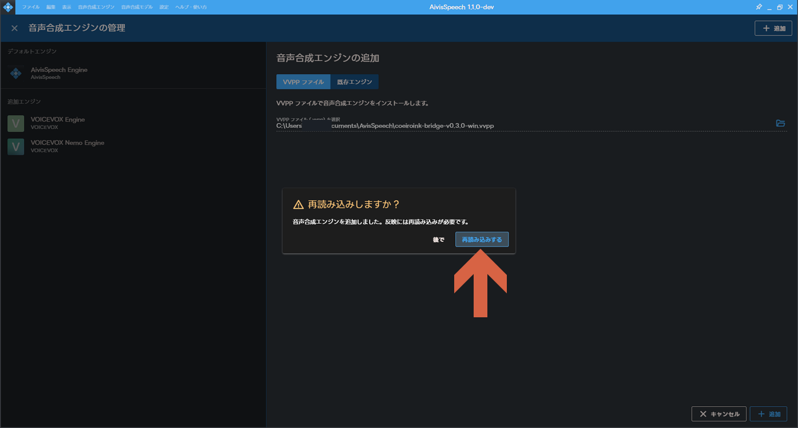

## Step 7: Restart AivisSpeech

Close AivisSpeech completely, just to be safe.

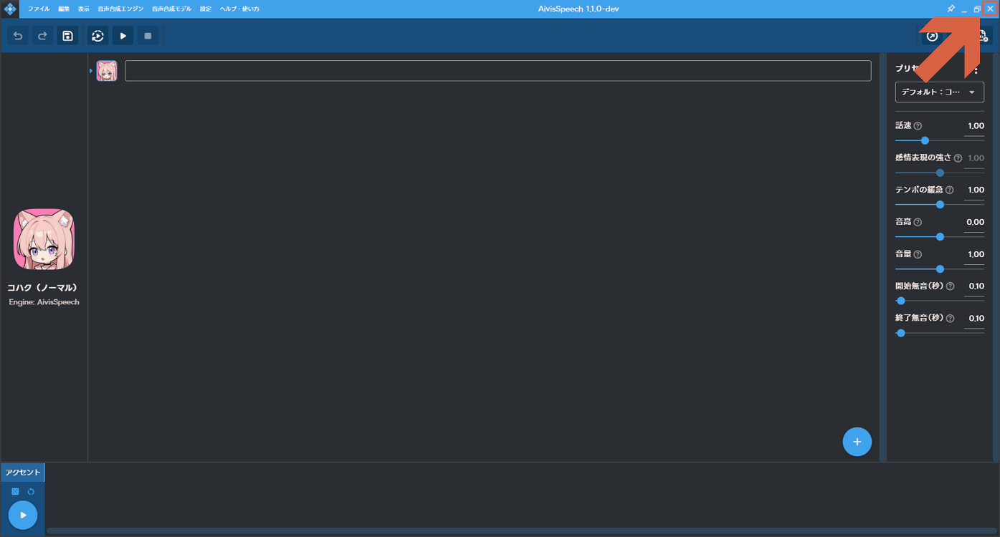

## Step 8: Launch CoeiroInk

Launch CoeiroInk. AivisSpeech reopens automatically alongside it.

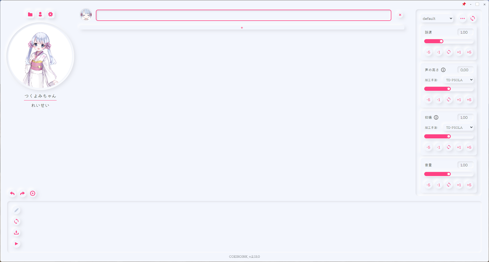

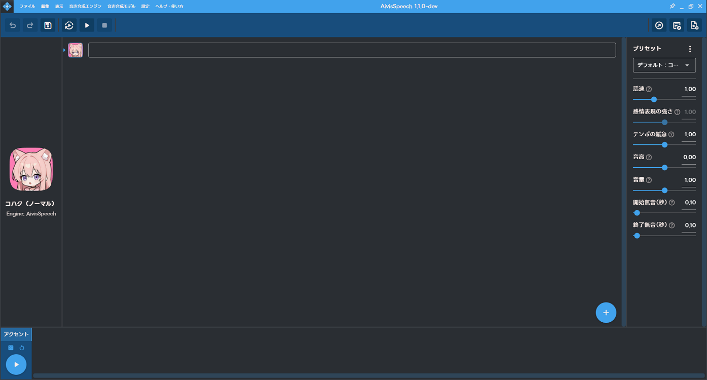

> **Note:** You may see an error saying "VOICEVOX Nemo Engine が異常終了しました" (VOICEVOX Nemo Engine terminated abnormally) at this point. This is a side effect of running multiple engines together, not a problem with the CoeiroInk bridge — click **OK** and continue.

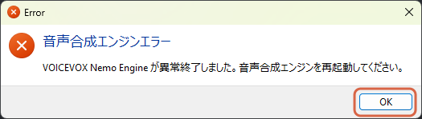

## Step 9: Confirm the Voices Are Available

CoeiroInk's own character list shows which voices are installed there.

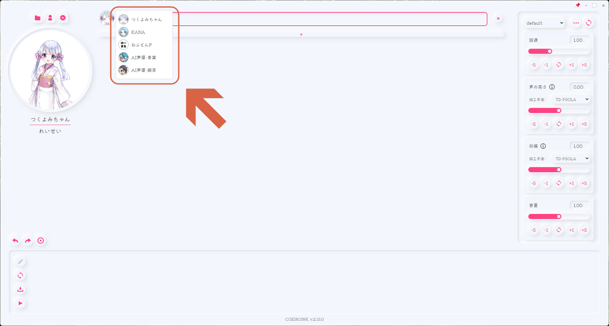

The same voices now appear in AivisSpeech's character list.

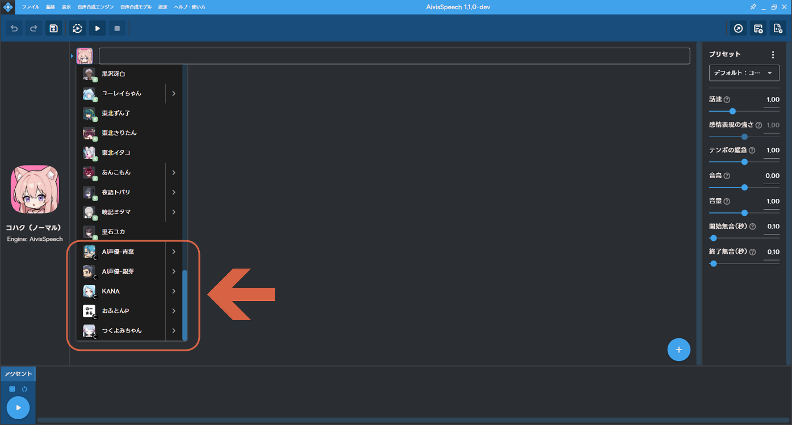
