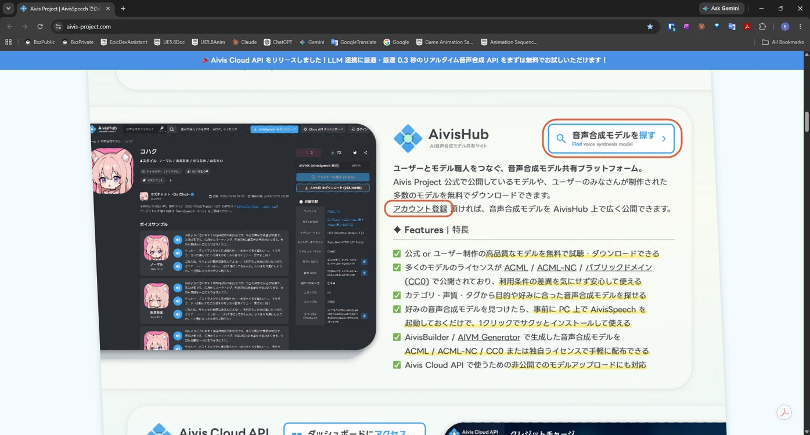
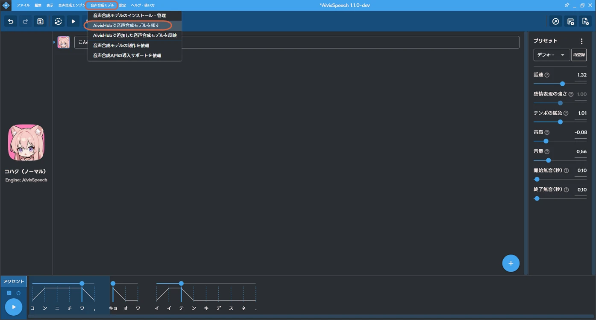
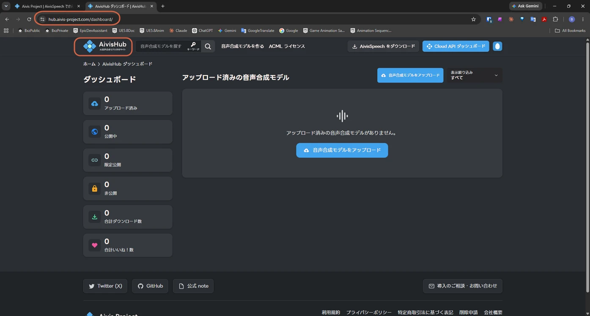
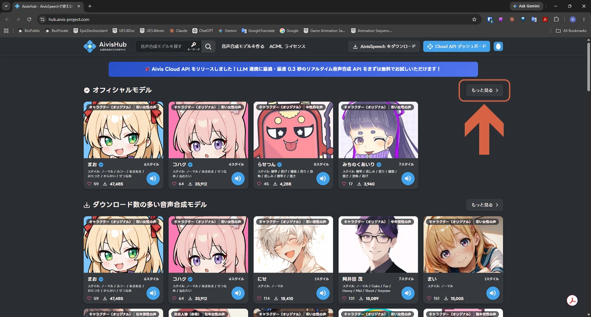
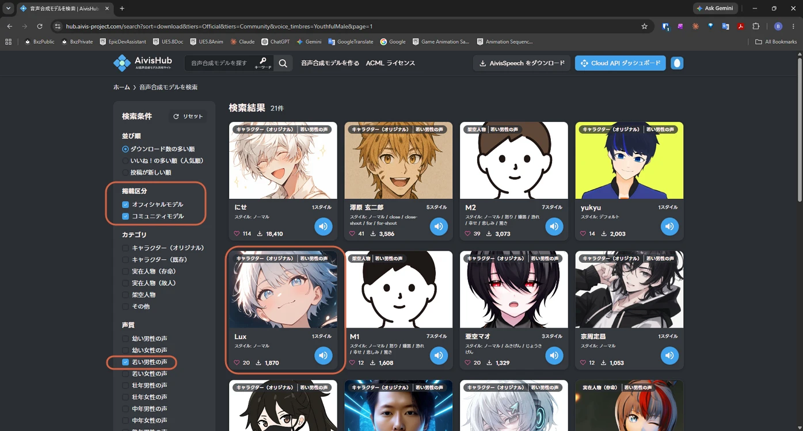
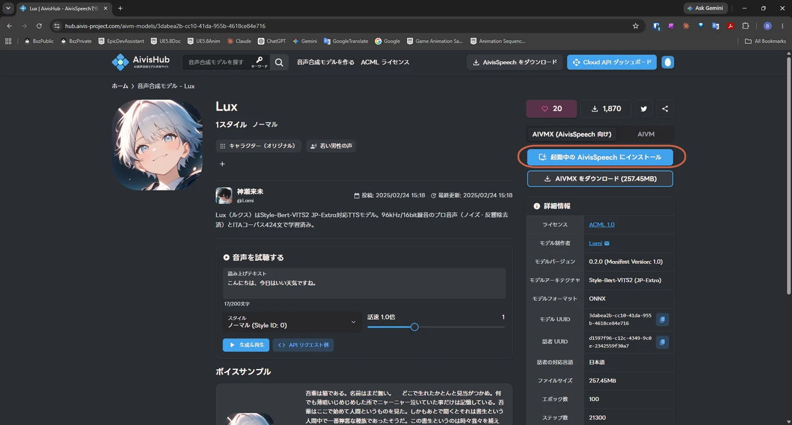
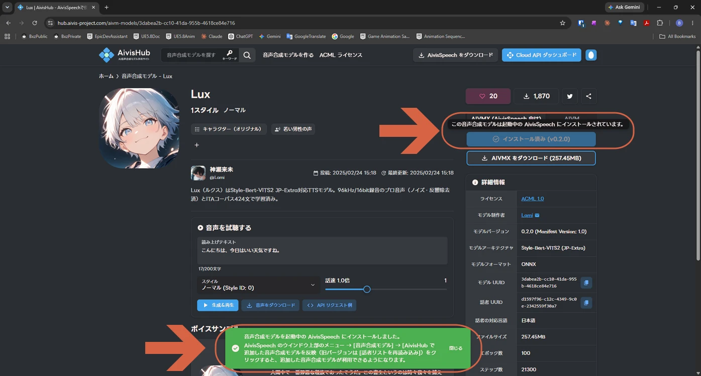
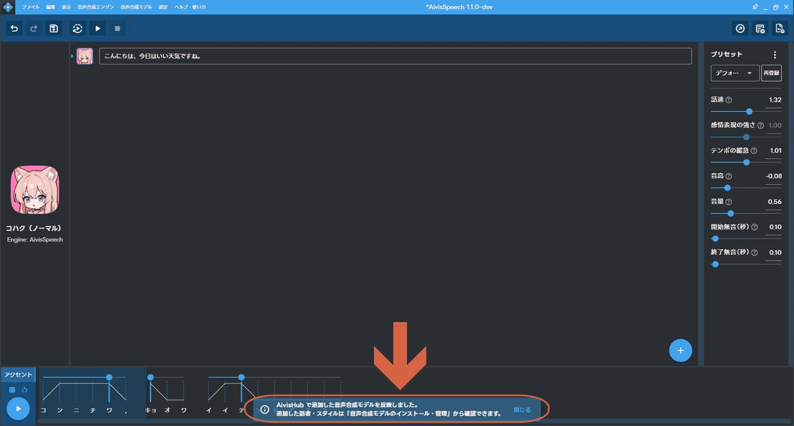
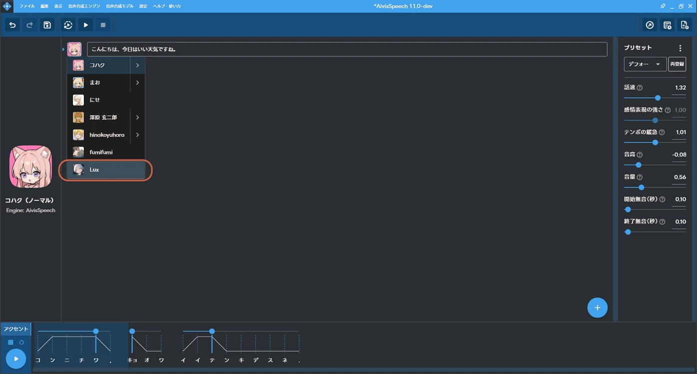

# Adding a Voice Model from AivisHub

> **Note:** This document was generated by Claude Code and has not been reviewed by a human. Please use it as a reference only.

**AivisHub** is Aivis Project's model-sharing site, where you can browse and install extra voice models — official ones and community-made ones — directly into [AivisSpeech](get-started-with-aivisspeech.md).

## Step 1: Open AivisHub

Create an account on the [official site](https://aivis-project.com)'s AivisHub section.

You can also jump straight to AivisHub from inside AivisSpeech: **音声合成モデル** (Voice Synthesis Model) → **AivisHubで音声合成モデルを探す** (Find voice synthesis models on AivisHub).

Either path signs you in and opens your AivisHub dashboard.

## Step 2: Browse and Filter Models

Click **もっと見る** (View more) under any category to see its full list.

Narrow the results down with the **掲載区分** (listing type — Official or Community) and **声質** (voice timbre) filters on the left.

## Step 3: Install the Model

Open a model's page and click **起動中のAivisSpeechにインストール** (Install into the running AivisSpeech).

> **Note:** AivisSpeech must already be running for this to work — it installs the model directly into the open instance.

A confirmation message appears once the install finishes.

## Step 4: Apply the Model in AivisSpeech

Back in AivisSpeech, go to **音声合成モデル** (Voice Synthesis Model) → **AivisHubで追加した音声合成モデルを反映** (Apply models added on AivisHub).

A confirmation toast appears once it's applied.

## Step 5: Select the New Model

The model now appears at the bottom of the character picker, ready to use like any built-in voice.

## Reference

- [AivisHub](https://hub.aivis-project.com)
