# Adding VOICEVOX Engine to AivisSpeech

> **Note:** This document was generated by Claude Code and has not been reviewed by a human. Please use it as a reference only.

AivisSpeech's multi-engine feature can load any VOICEVOX API-compatible synthesis engine. This guide adds the official VOICEVOX Engine (plugin build) to AivisSpeech, making VOICEVOX characters like Shikoku Metan and Zundamon available from inside AivisSpeech.

> **Note:** This only works in the VOICEVOX → AivisSpeech direction. Adding an AivisSpeech engine or AIVMX model to VOICEVOX isn't supported, due to compatibility differences.

**Prerequisites:**

- AivisSpeech installed
- Multi-engine function turned on (usually on by default)
- [7-Zip](https://www.7-zip.org/) installed

## Step 1: Open the VOICEVOX Engine Releases Page

Go to the [VOICEVOX Engine GitHub Releases page](https://github.com/VOICEVOX/voicevox_engine/releases).

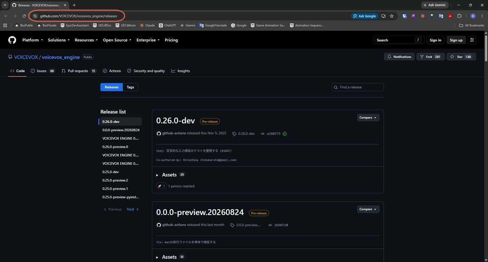

## Step 2: Download the Plugin Engine (VVPP) Build

Scroll to the latest release's **パッケージ案内** (Package Guide) section. Under **プラグインエンジン（VVPP）** (Plugin Engine, VVPP) — not **エンジン本体** (Engine itself) — pick the build matching your setup:

- CPU only → Windows (CPU version)
- GPU (DirectML) → Windows (GPU/DirectML version)
- NVIDIA GPU (CUDA) → Windows (GPU/CUDA version) — needs both part1 and part2

Click the link to download (saves as a `.7z.001` file).

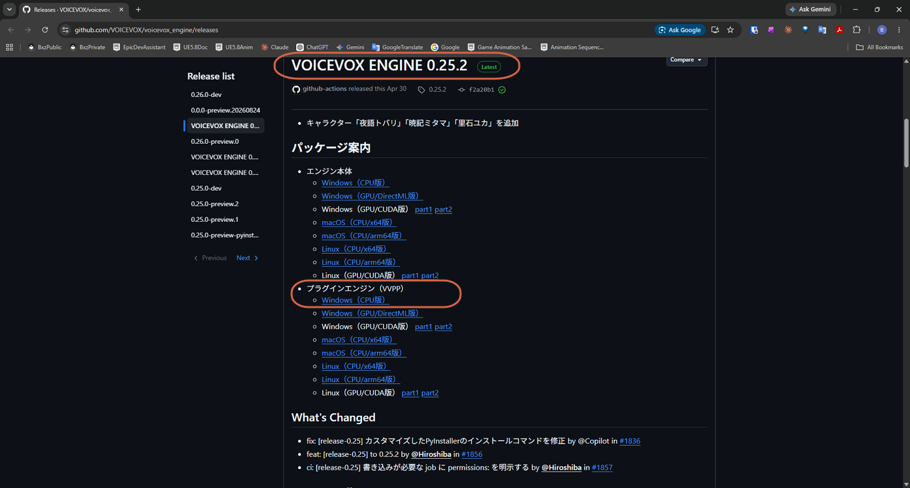

The download appears in your Downloads folder.

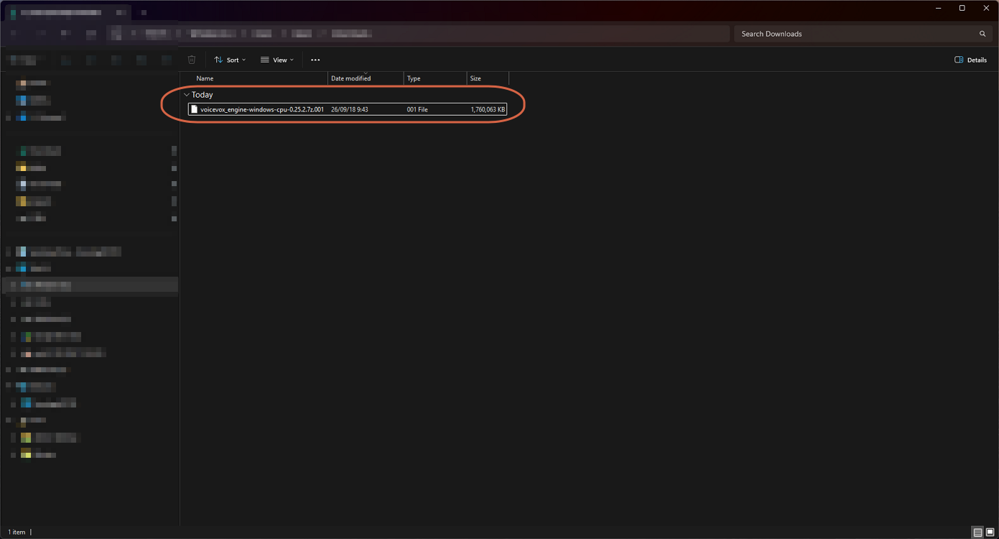

## Step 3: Extract the Archive

Right-click the downloaded file → **7-Zip** → **展開...** (Extract...).

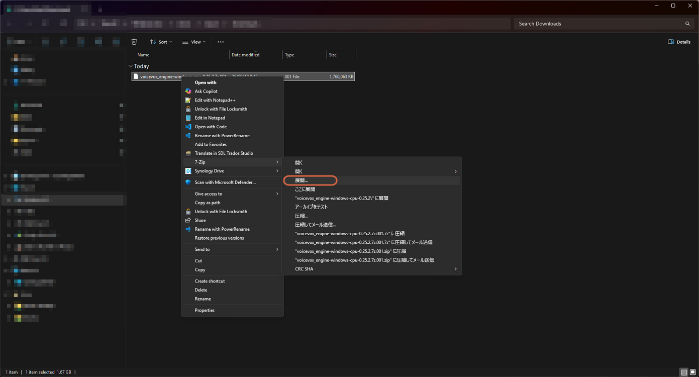

Extracting creates a folder containing `run.exe`, `engine_manifest.json`, `licenses.json`, `voicevox_core.dll`, `voicevox_onnxruntime.dll`, and the `engine_internal`, `model`, and `resources` folders.

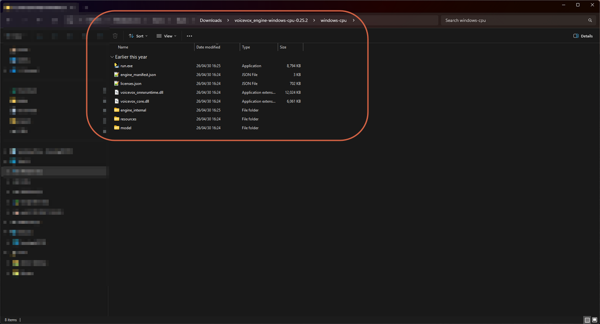

> **Note:** Move this folder somewhere you won't accidentally delete it — e.g. `Documents\Voicevox\` — rather than leaving it in Downloads.

## Step 4: Open Manage Voice Synthesis Engines

In AivisSpeech, go to **音声合成エンジン** (Voice Synthesis Engine) → **音声合成エンジンの管理** (Manage Voice Synthesis Engines).

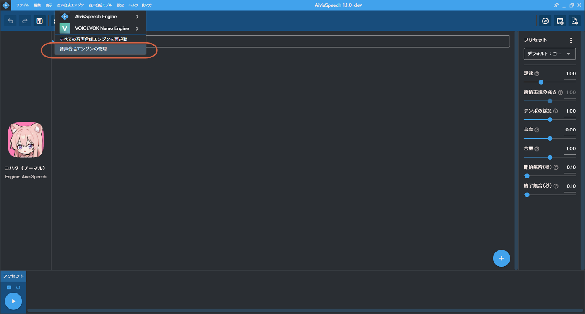

## Step 5: Add a New Engine

Click **＋追加** (Add) in the top right.

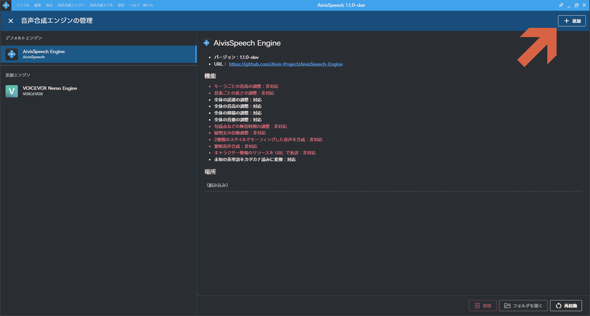

## Step 6: Select the Existing Engine Tab

Choose the **既存エンジン** (Existing Engine) tab — this points AivisSpeech at an already-extracted folder, instead of a single VVPP file.

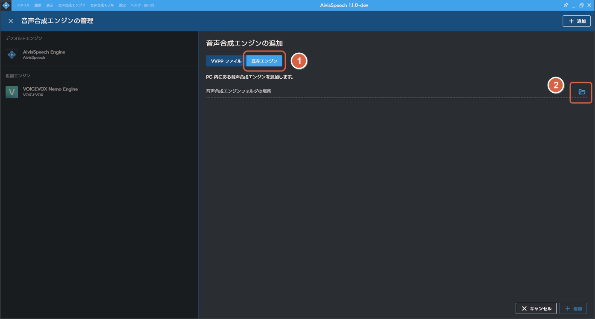

## Step 7: Select the Engine Folder

Click the folder icon and select the folder that contains `run.exe` (e.g. `windows-cpu`) — select the folder itself, not the `run.exe` file.

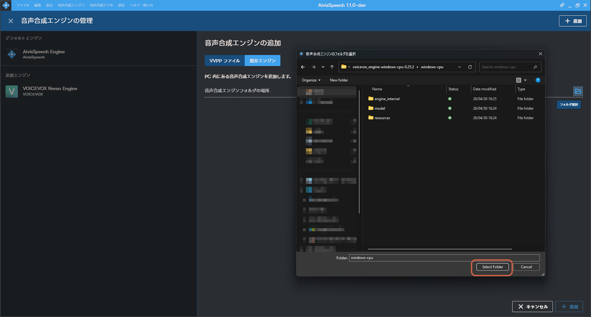

With the folder selected, click **＋追加** (Add).

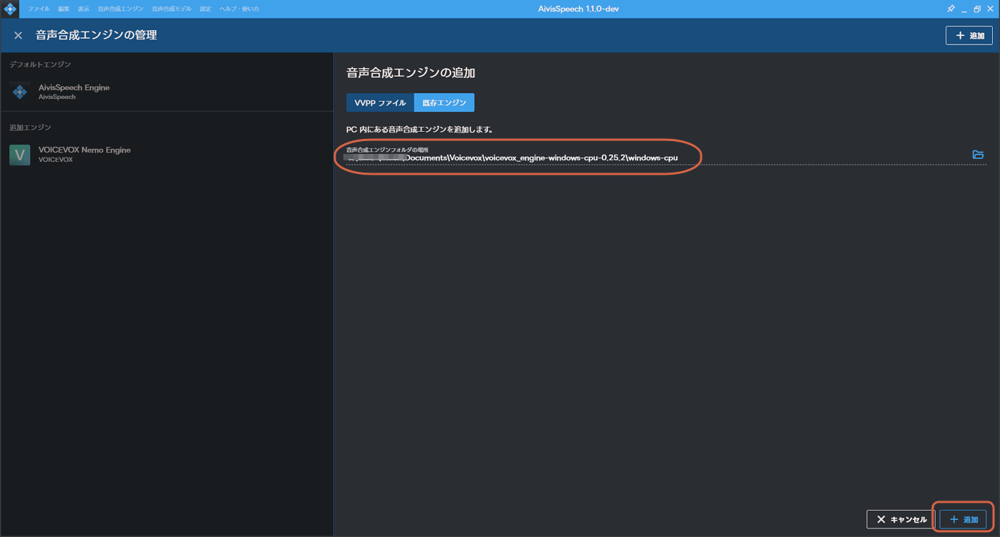

## Step 8: Accept the Security Warning

AivisSpeech warns that adding an engine could be harmful to your computer, and not to proceed unless you trust the source. Click **追加する** (Add) to continue.

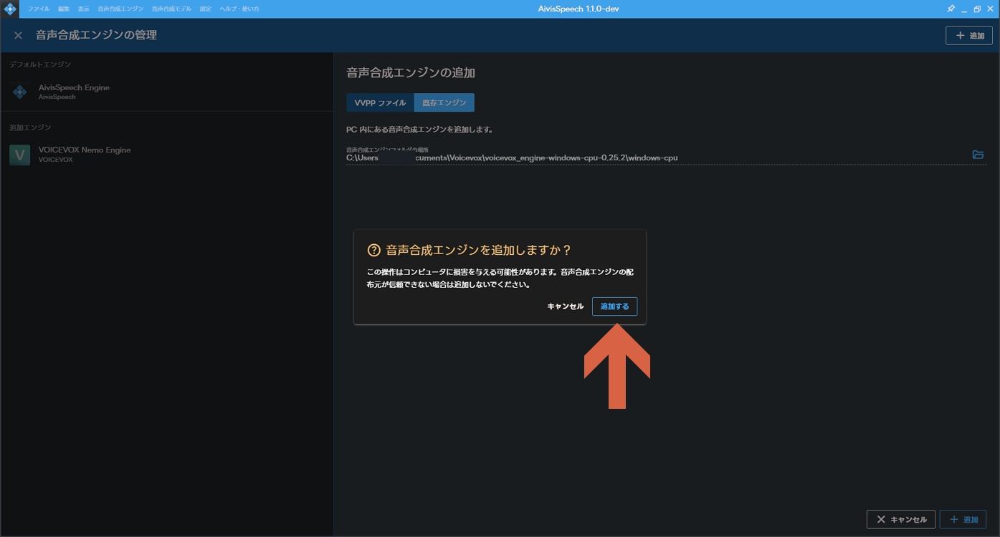

## Step 9: Reload

Click **再読み込みする** (Reload) to apply the change.

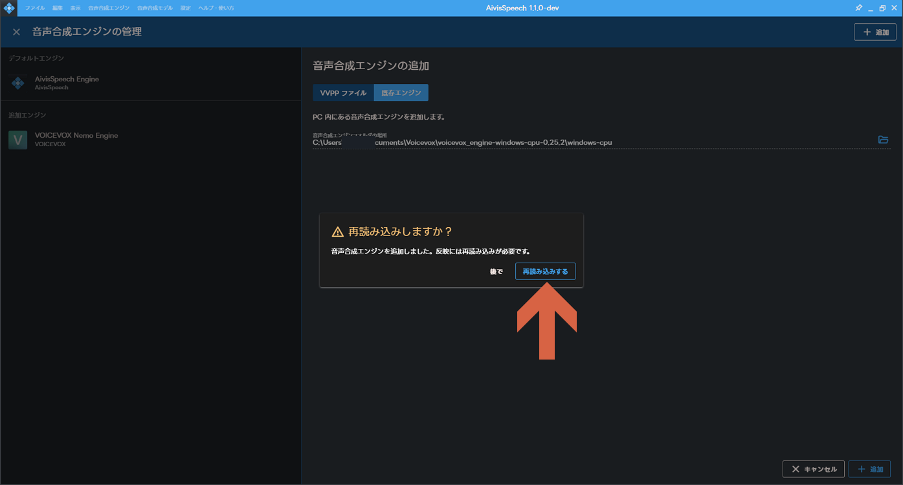

## Step 10: Confirm It Worked

After reloading, open **音声合成エンジン** (Voice Synthesis Engine) again — you should see multiple engines listed (AivisSpeech Engine, VOICEVOX Engine, plus anything else you've added). The character list on the left should now include VOICEVOX characters like Shikoku Metan and Zundamon.

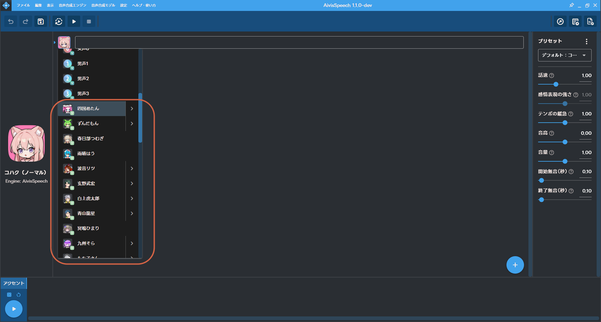

> **Note:** If you already have a single VVPP file instead of an extracted folder, use the **VVPPファイル** (VVPP File) tab instead of **既存エンジン** (Existing Engine).
