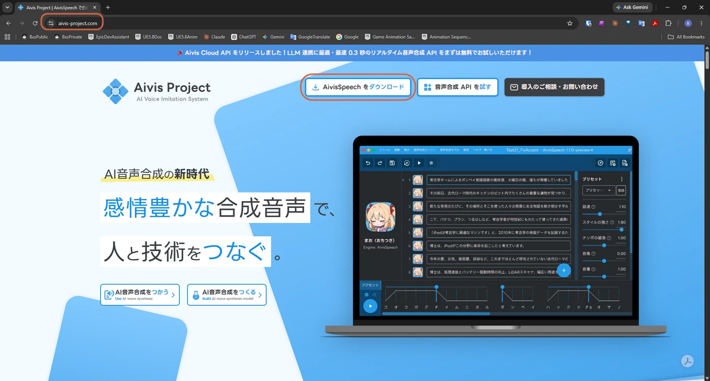
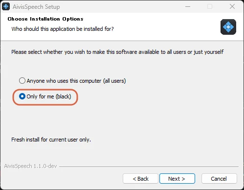
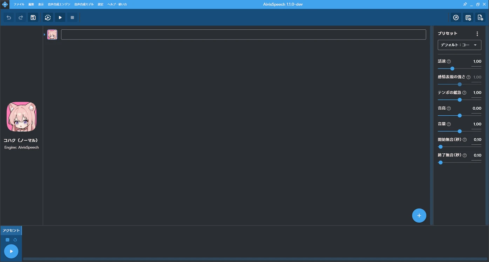
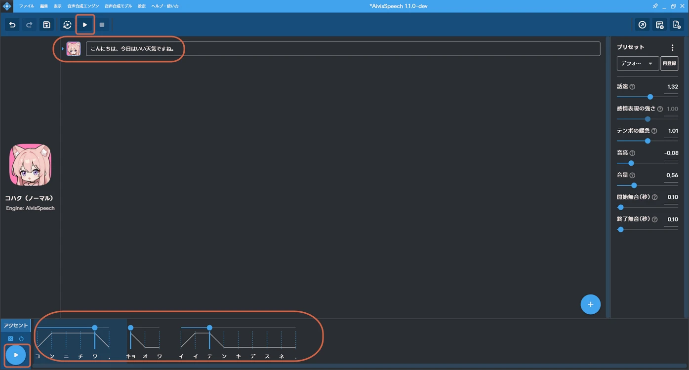
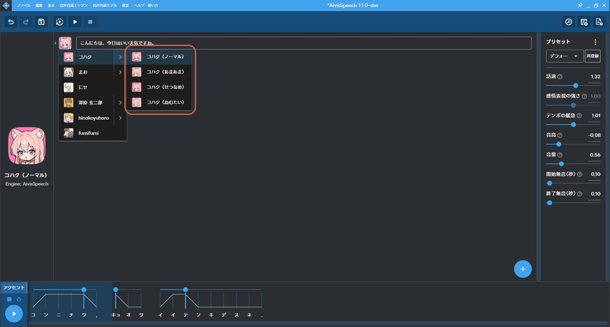

# Getting Started with AivisSpeech

> **Note:** This document was generated by Claude Code and has not been reviewed by a human. Please use it as a reference only.

[AivisSpeech](https://aivis-project.com) is a free Japanese text-to-speech app from the Aivis Project — type text, generate speech, and fine-tune the accent by dragging pitch points.

## Step 1: Download the Installer

Go to the [official site](https://aivis-project.com) and click **AivisSpeechをダウンロード** (Download AivisSpeech).

## Step 2: Install AivisSpeech

Run the downloaded installer. In **Choose Installation Options**, select **Only for me** unless other Windows accounts on the PC also need access.

## Step 3: Launch AivisSpeech

Open AivisSpeech. It starts with a default voice already loaded and an empty text box.

## Step 4: Generate Speech

Type text into the box, then click **Play** (▶) in the toolbar to hear it.

Drag the points in the **アクセント** (Accent) editor at the bottom to adjust the pitch of individual syllables.

## Step 5: Switch Between Voice Styles

Click the character portrait to switch characters or voices. Some characters, like **コハク** (Kohaku), have several style variations under the same character — Normal, Sweet, Wistful, Sleepy, and so on.

## Reference

- [Official site](https://aivis-project.com)
