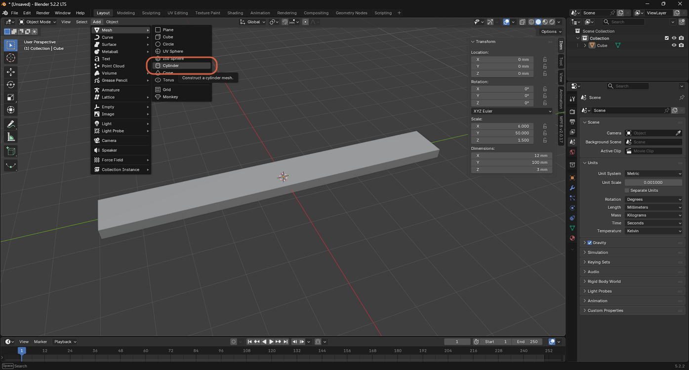
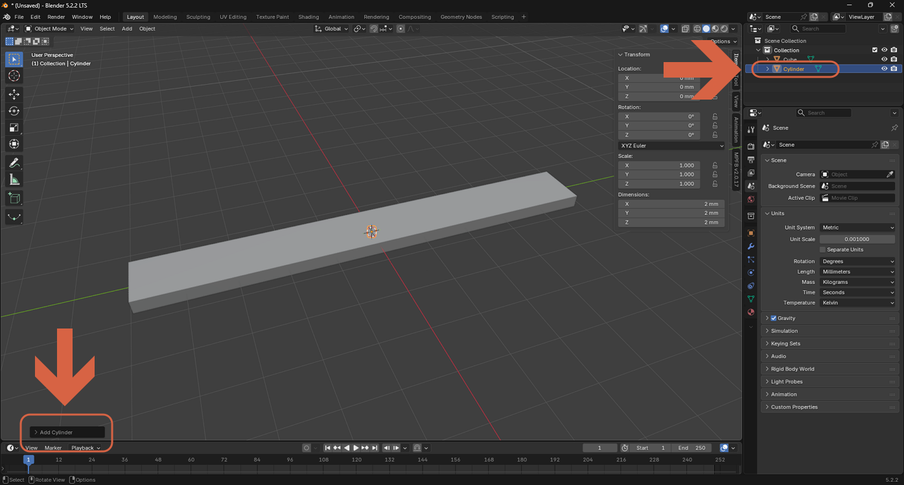
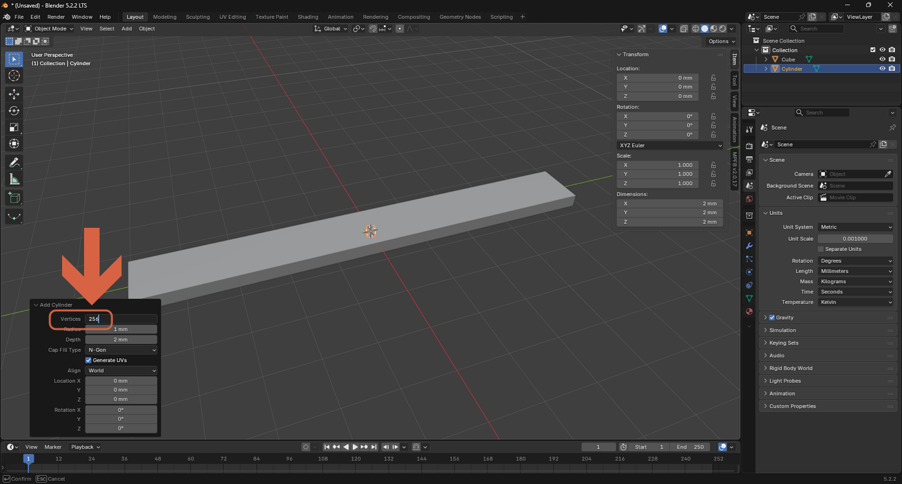
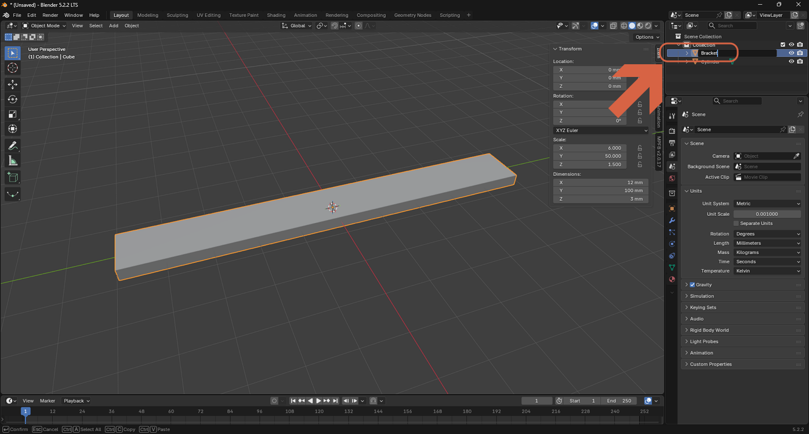
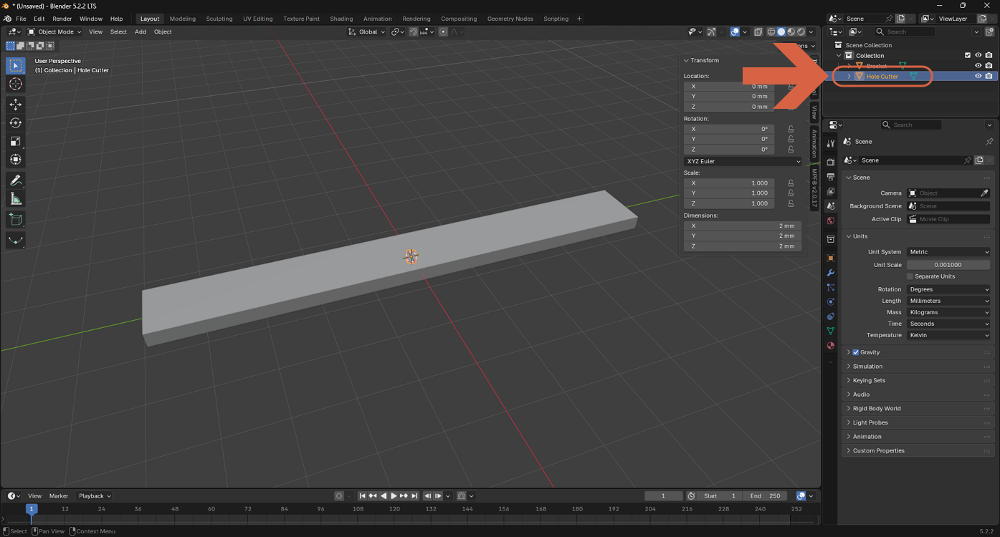
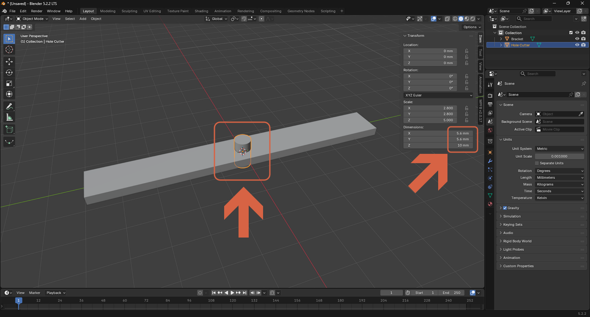

# Adding and Naming a Cylinder

> **Note:** This document was generated by Claude Code and has not been reviewed by a human. Please use it as a reference only.

> **Note:** See [this video](https://youtu.be/8_0RptMbhe0?si=lq3f7VX-mt7znVUY) for a demonstration.

## Step 1: Add a Cylinder Mesh

Select **Add** → **Mesh** → **Cylinder**.

## Step 2: Open the Add Cylinder Panel

The new cylinder is added at the default size, centered on the scene origin. Click the collapsed **Add Cylinder** panel at the lower left to expand its options.

## Step 3: Set the Vertex Count

In the expanded panel, increase **Vertices** (for example, `256`) for a smoother, more circular cylinder.

## Step 4: Rename the First Object

In the Outliner, double-click the original object's name and rename it to something identifiable, for example `Bracket`, so the scene stays organized as you add more parts.

## Step 5: Name the New Object

Rename the cylinder to describe its purpose, for example `Hole Cutter`.

## Step 6: Scale the New Object

Scale the cylinder so it's large enough to pass all the way through the bracket.

> **Note:** These steps only create and size the cylinder. Cutting the actual hole requires adding a **Boolean** modifier (set to **Difference**) on the bracket with **Hole Cutter** as its object — not covered in this guide.
