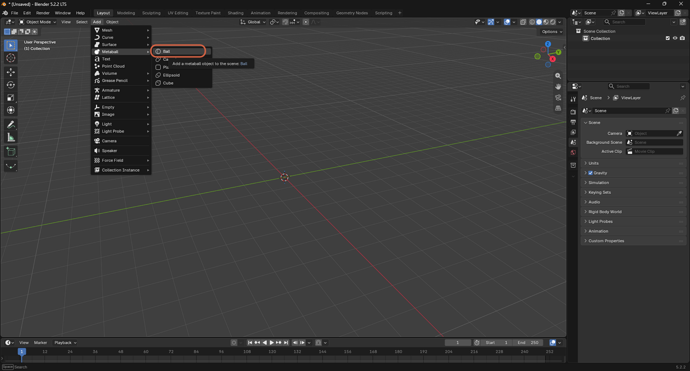
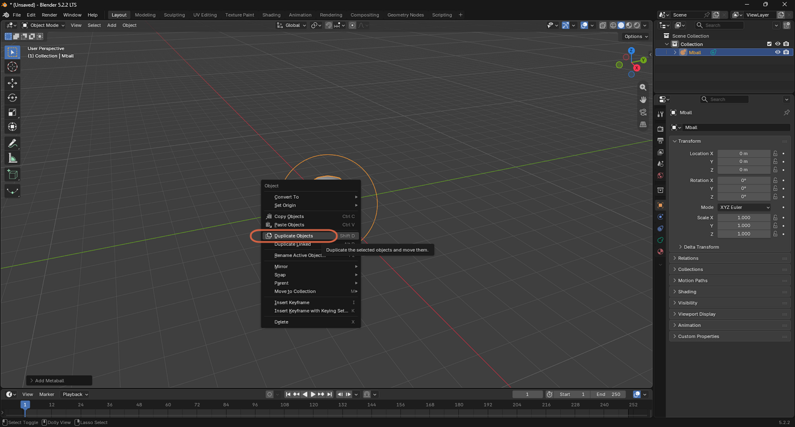
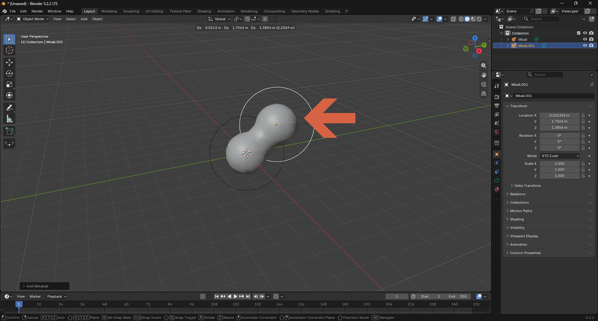

# Adding a Metaball

> **Note:** This document was generated by Claude Code and has not been reviewed by a human. Please use it as a reference only.

A **Metaball** is an organic surface that automatically blends with other nearby metaballs, merging into one smooth shape instead of intersecting like regular meshes.

## Step 1: Add a Metaball

Select **Add** → **Metaball** → **Ball**.

## Step 2: Duplicate It

Right-click, then select **Duplicate Objects** (or press `Shift+D`).

## Step 3: Move the Duplicate Close to the Original

Drag the duplicate near the original. Where the two overlap, they blend into a single smooth shape instead of showing as separate spheres.

