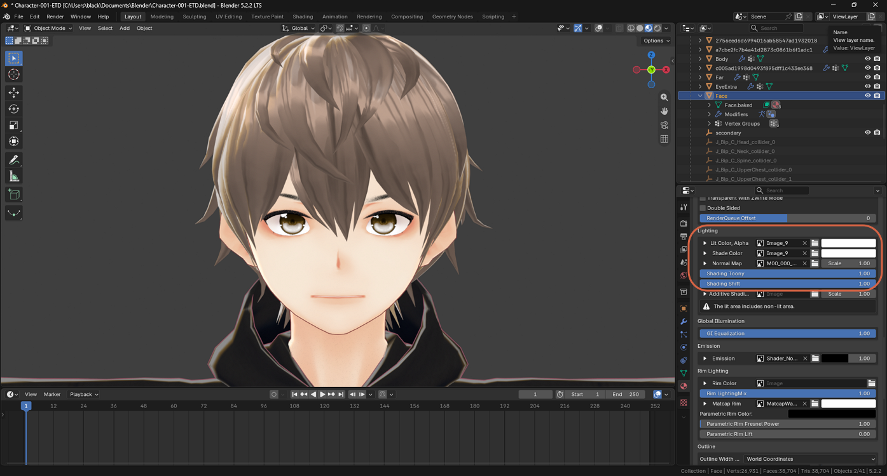

# Adjusting MToon Shading for a Hard Cel-Shaded Look

> **Note:** This document was generated by Claude Code and has not been reviewed by a human. Please use it as a reference only.

A VRM or VRoid model's soft, watercolor-like shading comes from its **MToon** material settings, not its texture. Adjusting a few Lighting properties can push it toward a harder, anime cel-shaded look before you touch the texture at all.

## Adjust the Lighting Settings

In the material's Properties panel, under **VRM Material** → **Lighting**:

- **Shading Toony** — raise to about **0.9–1.0** for a clean, sharp shadow edge instead of a soft, blurry transition.
- **Shading Shift** — moves where the shadow line falls; try values between **-0.3** and **0.1**.
- **Shade Color** — set it to a clearly darker, more saturated tone (for skin, a warm pinkish-orange) rather than plain darker gray. Anime shadows read as a distinct color, not just a darker version of the base color.
- **GI Equalization** — raise toward **1.0** for flatter, more even lighting.

> **Note:** Repeat this for the hair, clothes, and body materials, not just the face. This step alone can get a model most of the way to a cel-shaded look, before any texture painting — see [Repainting a Texture with Flat Anime Colors](../gimp/repaint-flat-anime-colors.md) for the next step.
