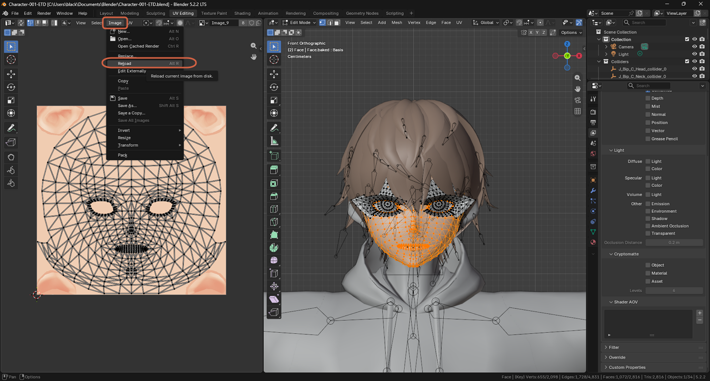
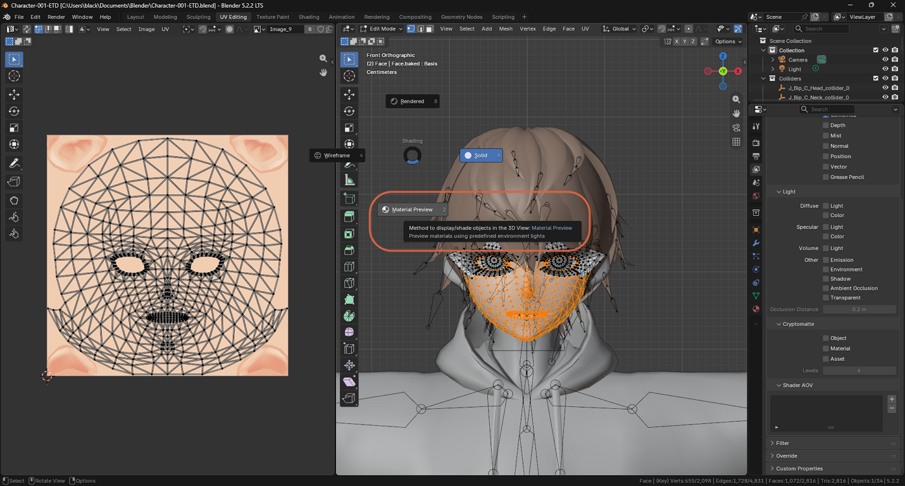
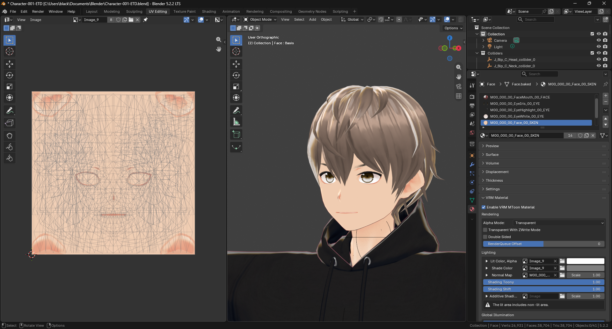
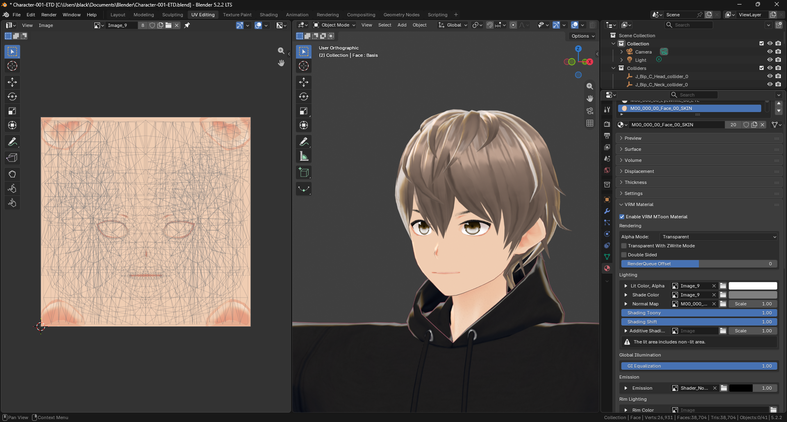

# Adjusting MToon Shading for a Hard Cel-Shaded Look

> **Note:** This document was generated by Claude Code and has not been reviewed by a human. Please use it as a reference only.

A VRM or VRoid model's soft, watercolor-like shading comes from its **MToon** material settings, not its texture. Adjusting a few Lighting properties can push it toward a harder, anime cel-shaded look before you touch the texture at all.

## Step 1: Reload the Texture and Preview Shading

After [repainting the texture](../gimp/repaint-flat-anime-colors.md) and re-exporting it, reload it in Blender to see the change:

1. In the Image Editor, with the texture image (for example `Image_9`) shown, open the **Image** menu and select **Reload** (`Alt+R`).
2. Switch the 3D viewport's shading mode to **Material Preview** (`Z`, then choose **Material Preview** from the pie menu) to see the model rendered with MToon shading instead of flat Solid shading.

## Step 2: Adjust the Lighting Settings

In the material's Properties panel, under **VRM Material** → **Lighting**:

- **Shading Toony** — raise to about **0.9–1.0** for a clean, sharp shadow edge instead of a soft, blurry transition.
- **Shading Shift** — moves where the shadow boundary falls. At **1.0**, the entire face counts as lit and no shadow appears at all — a useful flat, fully-lit reference point. To bring back anime-style shadows (under the hair, along the jaw, on the neck), lower it gradually toward **0–0.3** until shadow shapes appear.
- **Shade Color** — set it to a clearly darker, more saturated tone (for skin, a warm pinkish-orange) rather than plain gray. Gray shadows on skin tend to look dirty rather than anime-like.
- **GI Equalization** — raise toward **1.0** for flatter, more even lighting from all directions.

With a flat, repainted texture and **Shading Toony**, **Shading Shift**, and **GI Equalization** all raised to **1.0**, the face renders fully lit with no shadow at all — a clean cel look, and a good starting point before dialing shadows back in.

> **Note:** At high **Shading Shift** values, Blender shows a **"The lit area includes non-lit area"** warning under Lighting. This is informational, not an error — it's just describing the fully-lit state above.

> **Note:** Repeat this for the hair, clothes, and body materials, not just the face, so the neck and hands match.
