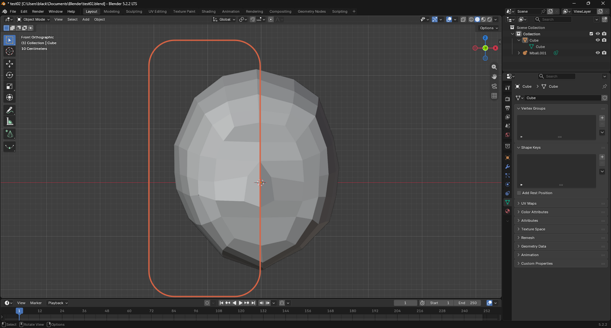
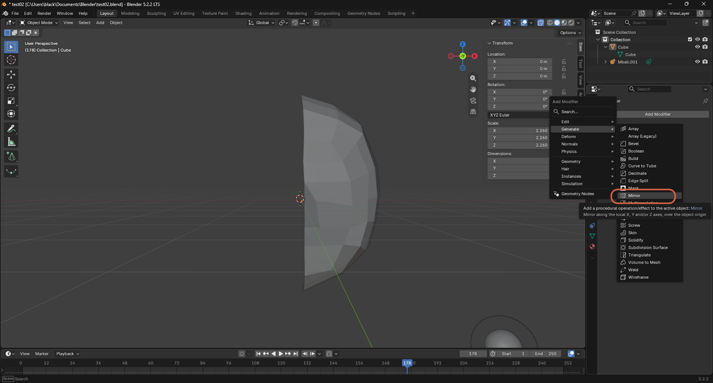
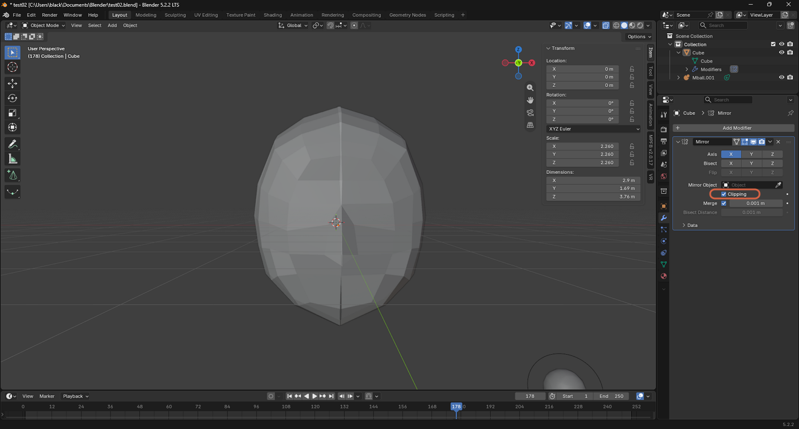
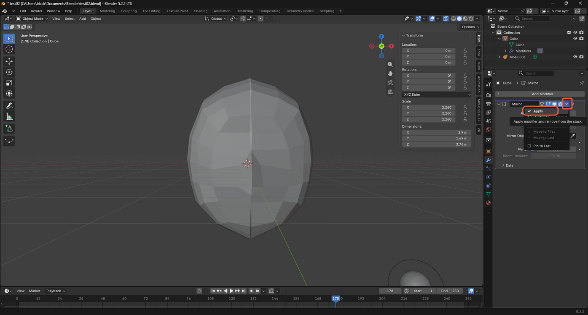

# Applying a Mirror Modifier

> **Note:** This document was generated by Claude Code and has not been reviewed by a human. Please use it as a reference only.

A **Mirror** modifier duplicates one half of a mesh across an axis, so both halves stay symmetric while you edit only one side — non-destructively until you apply it.

## Step 1: Identify the Side to Keep

Before adding the modifier, decide which half of the mesh to keep — the other half will be replaced by its mirror image.

## Step 2: Add a Mirror Modifier

Select **Generate** → **Mirror**.

## Step 3: Enable Clipping

With the modifier added, check **Clipping** to keep vertices near the center from crossing to the other side, so the seam between the two halves stays welded as you edit.

## Step 4: Apply the Modifier

Click the modifier's dropdown menu, then select **Apply** to bake the mirrored geometry into the mesh permanently.

