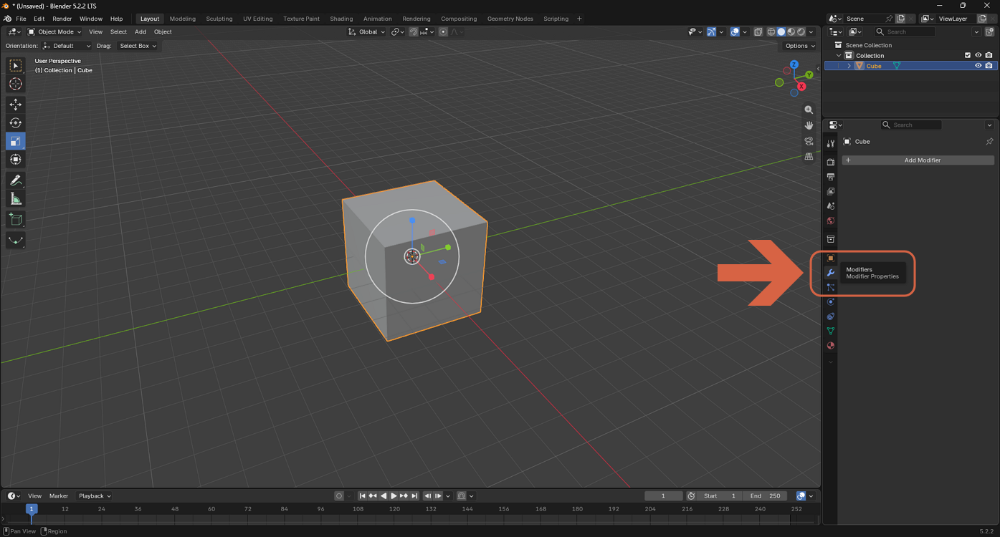
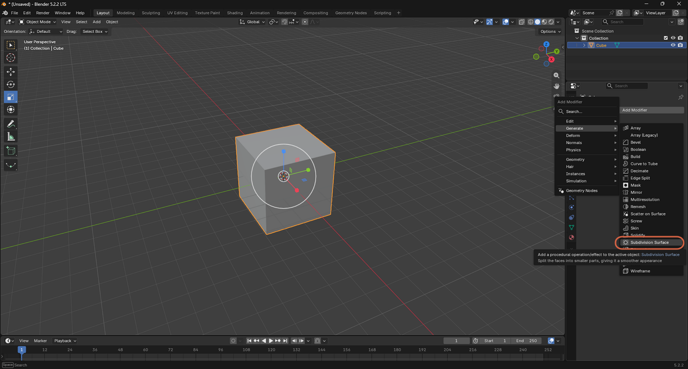
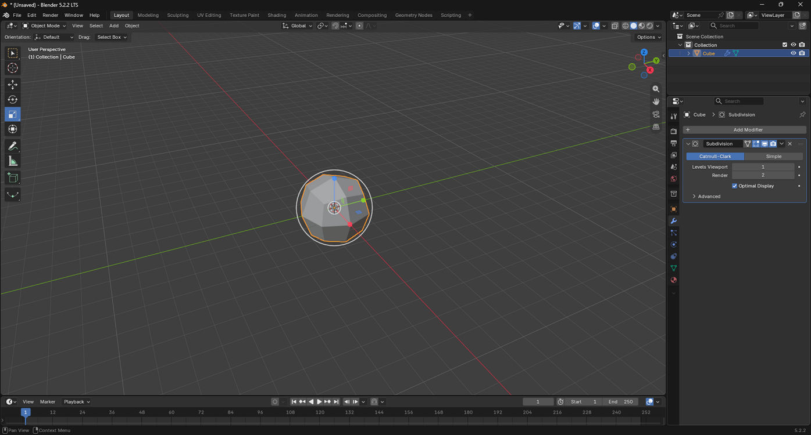
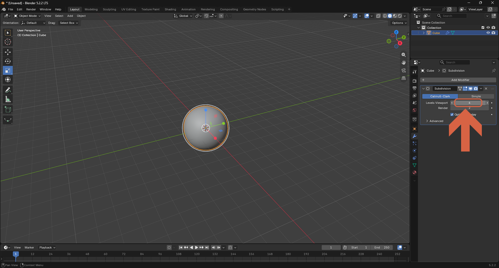
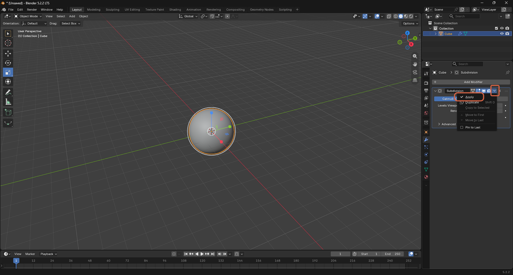
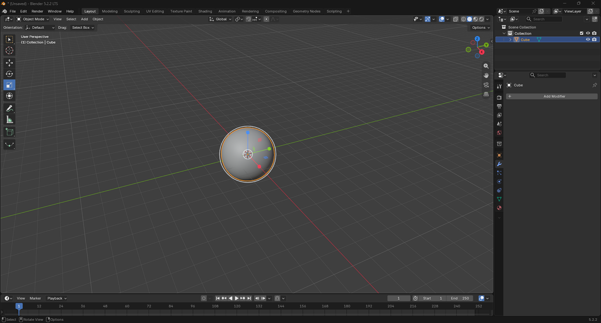

# Applying a Subdivision Surface Modifier

> **Note:** This document was generated by Claude Code and has not been reviewed by a human. Please use it as a reference only.

A **Subdivision Surface** modifier splits an object's faces into smaller parts, rounding its shape into a smoother surface — non-destructively until you apply it.

## Step 1: Open the Modifier Properties Tab

Select the object, click the **wrench** icon (**Modifier Properties**), then click **Add Modifier**.

## Step 2: Add a Subdivision Surface Modifier

Select **Generate** → **Subdivision Surface**.

## Step 3: Review the Default Smoothing

With the modifier's default settings, the cube's edges are already noticeably smoother.

## Step 4: Increase the Subdivision Level

Raise **Levels Viewport** for a smoother result — here, from `1` to `6`, turning the cube into a near-perfect sphere.

## Step 5: Apply the Modifier

Click the modifier's dropdown menu, then select **Apply** to bake the smoothed shape into the mesh permanently.

The modifier stack is now empty, and the smoothed shape is the object's actual geometry.

> **Note:** A high subdivision level multiplies the mesh's vertex count. Applying it adds all those vertices to the object permanently, which can slow down further edits — consider whether you need it applied, or can leave it non-destructive in the modifier stack instead.
