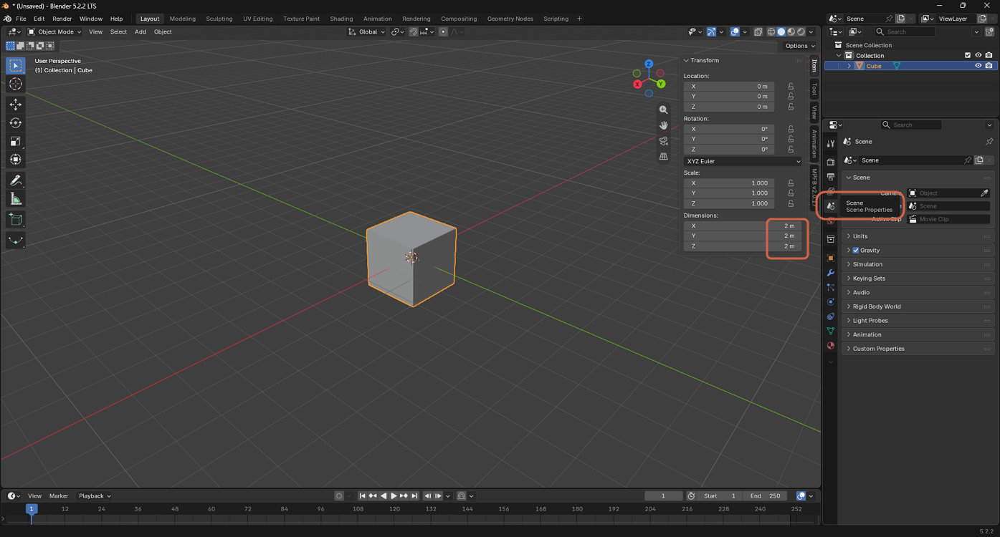
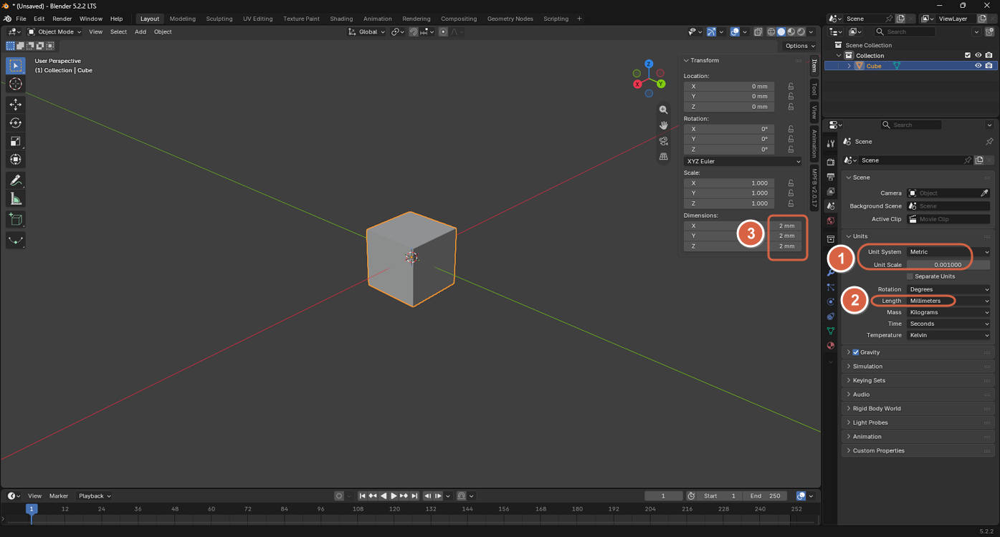
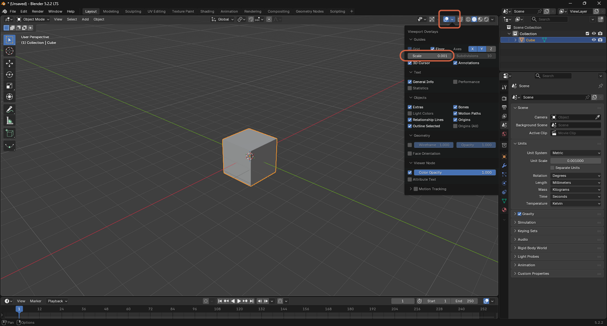

# Changing the Unit from Meters to Millimeters

> **Note:** This document was generated by Claude Code and has not been reviewed by a human. Please use it as a reference only.

Blender measures scenes in meters by default. For precision work such as product design or 3D printing, switch the scene unit to millimeters.

> **Note:** See [this video](https://youtu.be/8_0RptMbhe0?si=CqSJPeMNZCWuLqA6) for a demonstration.

## Step 1: Open Scene Properties

In the Properties editor, click the **Scene Properties** tab.

## Step 2: Set the Unit System to Millimeters

Under **Units**:

1. Set **Unit System** to **Metric**, with **Unit Scale** at `0.001`.
2. Set **Length** to **Millimeters**.

> **Note:** Setting **Unit Scale** to `0.001` keeps 1 Blender unit equal to 1 millimeter instead of 1 meter, so existing objects keep their size — only the displayed measurements change.

## Step 3: Match the Viewport Grid Scale

Open **Viewport Overlays** from the header, then under **Guides** set **Scale** to `0.001`.

This keeps the viewport grid spacing consistent with the new millimeter unit.
