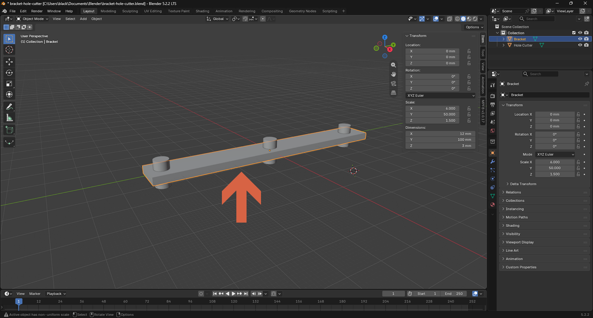
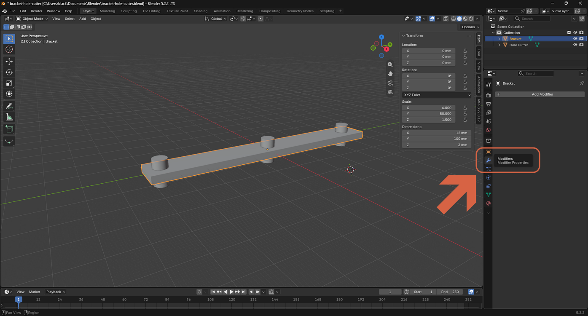
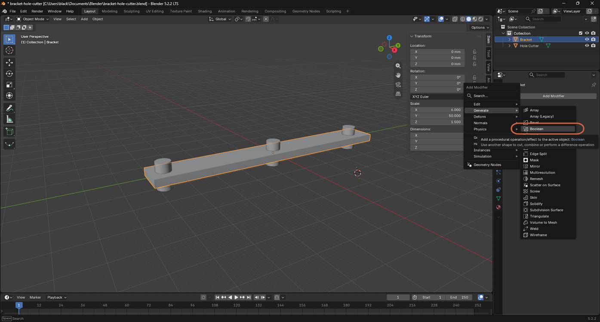
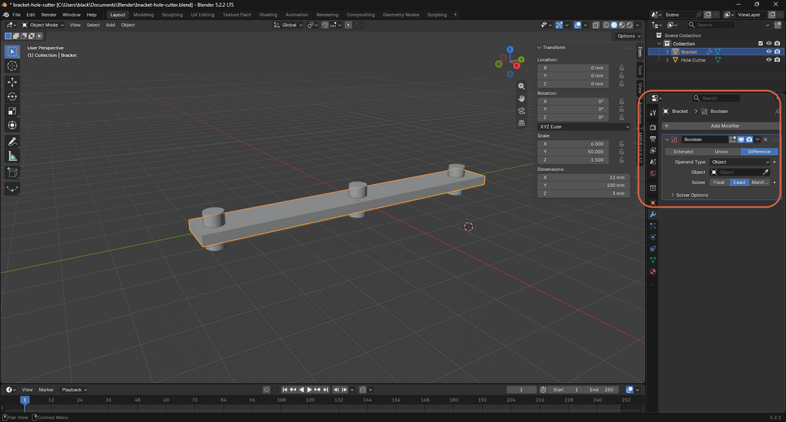
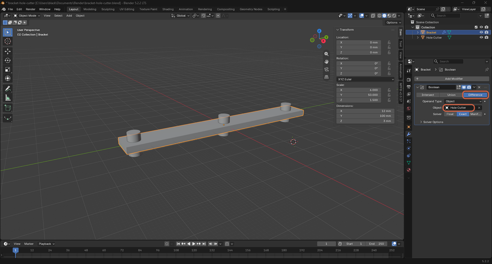
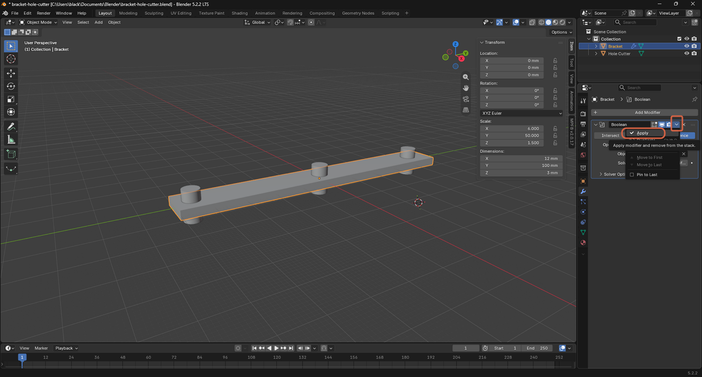
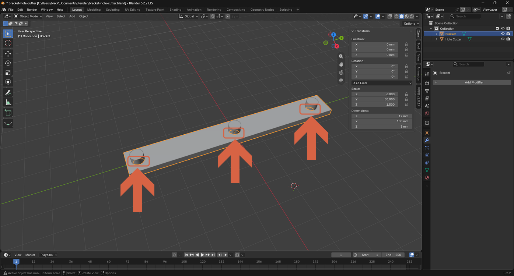
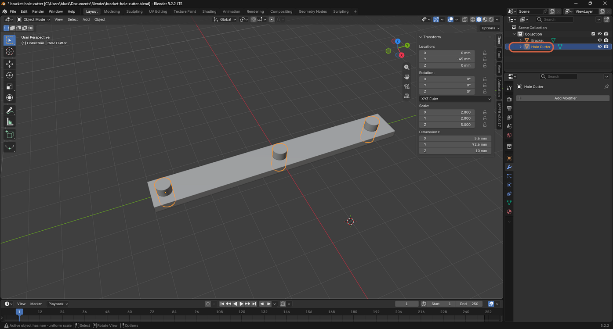
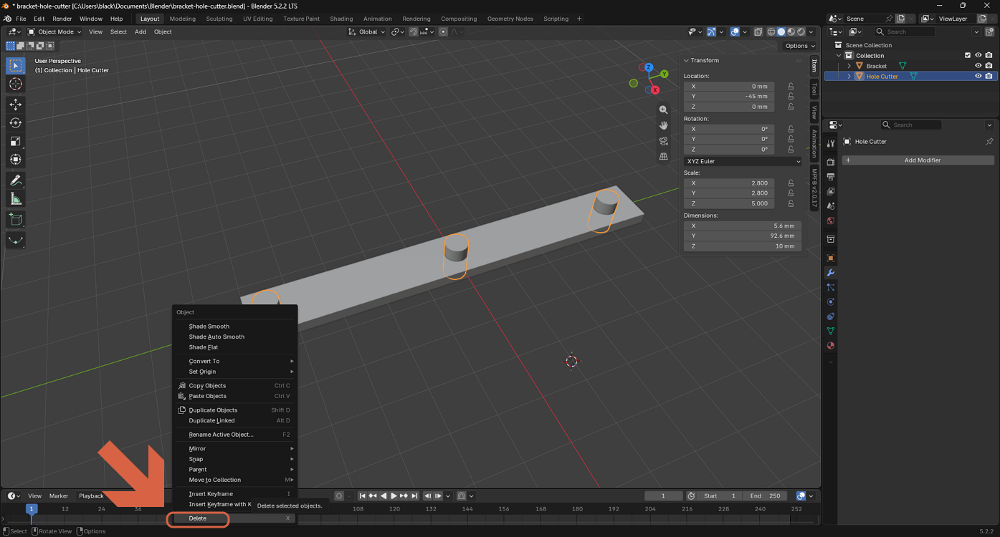
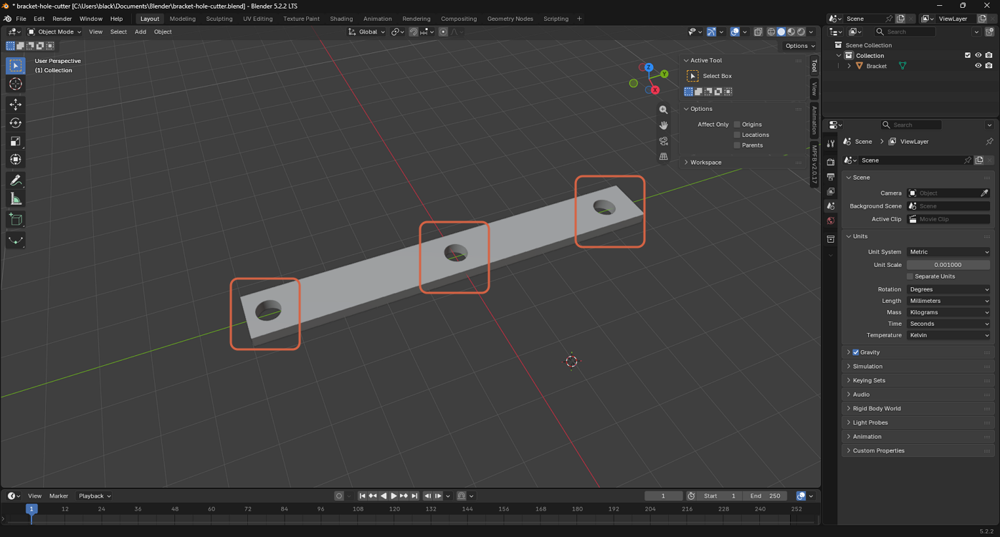

# Cutting a Hole with a Boolean Modifier

> **Note:** This document was generated by Claude Code and has not been reviewed by a human. Please use it as a reference only.

A **Boolean** modifier set to **Difference** cuts one object's shape out of another, non-destructively until you apply it. This follows on from [Adding and Naming a Cylinder](add-and-name-cylinder.md), [Duplicating and Positioning an Object](duplicate-and-position-object.md), and [Joining Multiple Objects](join-multiple-objects.md), which prepare the **Hole Cutter** object used here.

## Step 1: Select the Object to Cut

Select the object the hole will be cut into — here, **Bracket**.

## Step 2: Open the Modifier Properties Tab

In the Properties panel, click the **wrench** icon (**Modifier Properties**), then click **Add Modifier**.

## Step 3: Add a Boolean Modifier

Select **Generate** → **Boolean**.

## Step 4: Set the Operand Object

The modifier defaults to **Difference**, which subtracts the other object's shape. Set its **Object** field to **Hole Cutter** — the object that will be subtracted.

## Step 5: Apply the Modifier

Click the modifier's dropdown menu, then select **Apply** to bake the cut into the Bracket's mesh.

The three holes now appear where each Hole Cutter cylinder intersected the bracket.

## Step 6: Delete the Hole Cutter Object

The Hole Cutter object is no longer needed once the modifier is applied.

Right-click it, then select **Delete**.

## Result

