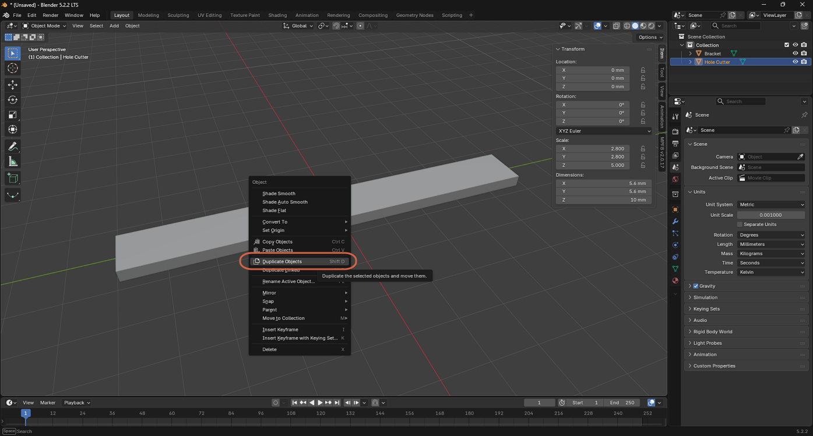
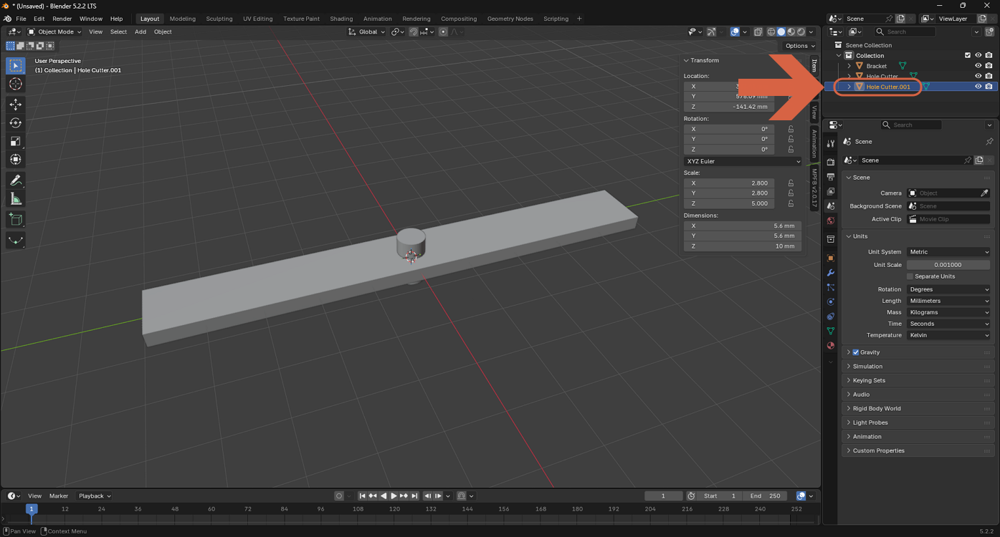
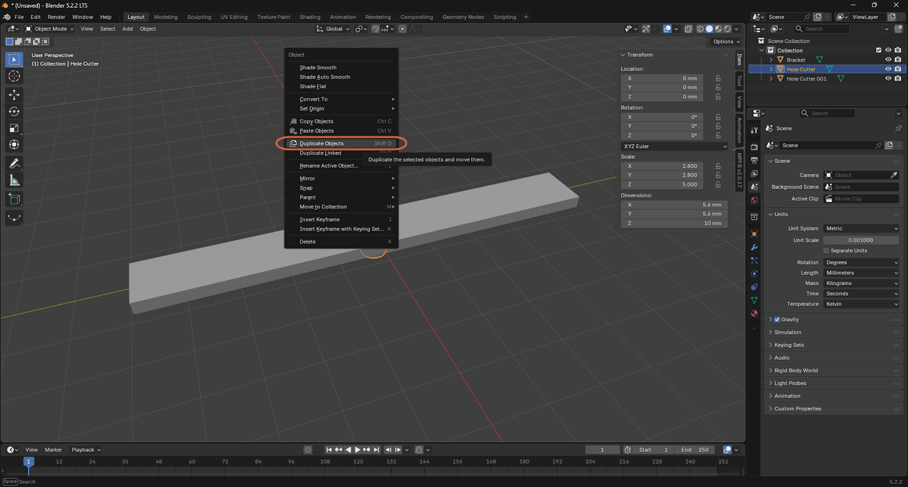
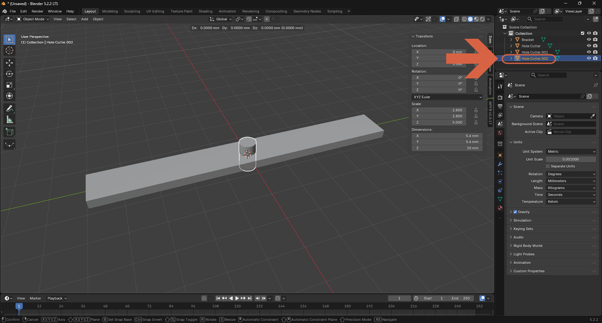
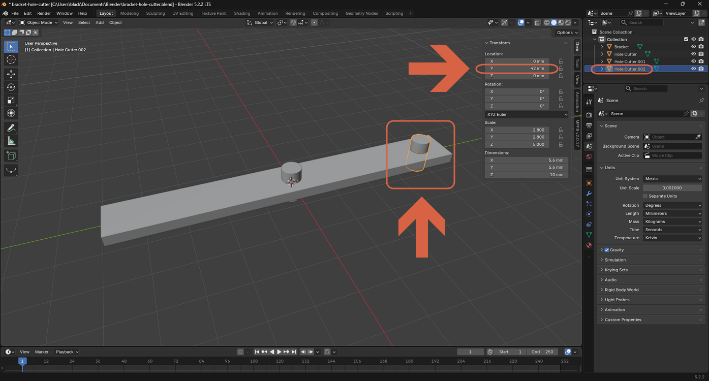
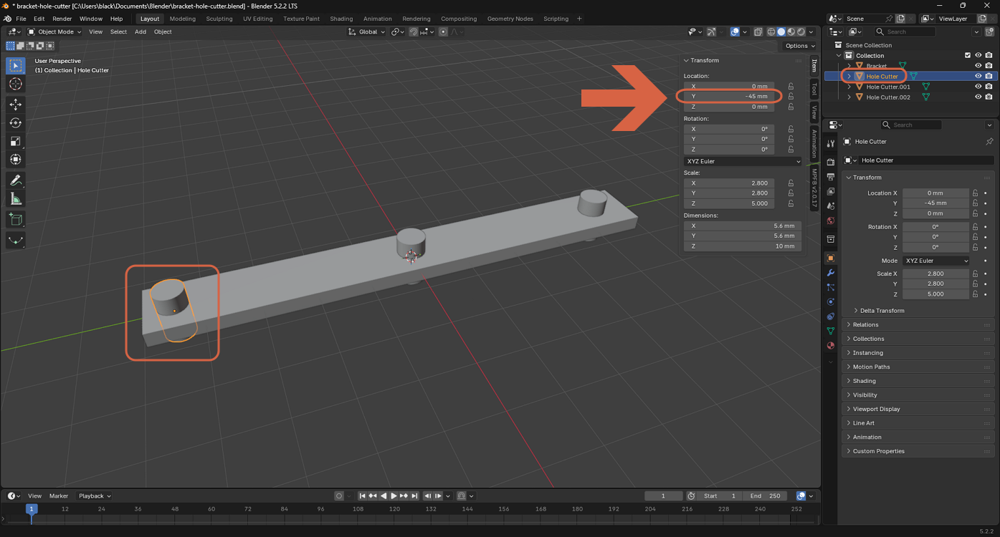

# Duplicating and Positioning an Object

> **Note:** This document was generated by Claude Code and has not been reviewed by a human. Please use it as a reference only.

Duplicating an object in Blender immediately starts moving the copy with your mouse. Confirming that move carelessly can drop the duplicate far from where you wanted it — typing an exact value into **Location** afterward is the precise way to place it.

## Step 1: Duplicate the Object

Right-click the object in the viewport, then select **Duplicate Objects** (or press `Shift+D`).

> **Warning:** After duplicating, the copy follows your mouse until you confirm the move. Clicking anywhere before positioning it — for example, to check the Outliner — drops the duplicate wherever the mouse happened to be, as shown below: the new **Hole Cutter.001** landed hundreds of millimeters from the original.

## Step 2: Cancel the Move to Keep the Duplicate in Place

Duplicate the object again. This time, right-click (or press `Esc`) immediately after — while the move is still at a zero offset — to cancel it and drop the copy exactly on top of the original instead of following the mouse.

## Step 3: Position the Duplicate Precisely

In the Properties panel's Transform section (or the viewport sidebar's N-panel), type an exact value into **Location** — for example, `Y = 42 mm` — to move the duplicate to a specific spot rather than dragging it by eye.

You can reposition the original object the same way. Here, the original **Hole Cutter** was moved to `Y = -45 mm`, giving the bracket three distinct hole positions.

