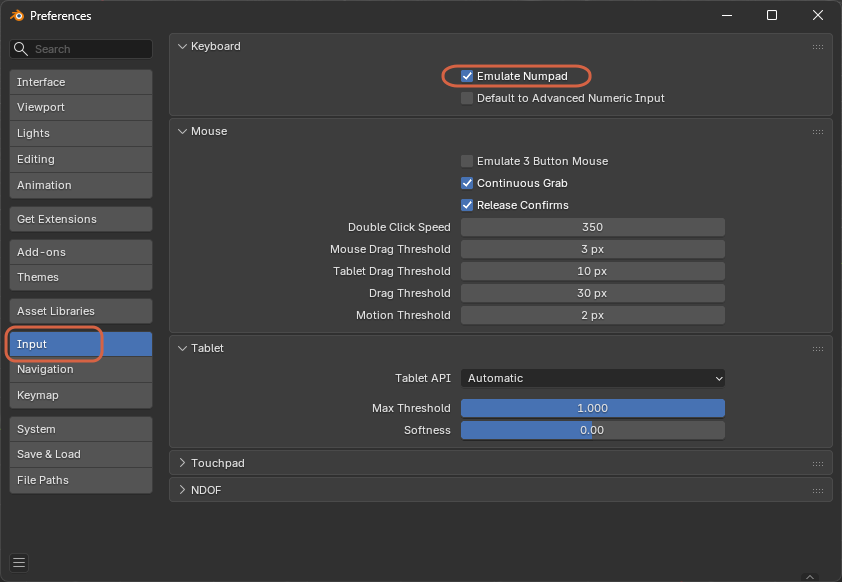

# Using Number Keys as a Numpad

> **Note:** This document was generated by Claude Code and has not been reviewed by a human. Please use it as a reference only.

Laptops often lack a dedicated numpad, which Blender uses for several view shortcuts (like `Numpad 7` for Top view). **Emulate Numpad** lets the number row at the top of the keyboard act as the numpad instead.

## Enable Emulate Numpad

Go to **Edit** → **Preferences** → **Input**, then check **Emulate Numpad** under **Keyboard**.

> **Note:** With this enabled, pressing `1` acts as `Numpad 1` (Front view), `7` as `Numpad 7` (Top view), and so on — see [Switching to Top View](switch-to-top-view.md).
