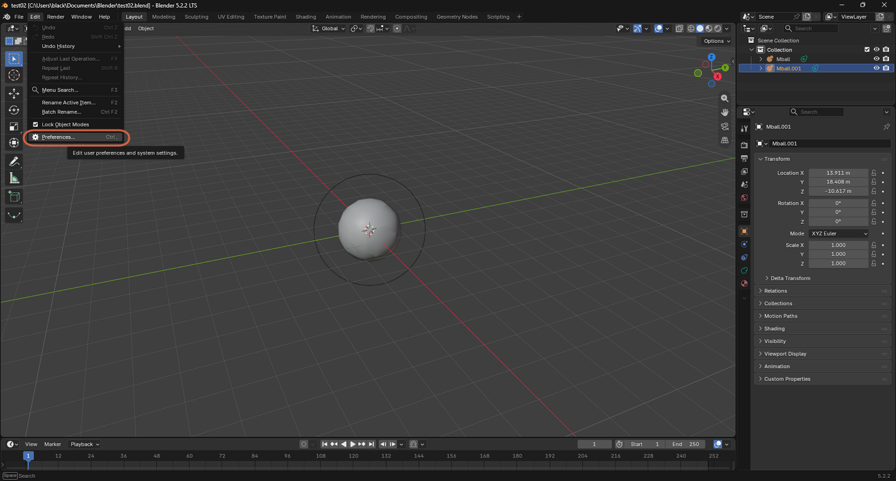
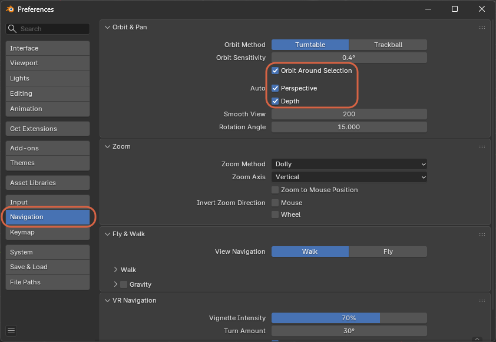

# Enabling Auto Navigation Settings

> **Note:** This document was generated by Claude Code and has not been reviewed by a human. Please use it as a reference only.

Blender's **Navigation** preferences include three **Auto** options that make orbiting and zooming adapt to what's on screen, instead of always pivoting around the same fixed point.

## Step 1: Open Navigation Preferences

Go to **Edit** → **Preferences**, then click **Navigation** in the sidebar.

## Step 2: Enable the Auto Settings

Under **Orbit & Pan** → **Auto**, check:

- **Orbit Around Selection** — orbiting pivots around the selected object instead of the view center.
- **Perspective** — automatically switches to Orthographic when you snap to an axis-aligned view (like Top or Front), and back to Perspective otherwise.
- **Depth** — scroll-wheel zoom moves toward the point under your cursor instead of always toward the view center.

