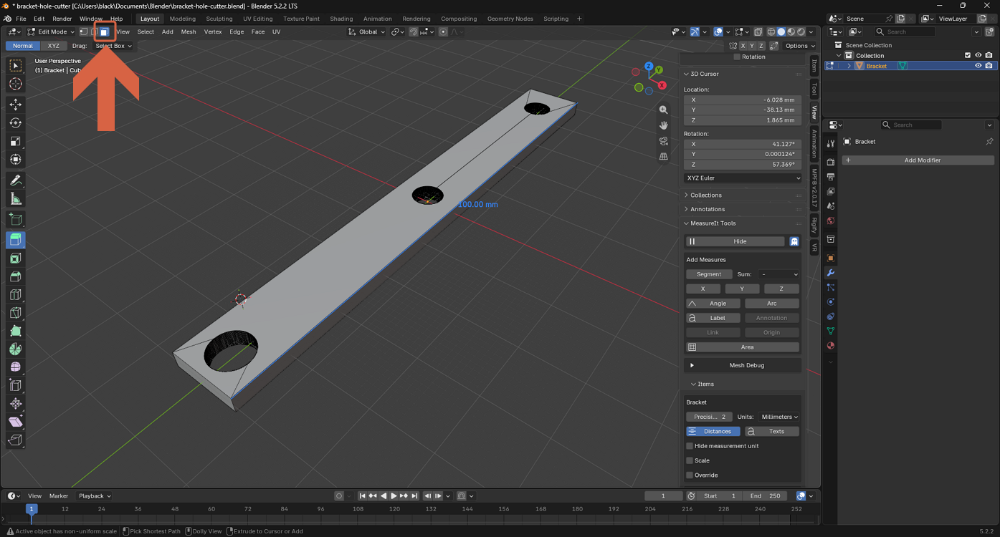
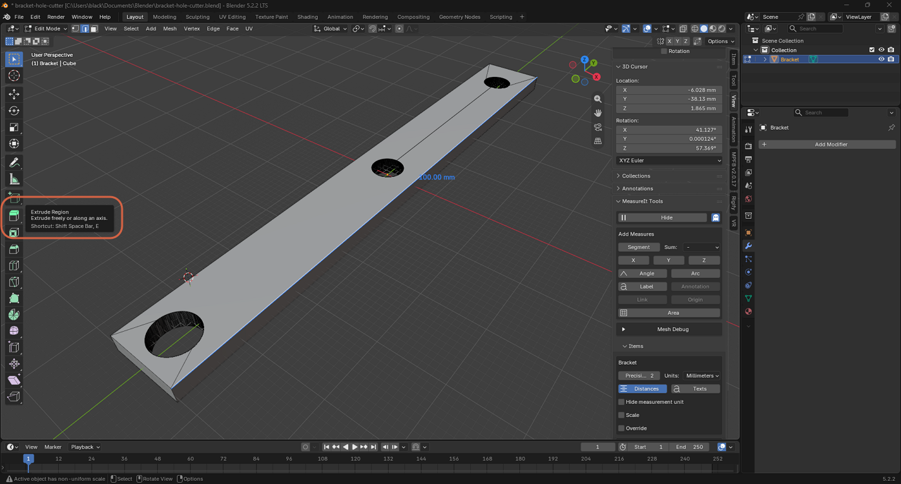
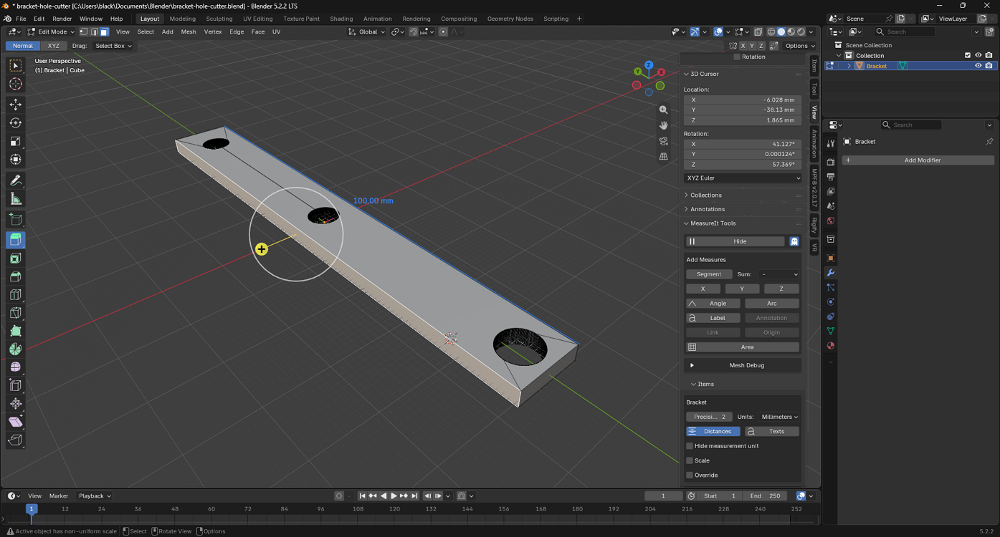
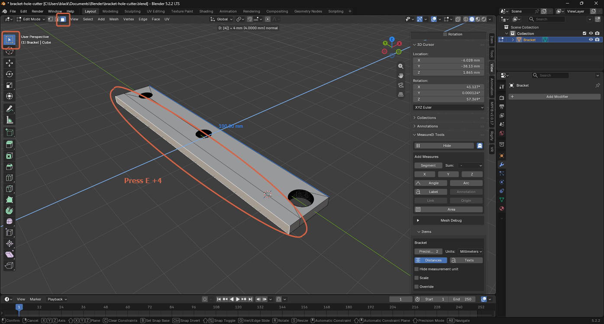
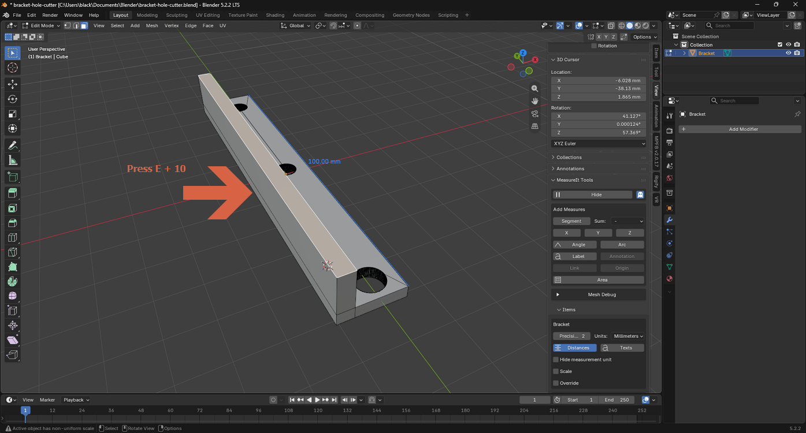

# Extruding a Face

> **Note:** This document was generated by Claude Code and has not been reviewed by a human. Please use it as a reference only.

Extrude adds new geometry by pushing a copy of the selected face outward (or inward) along its normal, connecting it to the original with new side faces.

## Step 1: Select the Face

With the **Select** tool active, switch to **Face Select** mode and click the face you want to extrude.

## Step 2: Choose the Extrude Region Tool

Click **Extrude Region** in the toolbar (or press `E`).

A gizmo appears on the selected face.

## Step 3: Set an Exact Distance

Type a number to extrude a precise distance along the face's normal, then press `Enter` (or click) to confirm.

## Result

Once confirmed, the extruded face becomes permanent new geometry — here, the top of the bracket after extruding it 10 mm.

