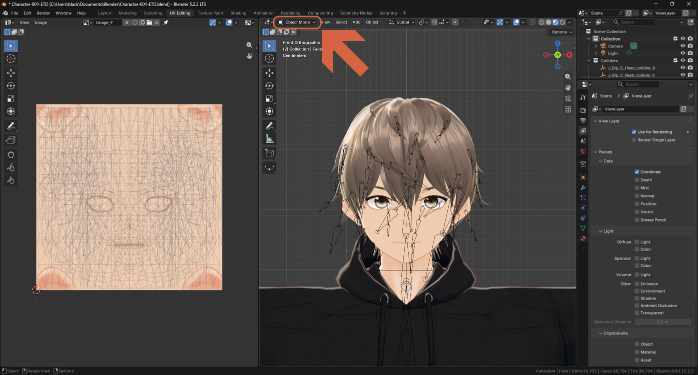
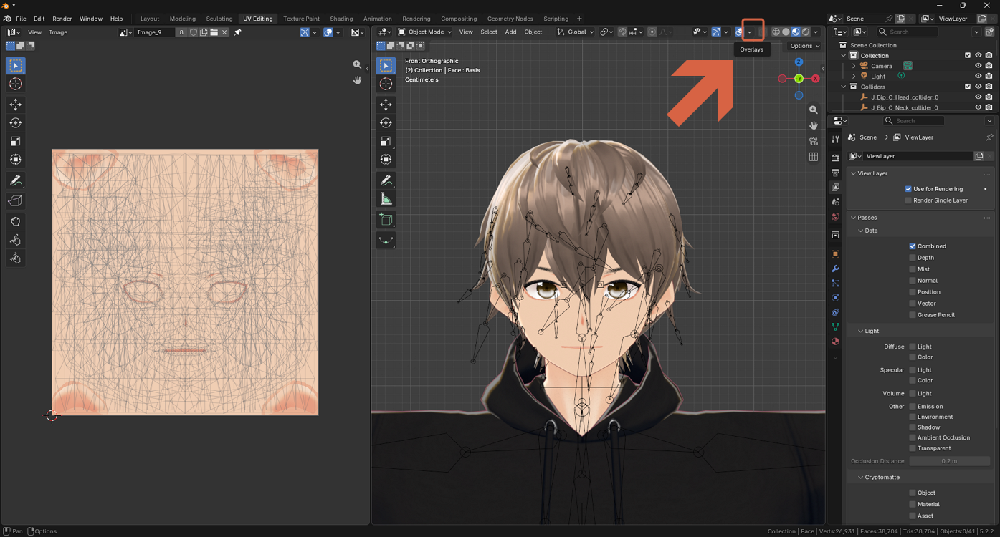
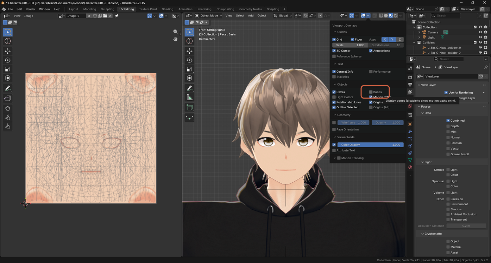
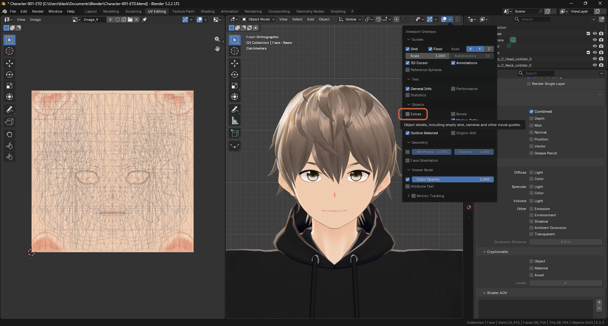
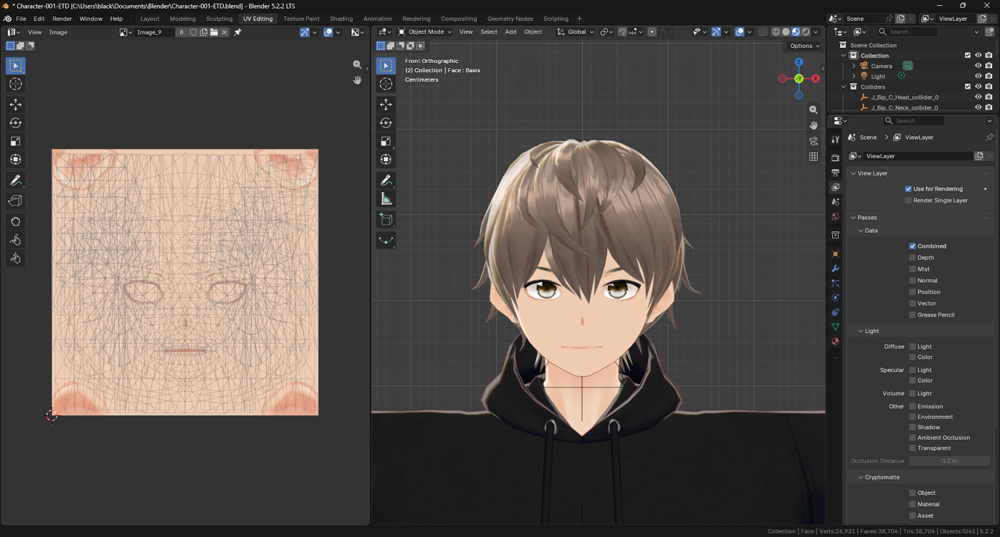

# Hiding Viewport Overlays

> **Note:** This document was generated by Claude Code and has not been reviewed by a human. Please use it as a reference only.

Vertices, edges, bones, and collider shapes can clutter the viewport when you just want to see how a model actually looks. Each viewport keeps its own overlay settings, so hiding them in one workspace doesn't hide them everywhere.

## Hide Vertices and Edges

Hover over the 3D viewport and press `Tab` to switch from Edit Mode to Object Mode. The orange vertices and edges disappear.

## Hide Bones and Colliders

1. In the 3D viewport header, click the small arrow next to the **Overlays** icon (the two overlapping circles).
2. Uncheck **Bones**. Uncheck **Extras** too if collider circles are still showing.

## Hide Everything at Once

Click the **Overlays** icon itself, or press `Shift+Alt+Z`, to toggle every overlay — bones, vertices, edges, the grid, and everything else — off in one go. Press it again to bring them all back.

> **Note:** The Image Editor panel has its own separate Overlays icon. Faint gray lines still visible there are a UV wireframe display overlay, not part of the actual texture — check whether the model itself looks clean before assuming the texture has a problem. See [Reducing the UV Wireframe in the Image Editor](reduce-uv-wireframe-image-editor.md) for how to hide or dim them.
