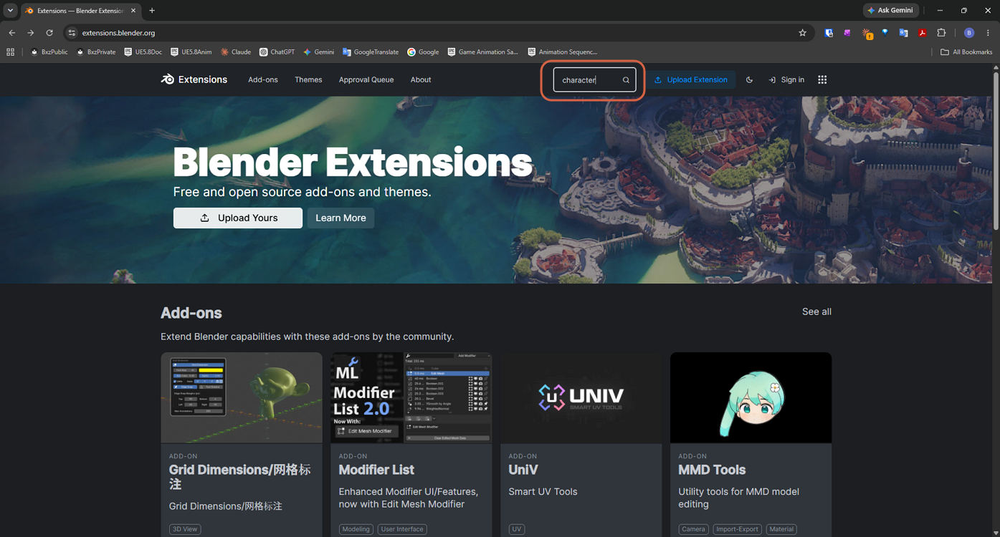
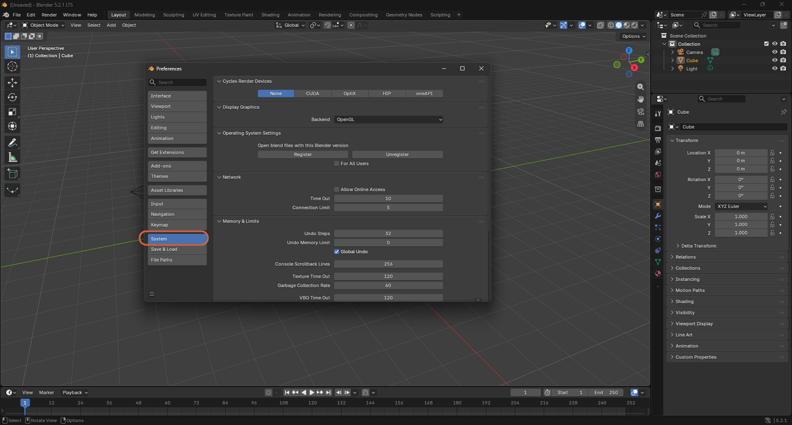
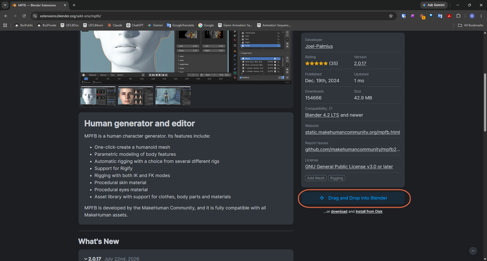
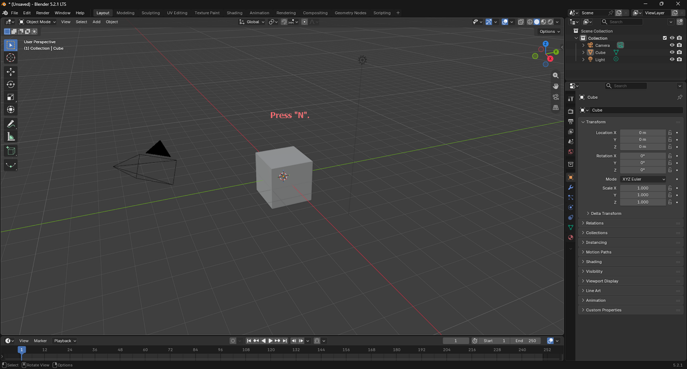
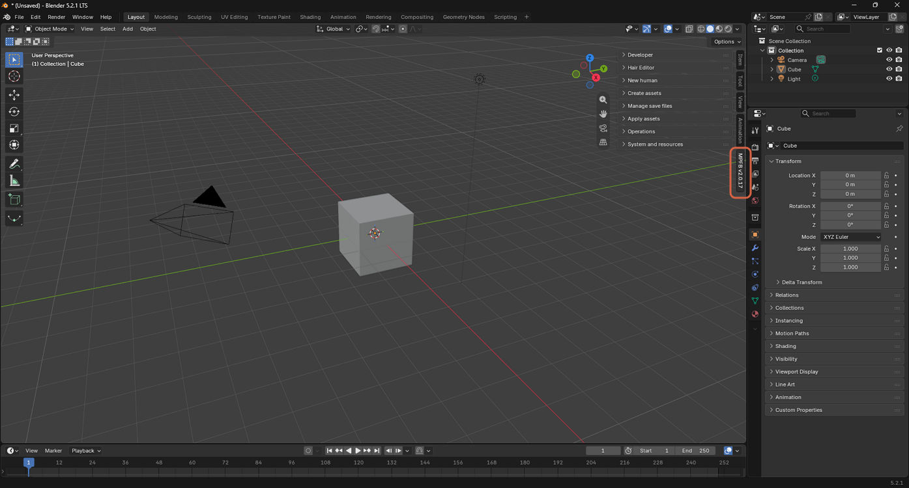

# Installing the MPFB Add-on

> **Note:** This document was generated by Claude Code and has not been reviewed by a human. Please use it as a reference only.

**MPFB** (MakeHuman ProceduralFace/Body) is a human character generator and editor add-on for Blender, developed by the MakeHuman Community. It one-click creates a humanoid mesh with parametric body modeling, automatic rigging (including Rigify, with both IK and FK modes), and procedural skin and eye materials.

## Step 1: Find MPFB on Blender Extensions

Go to [extensions.blender.org](https://extensions.blender.org) and search for `character`.

## Step 2: Get the Add-on

Open the **MPFB** listing, then drag the **Get Add-on** button from the browser and drop it onto the Blender editor window.

## Step 3: Enable Online Access

Blender shows an **Install Extension** dialog reading "Please enable Online Access from the System settings." Click **Allow Online Access**.

This opens **Preferences** → **System**, where **Allow Online Access** is unchecked by default.

Check **Allow Online Access**, then close the Preferences window.

## Step 4: Install the Add-on

Back on the MPFB page, the button now reads **Drag and Drop into Blender** instead of **Get Add-on**. Drag it onto the Blender editor window again the same way.

Blender shows a confirmation dialog naming the add-on, its repository, and its size, with **Enable Add-on** checked. Click **OK**.

## Step 5: Confirm the Add-on Is Installed

In the 3D viewport, press `N` to open the sidebar.

An **MPFB** tab appears among the sidebar's vertical tabs, confirming the add-on installed successfully.

