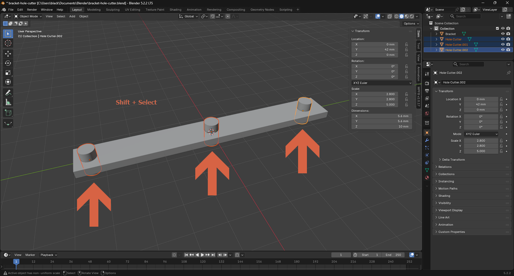
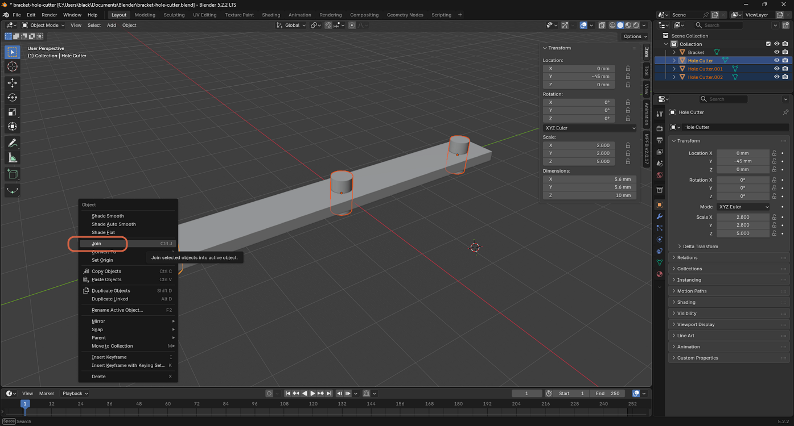
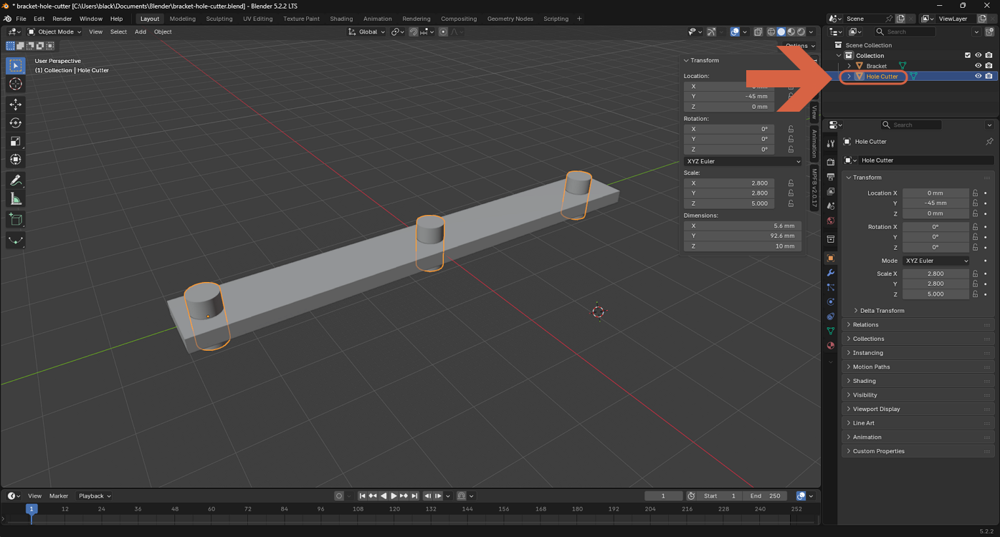

# Joining Multiple Objects

> **Note:** This document was generated by Claude Code and has not been reviewed by a human. Please use it as a reference only.

> **Note:** See [this video](https://youtu.be/8_0RptMbhe0?si=lq3f7VX-mt7znVUY) for a demonstration.

## Step 1: Select the Objects

Click one object, then hold `Shift` and click each additional object to add it to the selection. The last object you click becomes the **active** object, shown with a lighter outline.

## Step 2: Join Them

Right-click in the viewport, then select **Join** (or press `Ctrl+J`).

## Step 3: Confirm the Result

The selected objects merge into a single object, keeping the active object's name. Here, three separate **Hole Cutter** cylinders became one **Hole Cutter** object, now spanning all three positions.

