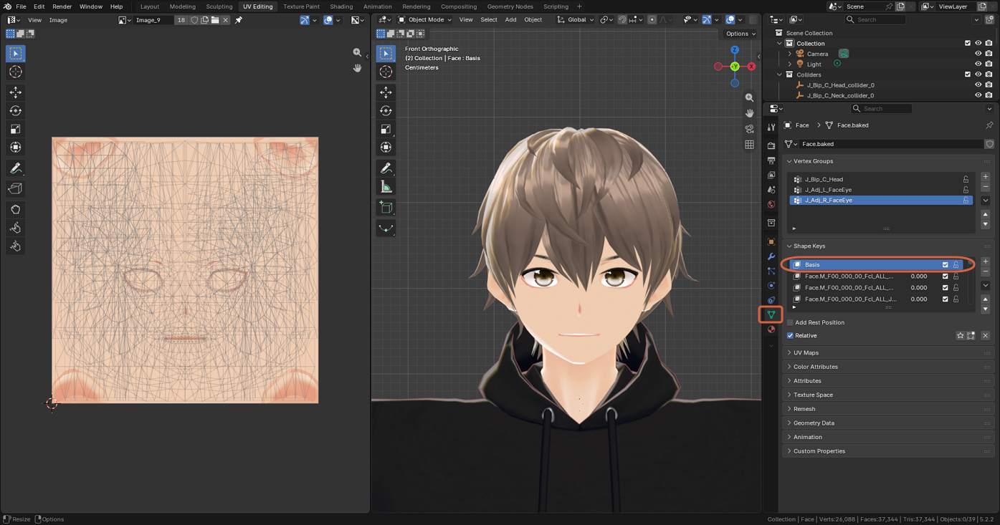
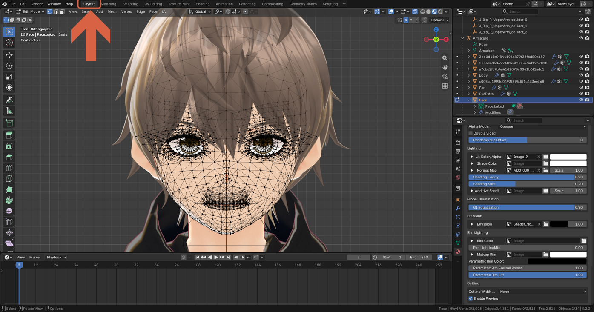
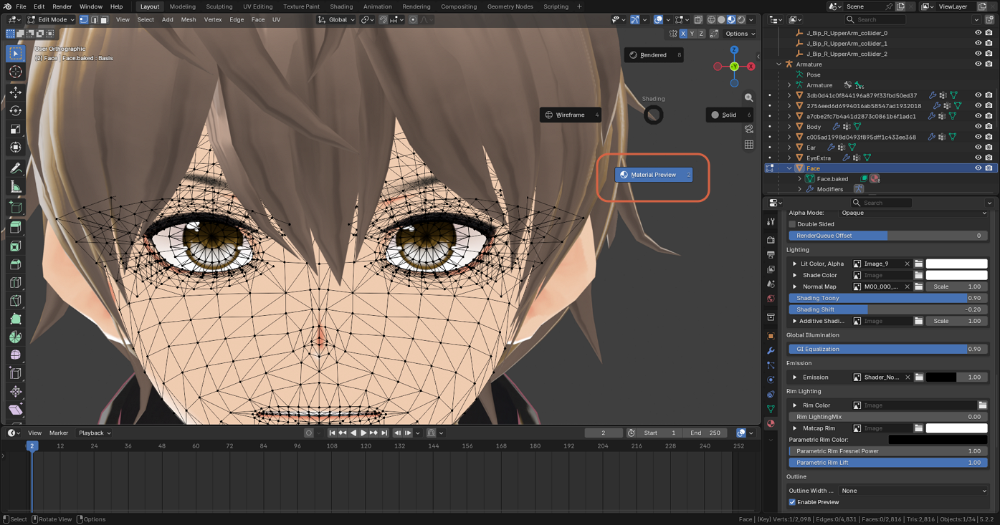
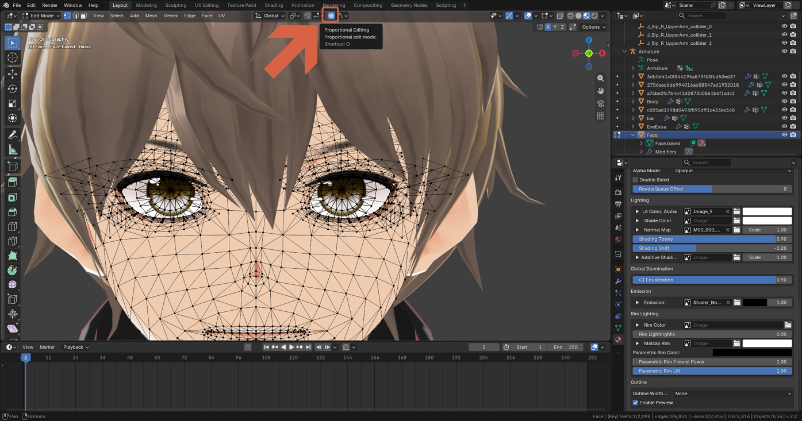
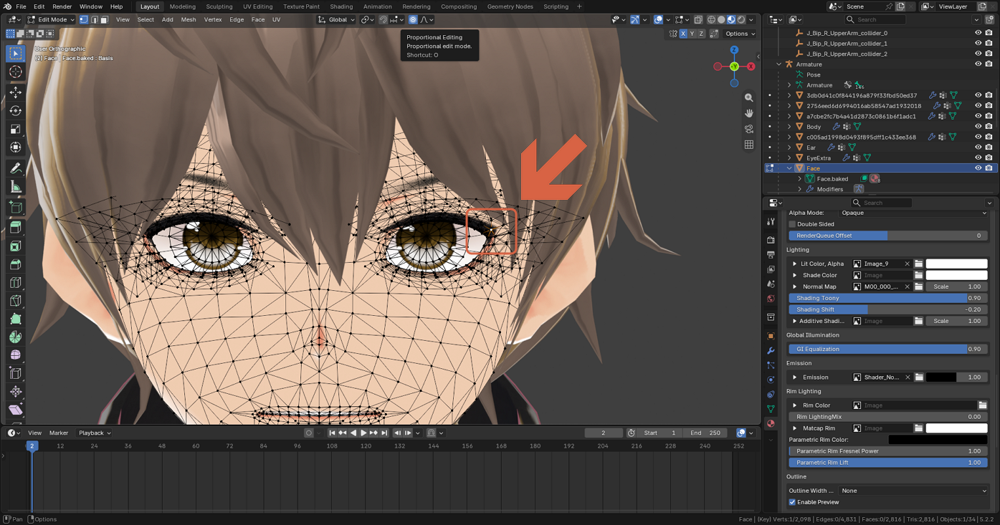
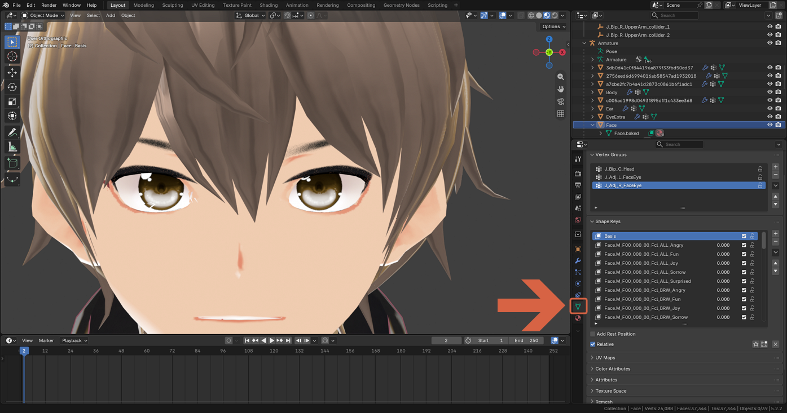
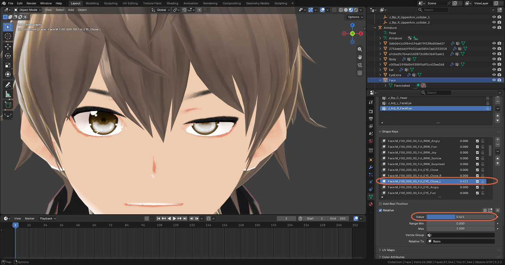
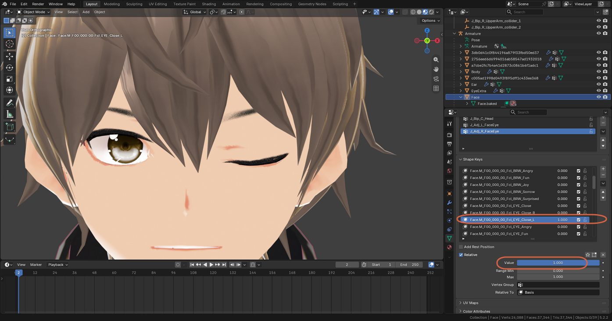

# Lifting the Outer Corners of the Eyes

> **Note:** This document was generated by Claude Code and has not been reviewed by a human. Please use it as a reference only.

Slightly raising the outer corners of the eyes makes a face look sharper and stronger. In Edit Mode, **Proportional Editing** moves the selected vertex together with a soft-falloff area around it, so the change blends into the surrounding mesh instead of leaving a sharp point.

## Step 1: Select the Basis Shape Key

Open the **Object Data** tab (green triangle) → **Shape Keys**, and select **Basis**. This makes your edits go into the base shape rather than into a blink or expression shape key.

## Step 2: Enter Edit Mode Close to the Eyes

Switch to the **Layout** workspace, press `Tab` to enter Edit Mode, then press `Numpad 1` for Front Orthographic view (see [Using Number Keys as a Numpad](emulate-numpad.md) if you have no numpad) and zoom in on the eyes.

Optionally, press `Z` and choose **Material Preview** to judge the result with the model's real shading.

## Step 3: Turn On Mirror Editing

In the viewport header, enable the **X** mirror toggle. Then open **Options** and check **Topology Mirror**, so the other eye moves symmetrically when both sides of the mesh have matching topology.

## Step 4: Turn On Proportional Editing

Click the **Proportional Editing** icon in the header, or press `O`.

## Step 5: Select the Outer Corner Vertex

Click the vertex at the outer corner of the eye. With mirror editing on, the opposite eye follows.

## Step 6: Move the Vertex Up

Press `G`, then `Z`, move up a little, and click to confirm.

> **Warning:** **Proportional Size** defaults to `1 m`. A head is only about 20 cm wide, so the influence circle covers the whole face and everything moves. Before you move much, change the size while watching the value in the header: scroll the mouse wheel, or press `Page Up` / `Page Down`. Bring it down to about `0.015 m` — you should then see a small circle around the eye corner. If the number goes the wrong way, use the other direction.

`Page Up` / `Page Down` are the easier option, because scrolling the wheel can shift the face before you've started dragging.

## Fine-Tune the Result

**Type a distance instead of dragging.** Select the vertex, press `G`, `Z`, type `0.003`, and press `Enter`. The vertex moves exactly 3 mm up, with no accidental movement from the mouse or pen.

**Use the Move panel.** After a move, open the small **> Move** panel at the bottom-left of the viewport and edit the values there, seeing the result instantly:

- **Proportional Size** — try `0.01`–`0.02`.
- **Move Z** — the lift amount. Try small values like `0.002`–`0.005` m.

To open the panel without moving anything, press `G`, then `Enter`. Blender remembers the proportional size, so the next move starts at your last value instead of `1 m`.

## Check the Result and Save

1. Press `Numpad 1` and zoom out to judge the overall face. A glance from a slight angle helps too.
2. Press `Tab` to return to Object Mode and open **Object Data** → **Shape Keys**.

    

3. Select a blink key (such as `Fcl_EYE_Close_L`) and drag its **Value** slider up, first partway and then to `1.0`, along with a couple of expressions. Make sure the eyelids still close cleanly, then set every value back to `0`.

    

    

4. Save with `Ctrl+S`, or save a new version of the file so you can compare with the original.

## Alternative: Sculpt Mode

Sculpt Mode can feel more natural than Edit Mode with a pen tablet — see [Using a Pen Tablet in Blender](use-pen-tablet.md). Switch to Sculpt Mode, choose the **Grab** brush, set a small radius, turn on X symmetry, and drag the outer corner upward like pushing clay. It works on the Basis shape key the same way, so save a copy first and check the blink shape keys afterward.
