# Measuring a Distance with MeasureIt

> **Note:** This document was generated by Claude Code and has not been reviewed by a human. Please use it as a reference only.

**MeasureIt** is a free Blender add-on that displays distance, angle, and area measurements directly in the viewport.

## Step 1: Open Preferences

Go to **Edit** → **Preferences**.

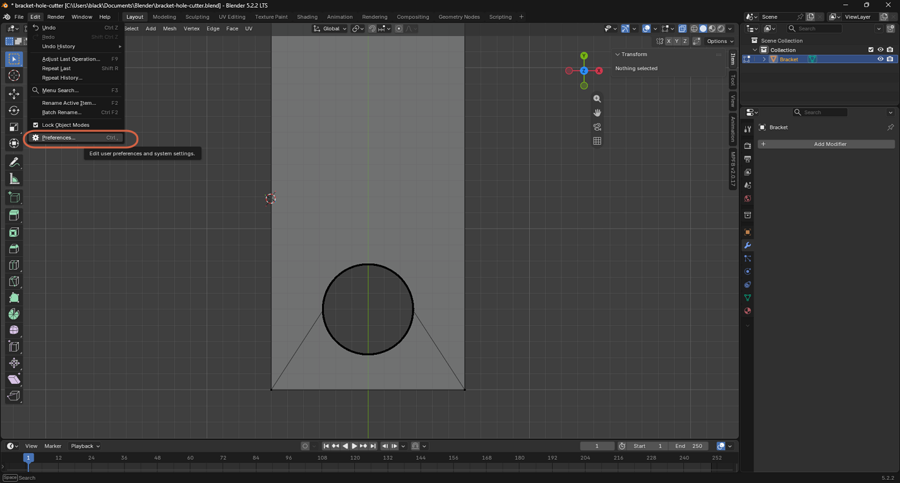

## Step 2: Search for MeasureIt

In Preferences, click **Get Extensions**, then search for `measureit`.

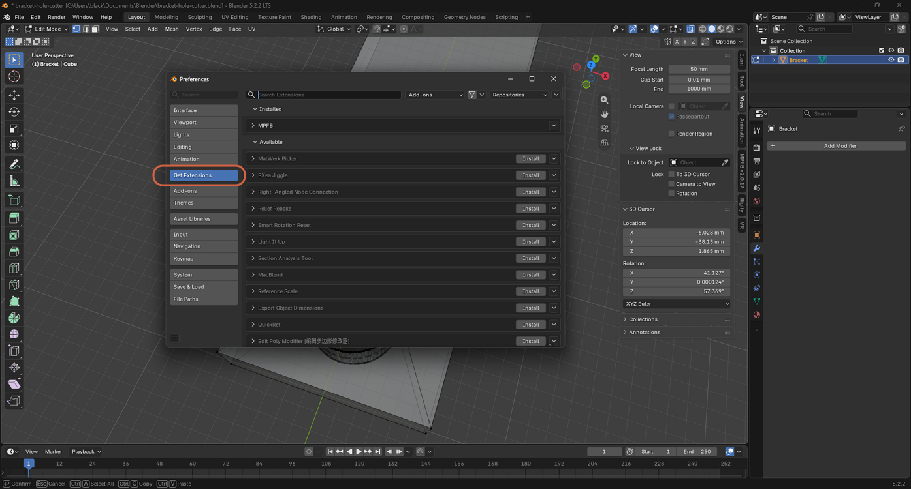

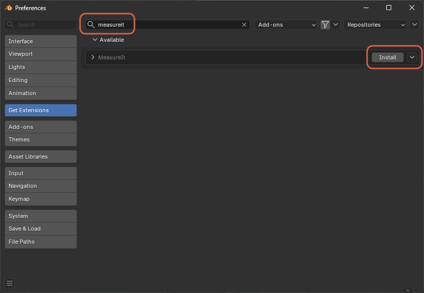

## Step 3: Install and Enable It

Click **Install**.

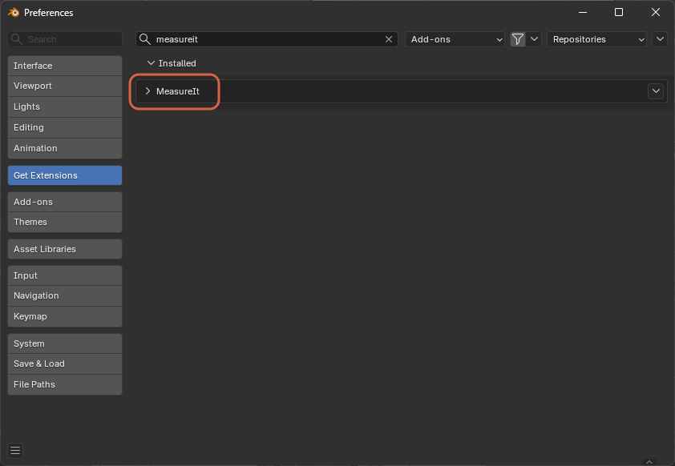

Click the **Add-ons** tab to confirm it's enabled.

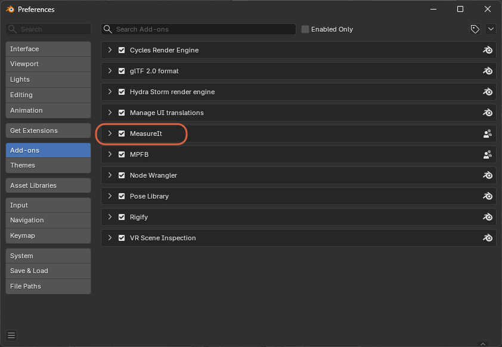

## Step 4: Save Preferences

Open the menu in the lower-left corner, then click **Save Preferences** so MeasureIt stays enabled the next time you open Blender.

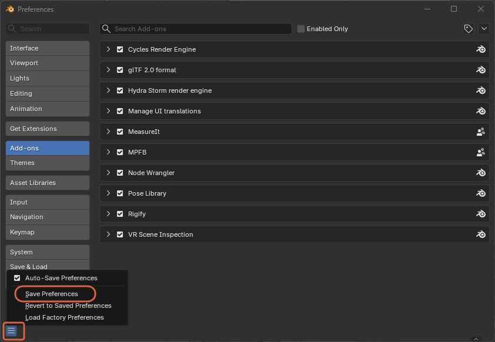

## Step 5: Open MeasureIt Tools

In Edit Mode, open the viewport sidebar's **View** tab (press `N` if it's closed), then expand **MeasureIt Tools**.

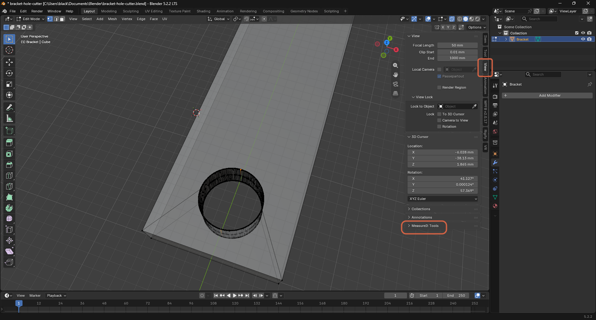

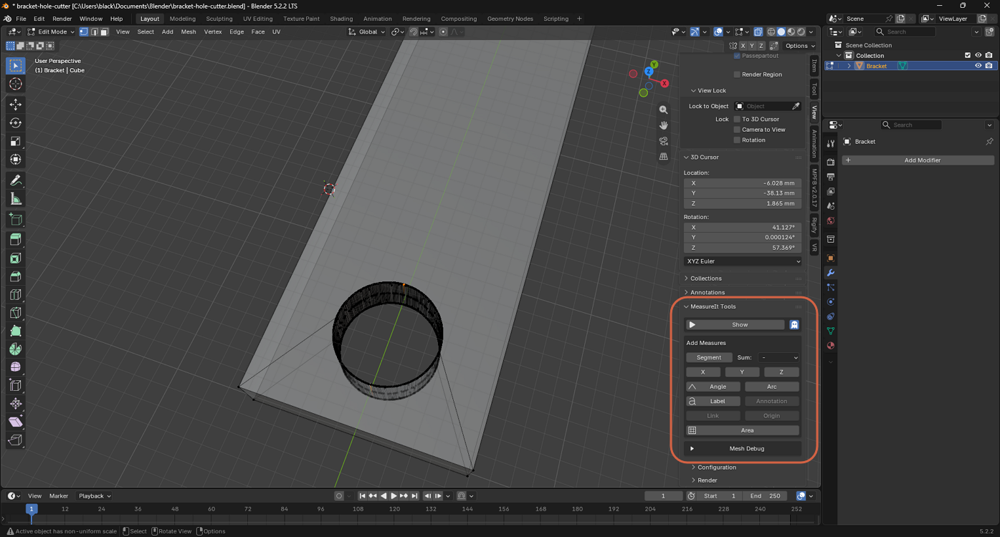

## Step 6: Measure Between Two Vertices

Select 2 vertices, then click **Segment**.

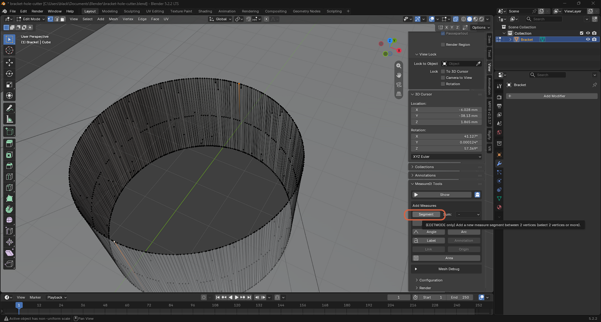

## Step 7: Show the Measurement

Click **Show** to display the measurement in the viewport.

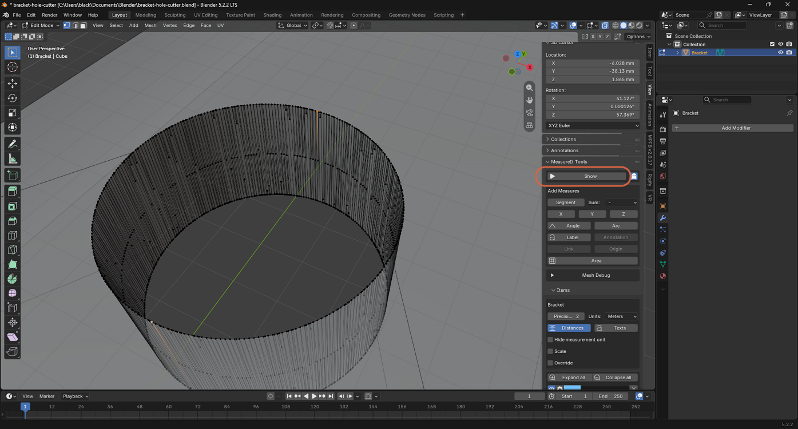

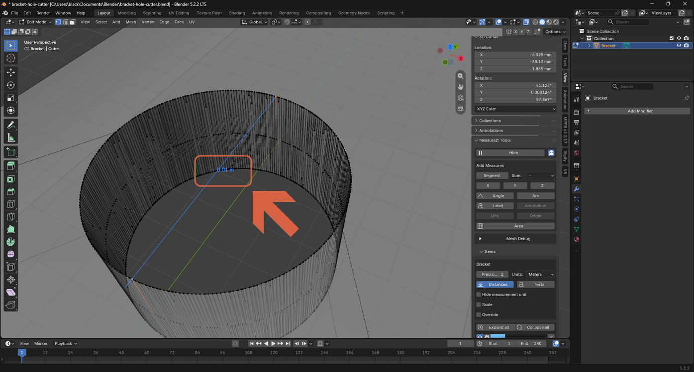

## Step 8: Change the Measurement Unit

Under **Units**, choose **Millimeters** (or another unit) for a more readable value at this scale.

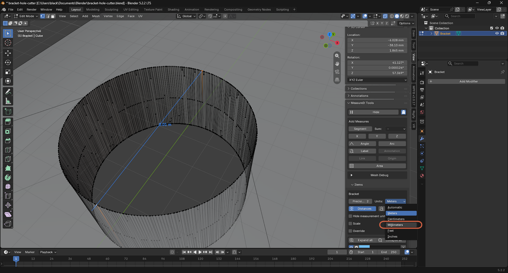

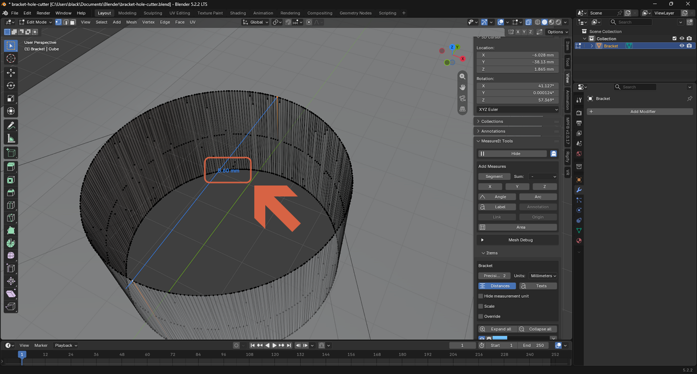
