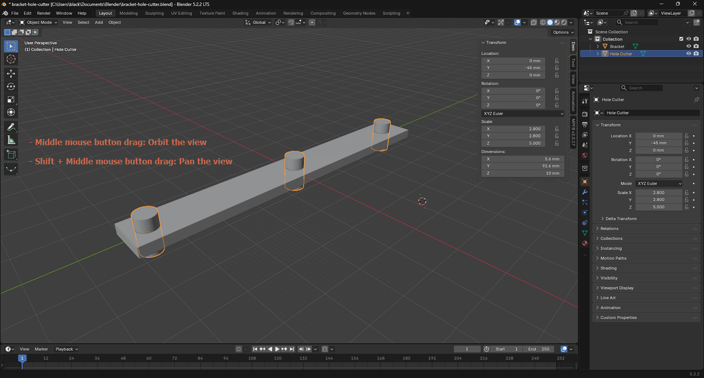
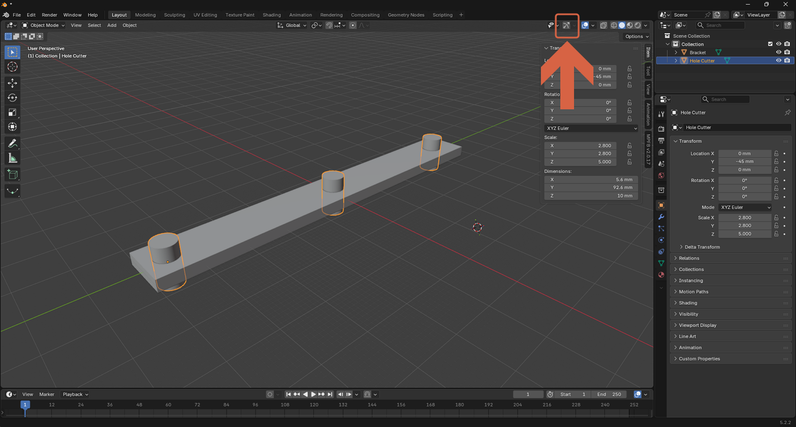
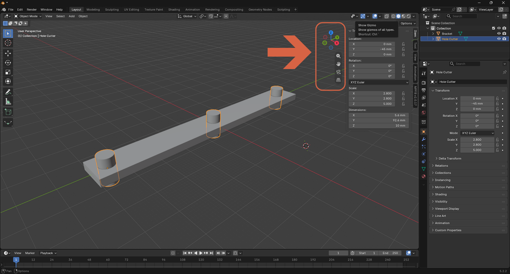
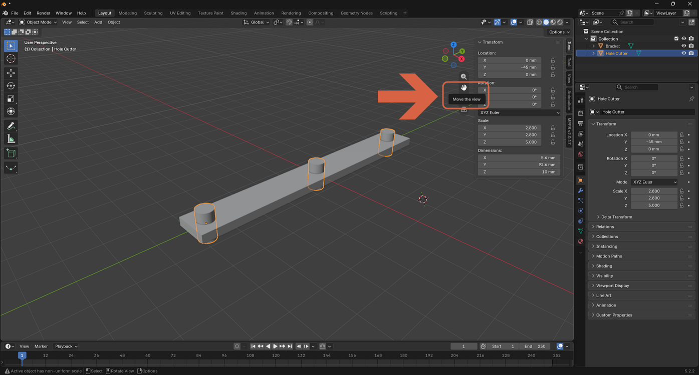

# Orbiting and Panning the View

> **Note:** This document was generated by Claude Code and has not been reviewed by a human. Please use it as a reference only.

> **Note:** See [this video](https://youtu.be/8_0RptMbhe0?si=lq3f7VX-mt7znVUY) for a demonstration.

Use the middle mouse button to move around the 3D viewport without moving any objects.

## Orbit the View

Hold the **middle mouse button** and drag.

## Pan the View

Hold **Shift** and the **middle mouse button**, then drag.

## Use the Navigation Gizmo Instead

The viewport also has an on-screen gizmo for orbiting and panning without a middle mouse button.

1. Click the **Show Gizmo** icon in the header (or press `` Ctrl+` ``) to show or hide it.

    

2. The gizmo appears in the top-right corner of the viewport: drag the colored axis ball to orbit the view, and use the icons below it to zoom, pan, and toggle between perspective and orthographic.

    

3. Click and drag the hand icon to pan the view — the same result as Shift + middle mouse button drag.

    
