# Painting Flat Anime Skin with a Stencil Mask

> **Note:** This document was generated by Claude Code and has not been reviewed by a human. Please use it as a reference only.

This replaces soft, watercolor-style shading on a face texture with a single flat skin color, while keeping the eye, eyelid, nose, and mouth lines. The method uses Texture Paint with a **stencil mask** — a separate black-and-white image that protects the lines while you paint over everything else.

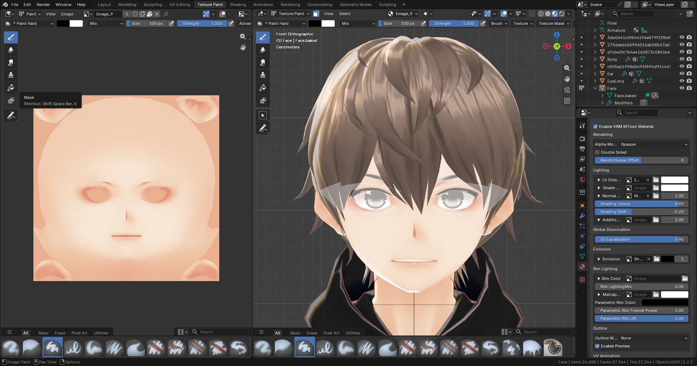

> **Note:** Three rules matter most:
>
> 1. Do all mask painting and color painting in the **3D Viewport**. The stencil has no effect in the 2D Image Editor.
> 2. The Mask brush needs **Mask Value = 0**, so it paints black onto the white stencil.
> 3. In this Blender version, a black-on-white mask only protects the lines when **Invert** is ticked in the Masking popover.

## Step 1: Back Up the Original Texture

Before painting anything, keep an untouched copy of the face texture — for example, `Image_9_original.png`. Painted textures aren't saved with the .blend file, and changes can't be undone once saved.

## Step 2: Enable the Stencil Mask

1. Select the **Face** object and switch to **Texture Paint** mode.
2. Pick the **Mask** tool in the toolbar (`Shift+Space` → `6`).
3. In the 3D Viewport header, open the **Masking popover** — the small dropdown right of the `Image_9` texture-slot dropdown.
4. Tick **Stencil Mask**.

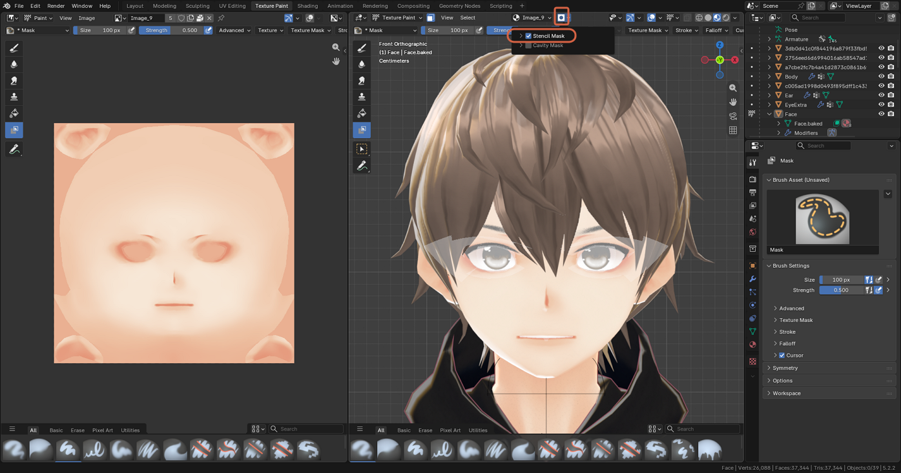

## Step 3: Create the Stencil Image

1. Expand **Stencil Mask** with the small arrow and click **New**.
2. Find the face texture's size first: in the left Image Editor, press `N` → **Image** tab.

    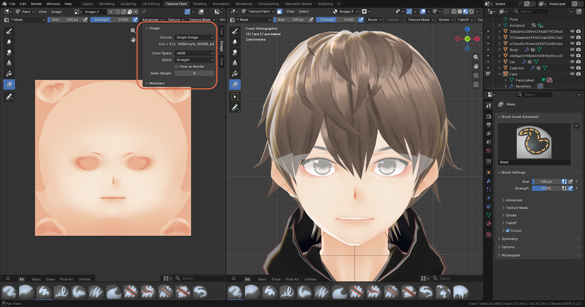

    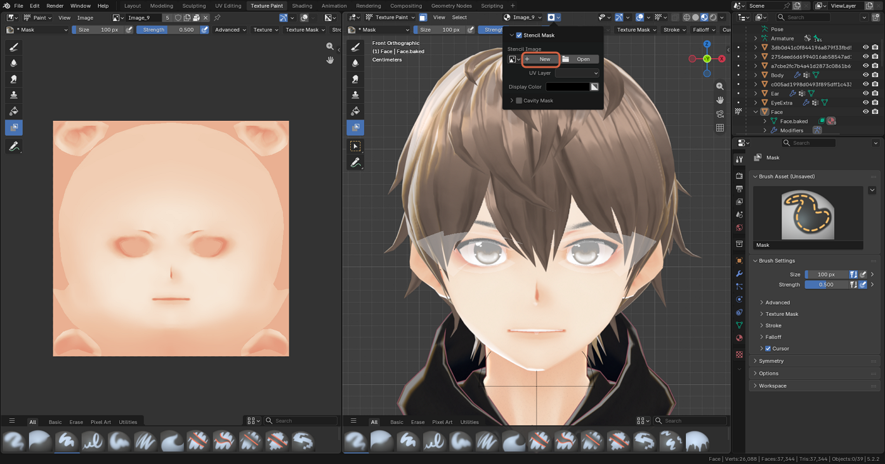

3. In the **Create a New Image** dialog, use:

    | Field | Value |
    |---|---|
    | Name | `FaceStencil` |
    | Width / Height | Same as the face texture (512 × 512) |
    | Generated Type | Blank |
    | Color | White (`#FFFFFF`) |
    | Alpha | Off |

    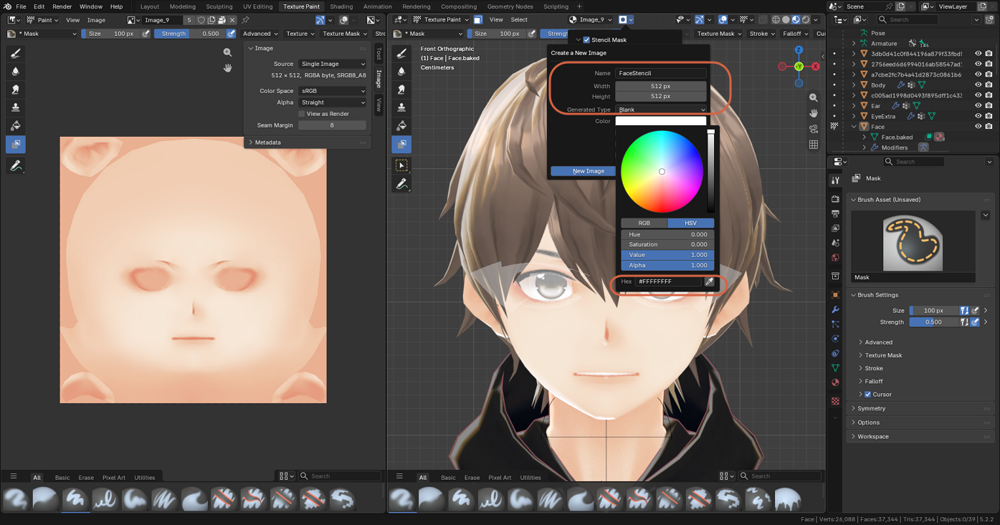

4. Click **New Image**.
5. Set **UV Layer** to the face's UV map.

    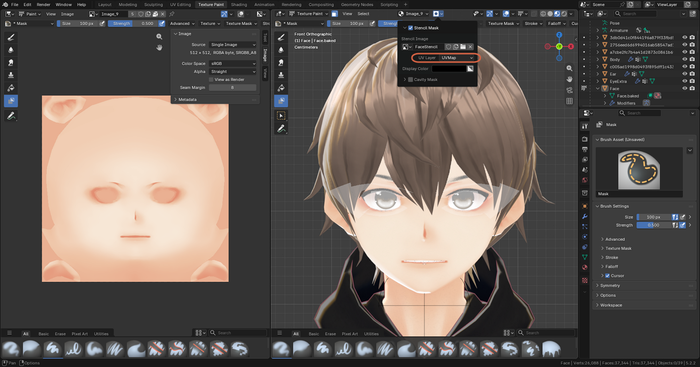

## Step 4: Isolate the Face with Local View

This hides the hair and body so you can paint on a clean face.

1. Click **Face** in the Outliner.
2. In the 3D Viewport: **View** → **Local View** → **Toggle Local View** (`Numpad /`).

    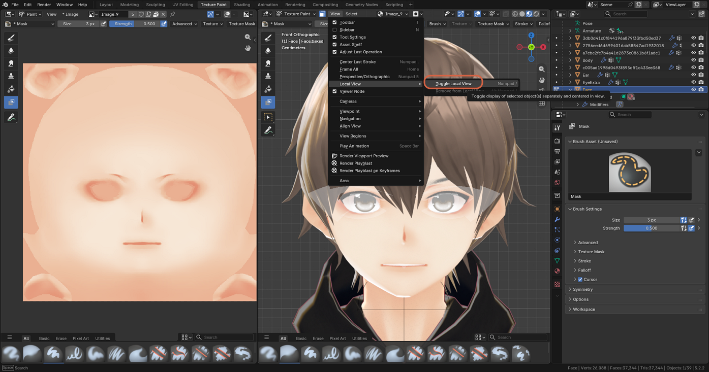

3. Press `Numpad 1` for the front orthographic view.

    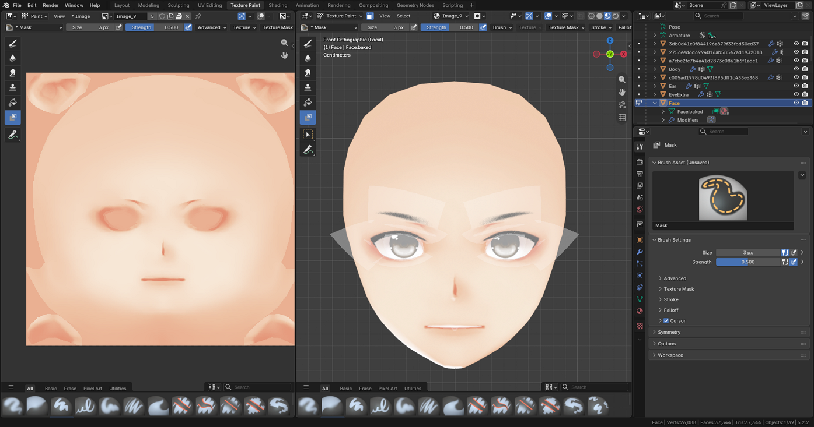

## Step 5: Set Up the Mask Brush

With the Mask tool active, check these in the right-hand **Tool** properties:

| Setting | Value | Why |
|---|---|---|
| Strength | `1.0` | At `0.5` the lines are only half protected. |
| Advanced → Mask Value | `0` | At `1` the brush paints white onto a white stencil, so nothing happens. |
| Falloff | Constant | A soft falloff leaves grey edges, which give only partial protection. |
| Falloff → Normal Falloff | Off | Otherwise angled surfaces like the sides of the nose get weaker strokes. |
| Size | About 5–15 px for the lines | The texture is only 512 px, so the lines are thin. Zoom in for control. |

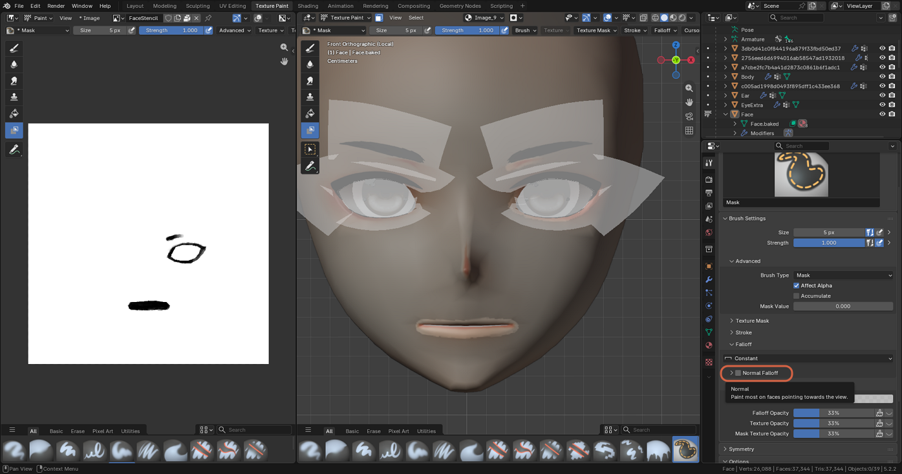

> **Warning:** Brush settings can reset after reopening Blender or switching brushes. Check them again before each session.

## Step 6: Make the Mask Visible in the 3D View

1. Switch the viewport to **Solid** shading — the second sphere. Material Preview (MToon) doesn't draw the stencil overlay.
2. Open the **Texture Paint Overlays** popover, the small dropdown right of the general Overlays dropdown, and set **Stencil Mask Opacity** to about `0.45`.
3. Optionally, set **Display Color** in the Masking popover to something vivid (blue or green) for better contrast.

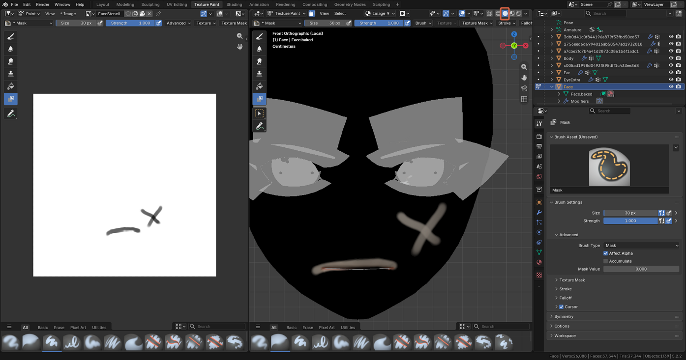

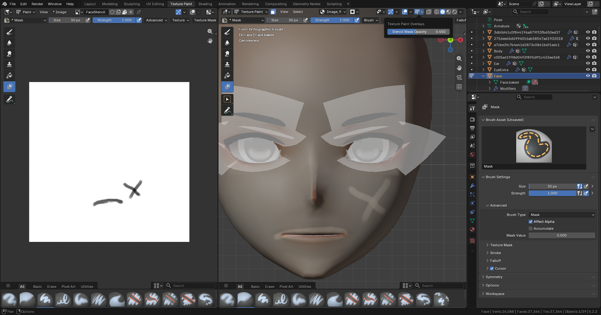

You can also keep **FaceStencil** open in the left Image Editor. It shows exactly what's masked: black means masked.

## Step 7: Paint Only on the Skin

The grey, semi-transparent flaps around the eyes are separate parts of the Face mesh that hold the eyebrows and eyeliner. They aren't on the skin area of the texture, so they don't need masking — but they can get in the way.

1. In **Options**, untick **Occlude** so strokes reach the skin under the flaps.
2. Turn on **Paint Mask**, the square icon right after the **Texture Paint** mode dropdown.

    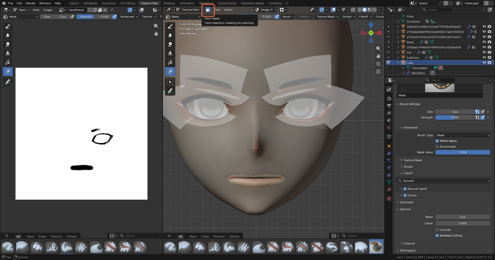

3. Press `Alt+A` to deselect all. Then hover over the skin and press `L` to select only the skin. With Paint Mask on, only selected faces receive paint.

    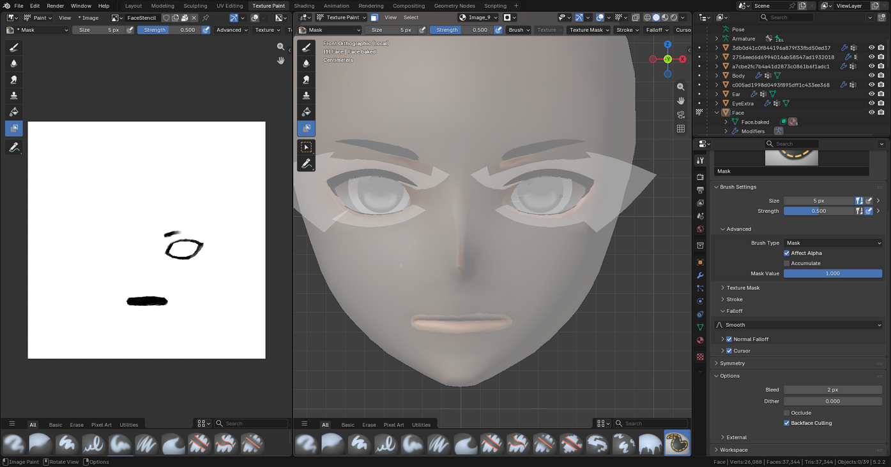

## Step 8: Mask the Lines

With the Mask tool in the 3D view, paint over every line you want to keep: eye outlines, eyelid creases, the nose line, and the mouth. Zoom in, and change the brush size with `F`.

To erase a mistake, set **Mask Value** to `1` temporarily, paint over it, and then set it back to `0`.

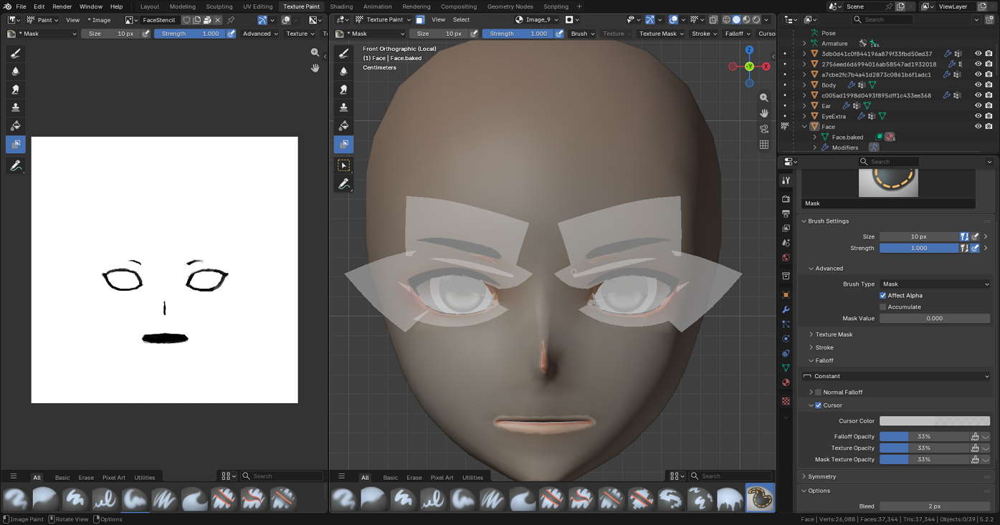

## Step 9: Turn On Invert

In the Masking popover, click the **Invert** button next to **Display Color**.

> **Note:** Without Invert, Blender protects the **white** area and paints **over** the black lines. With Invert on, the black strokes are protected and everything else is paintable.

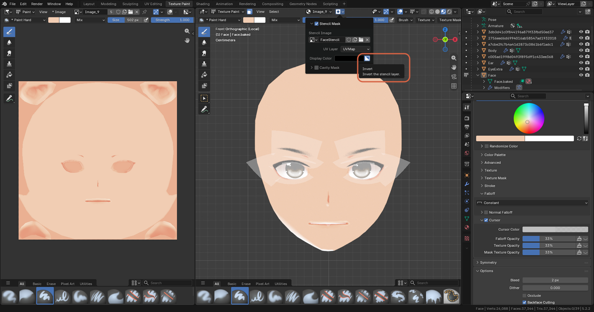

**Test first:** paint one stroke across the mouth with a bright color. If the mouth line stays clean, it's working. Undo the test with `Ctrl+Z`.

## Step 10: Paint the Flat Skin Color

1. Switch to the **Paint Hard** brush, with Blend **Mix**, Strength `1.0`, Falloff **Constant**, and Normal Falloff off.
2. Pick the skin color. Show your face texture in the left editor, click the color swatch, use the eyedropper, and click a clean skin area such as the forehead or cheek. Don't sample from the 3D view, since the overlay tints it.

    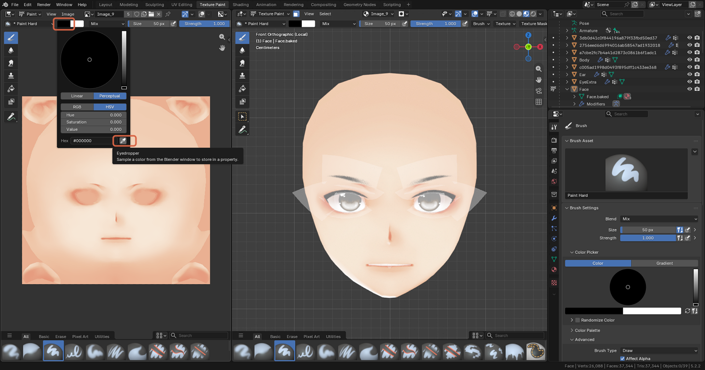

    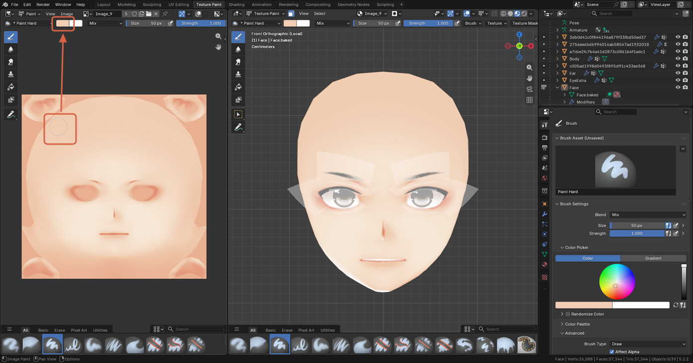

    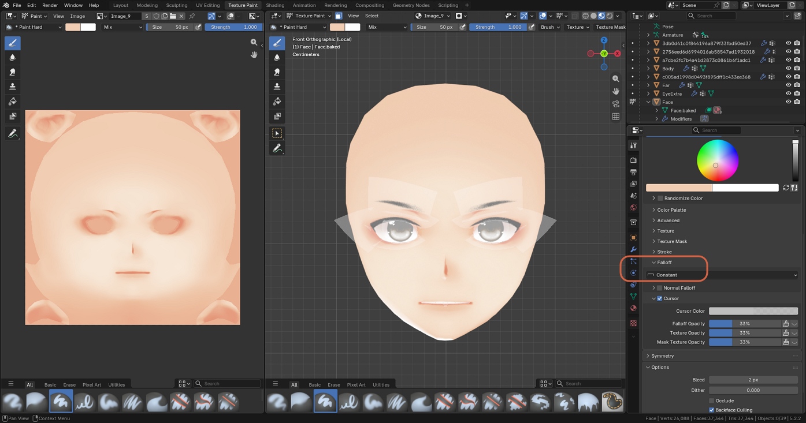

3. Use a large size (80–150 px or more) and paint over the whole face **in the 3D view only**. Rotate to cover the sides, jaw, and under the chin.
4. Switch to **Material Preview** — the third sphere — to check the real result.

## Step 11: Save the Images

1. With your face texture in the left editor: **Image** → **Save As…**, and save under a new name.

    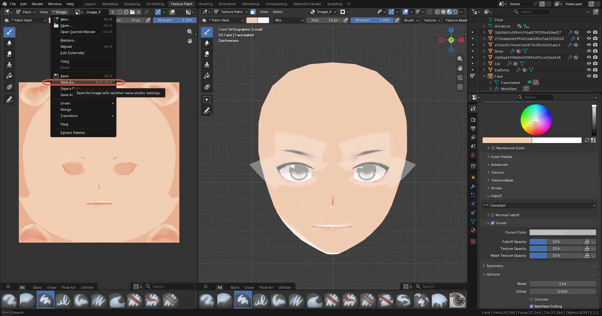

    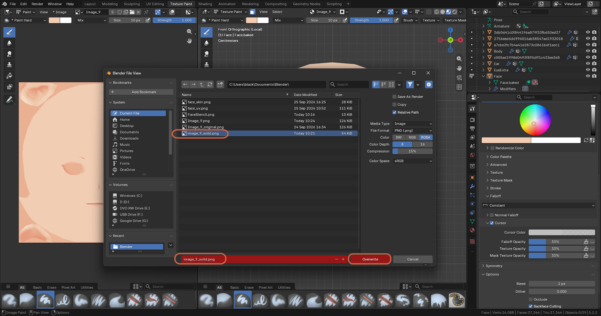

2. Switch the left editor to **FaceStencil** and save it too. It's a generated image, and it may come back blank when you reopen the file if it isn't saved.

> **Warning:** **Save As** changes which file Blender uses. After Save As, the image datablock still shows its old name in Blender, but it now points to the *new* file on disk — the name in Blender is only a label, not the original filename.

## Step 12: Return to Normal View and Save

1. **View** → **Local View** → **Toggle Local View** (`Numpad /`) brings back the hair, ears, and body.
2. Turn off **Paint Mask**.
3. Switch the mode dropdown to **Object Mode**.
4. Save the .blend with `Ctrl+S`.

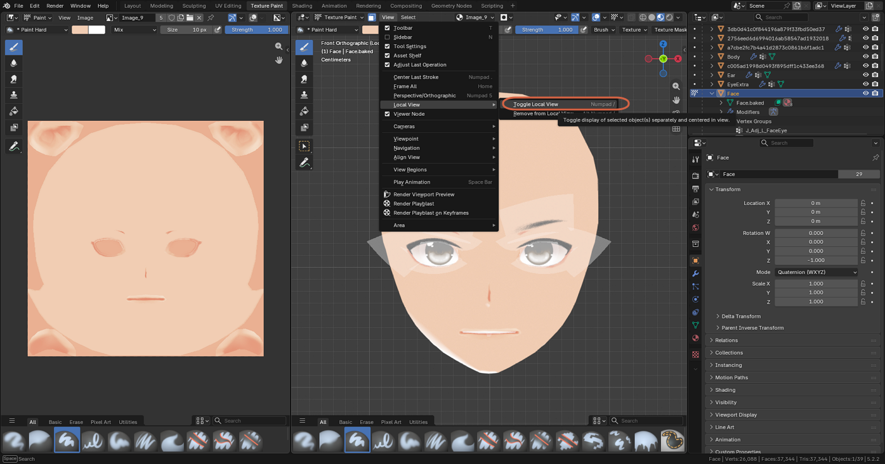

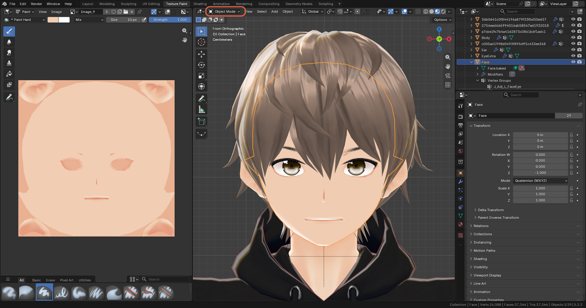

> **Note:** Other parts of the model, such as the ears or neck, may use their own separate textures and keep the original shading. The same method works there if needed — remember to tick Invert from the start.

## Troubleshooting

- **The Mask brush paints nothing.** Mask Value was probably `1.0`, so it painted white onto the white stencil — set Advanced → Mask Value to `0`. Also check that **Stencil Image** actually shows your stencil (`FaceStencil`); after some undos it can go empty, and you'll need to re-select it from the image dropdown.

    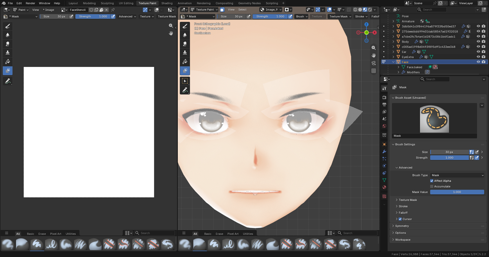

- **Strokes show in the stencil image but not on the 3D model.** The overlay isn't drawn in Material Preview. Switch to Solid shading. If the face turns completely black, lower Stencil Mask Opacity to about `0.45` (Step 6).
- **The lines got painted over anyway.** Invert was probably off — tick Invert in the Masking popover (Step 9). Also make sure you paint in the 3D view, not the 2D Image Editor, and don't use the Smear tool on the texture.

    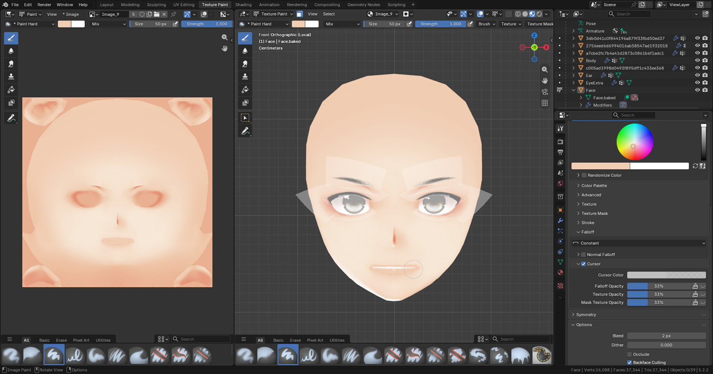

- **The saved file looks different from what Blender shows.** After Save As, Blender's image datablock points to the new file, so the original filename on disk is unchanged and no longer used. To load a different file into the same image slot instead, use **Image** → **Replace…**.

    

    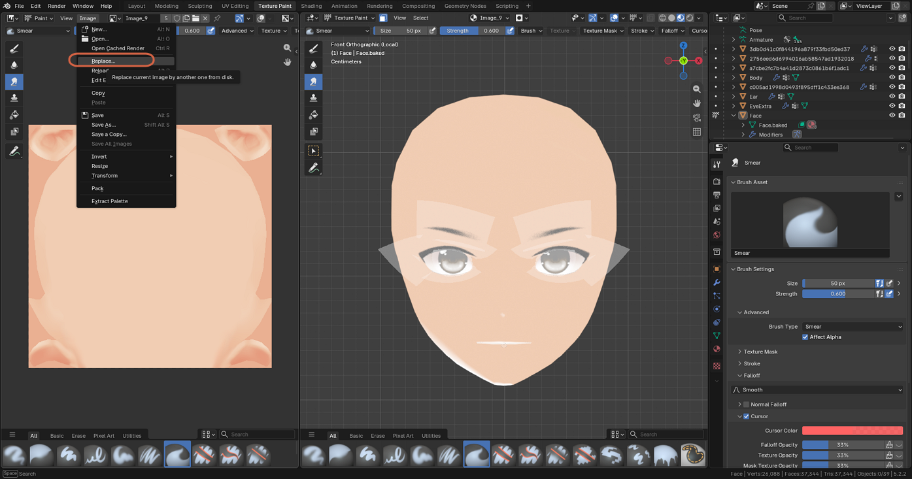

- **Finding the settings.** Texture Slots and Masking are popovers in the 3D Viewport header, not in the Tool tab. Stencil Mask Opacity is in its own Texture Paint Overlays popover, just right of the general Overlays dropdown. The shading spheres, from left to right, are Wireframe, Solid, Material Preview, and Rendered. The Paint Mask toggle sits right after the Texture Paint mode dropdown.

## File Reference

Files produced by this method, all kept alongside the .blend project:

| File | What It Is |
|---|---|
| Flat-skin texture (for example, `image_9_soild.png`) | The final flat-skin face texture, now used by the model |
| `FaceStencil.png` | The line mask (black = lines). Reusable for other textures. |
| Original texture (for example, `Image_9.png`) | The texture as Blender's image datablock still names it — no longer the file actually in use, once you've saved a new one over it |
| Backup copy (for example, `Image_9_original.png`) | Untouched backup of the original texture, made in Step 1 |
