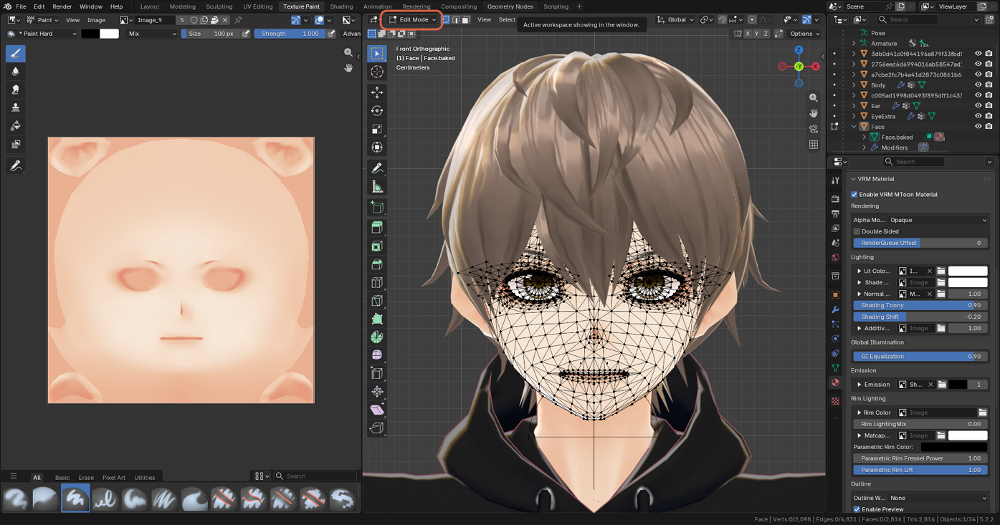
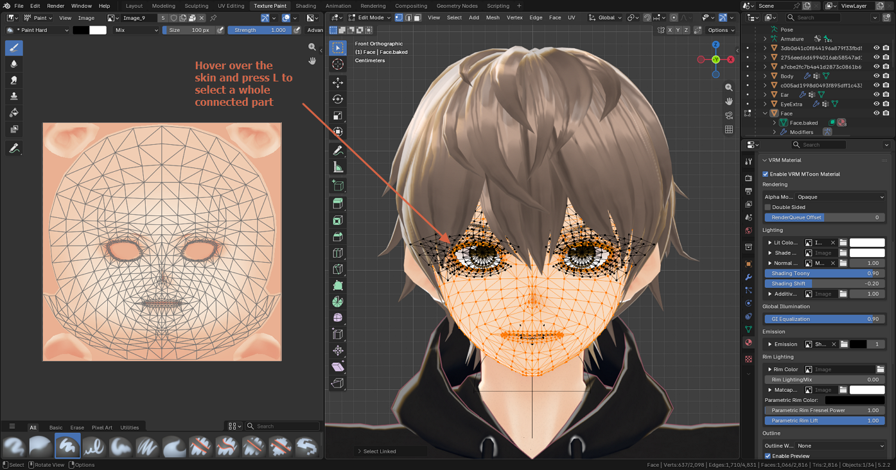
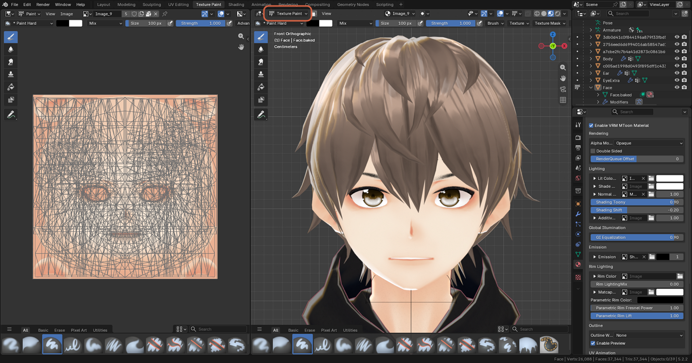
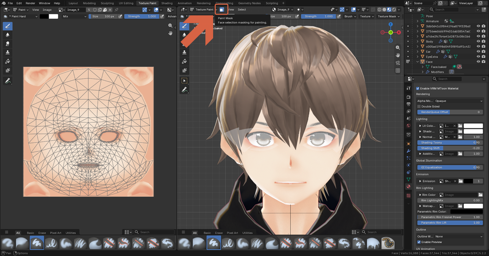

# Reducing the UV Wireframe in the Image Editor

> **Note:** This document was generated by Claude Code and has not been reviewed by a human. Please use it as a reference only.

In Texture Paint mode, a dense mesh fills the Image Editor with lines. These are the UV wireframe overlay, drawn on top of the image — they aren't painted into the texture. Methods 1 and 2 only change what's drawn, and Method 3 also limits where you can paint. Switch the overlay back on whenever you need to check where something maps on the texture.

## Method 1: Hide the Overlays Completely

In the left Image Editor header, click the **Overlays** toggle (the two overlapping circles), or hover over the Image Editor and press `Shift+Alt+Z`. All overlays, including the UV lines, disappear.

## Method 2: Dim the Wireframe Instead

1. Click the small arrow next to the **Overlays** icon.
2. Under **Geometry**, lower the **Edges** value. It defaults to `1.000`; a value like `0.190` leaves a faint guide. You can also uncheck the **Geometry** checkbox to hide the UV lines while keeping the other overlays.

    

    

## Method 3: Show Only the Wires of One Area

A face mesh has many polygons, so every UV edge adds a line. To see only the wires that belong to one part, such as the face skin, use your Edit Mode selection together with **Paint Mask** (face selection masking). The mask also limits painting to those faces, so you won't accidentally paint the eyes or mouth.

1. Switch the 3D viewport to Edit Mode.

    

2. Select only the face-skin faces. Hover over the skin and press `L` to select a whole connected part. The Image Editor now shows just those wires.

    

3. Switch back to Texture Paint mode. The Image Editor shows every wire again until you turn on the mask.

    

4. In the 3D viewport header, click the **Paint Mask** icon (the small square with a face on it, next to the mode dropdown). The Image Editor now shows only the wires of the selected faces, and the unselected areas are dimmed in the viewport.

    

To paint elsewhere later, turn the mask off or change the selection in Edit Mode.

## Method 4: Hide Everything Else

In Edit Mode, invert the selection with `Ctrl+I`, then press `H` to hide everything else. Hidden faces are also hidden in Texture Paint, so both the 3D view and the UV overlay show only the face. Press `Alt+H` in Edit Mode to bring everything back.

> **Note:** The 3D viewport has its own separate overlays, for bones, vertices, and edges — see [Hiding Viewport Overlays](hide-viewport-overlays.md).
