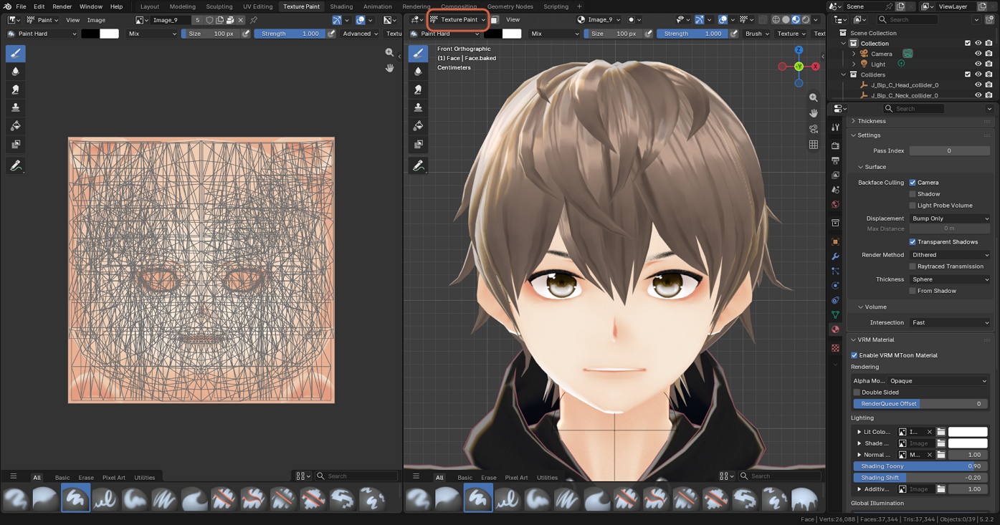
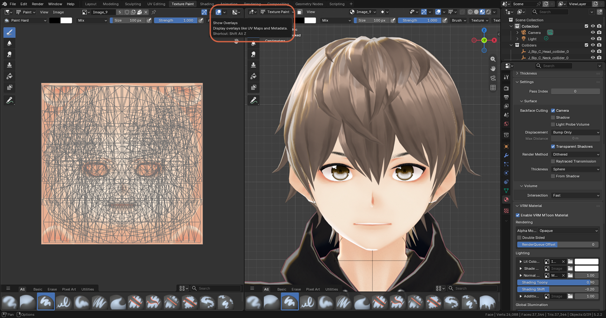
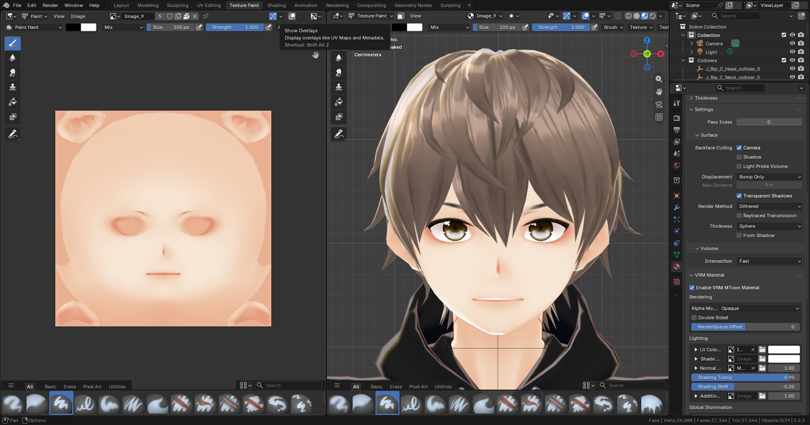
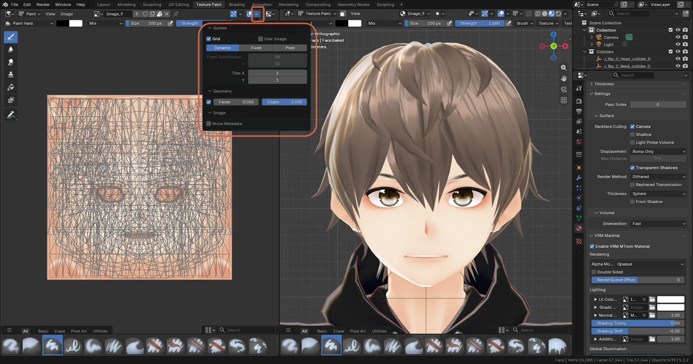
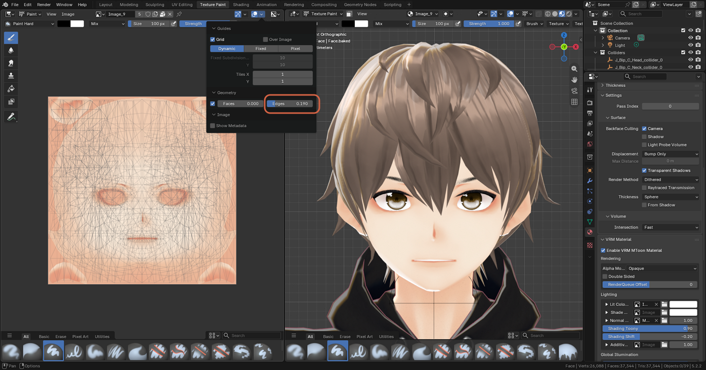
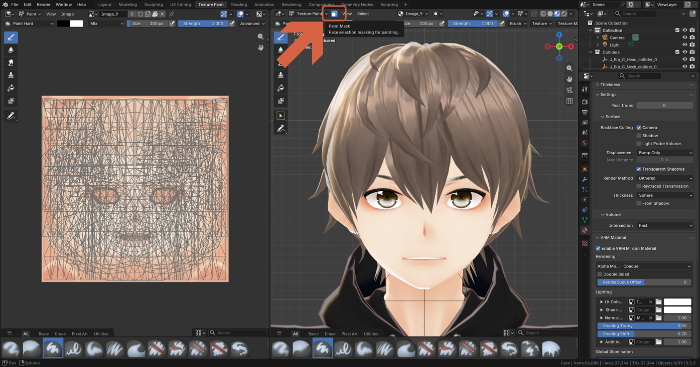

# Reducing the UV Wireframe in the Image Editor

> **Note:** This document was generated by Claude Code and has not been reviewed by a human. Please use it as a reference only.

In Texture Paint mode, a dense mesh fills the Image Editor with lines. These are the UV wireframe overlay, drawn on top of the image — they aren't painted into the texture, and none of the methods below affect your painting. Switch the overlay back on whenever you need to check where something maps on the texture.

## Method 1: Hide the Overlays Completely

In the left Image Editor header, click the **Overlays** toggle (the two overlapping circles), or hover over the Image Editor and press `Shift+Alt+Z`. All overlays, including the UV lines, disappear.

## Method 2: Dim the Wireframe Instead

1. Click the small arrow next to the **Overlays** icon.
2. Under **Geometry**, lower the **Edges** value. It defaults to `1.000`; a value like `0.190` leaves a faint guide. You can also uncheck the **Geometry** checkbox to hide the UV lines while keeping the other overlays.

    

    

## Method 3: Limit Painting to the Area You Want

A face mesh has many polygons, so every UV edge adds a line. To work on one area only, such as the eyes, turn on face selection masking. In the 3D viewport header, in Texture Paint mode, click the **Paint Mask** icon (the square face icon next to the mode menu). Then select just the faces you want in Edit Mode, and painting is limited to those faces.

> **Note:** The 3D viewport has its own separate overlays, for bones, vertices, and edges — see [Hiding Viewport Overlays](hide-viewport-overlays.md).
