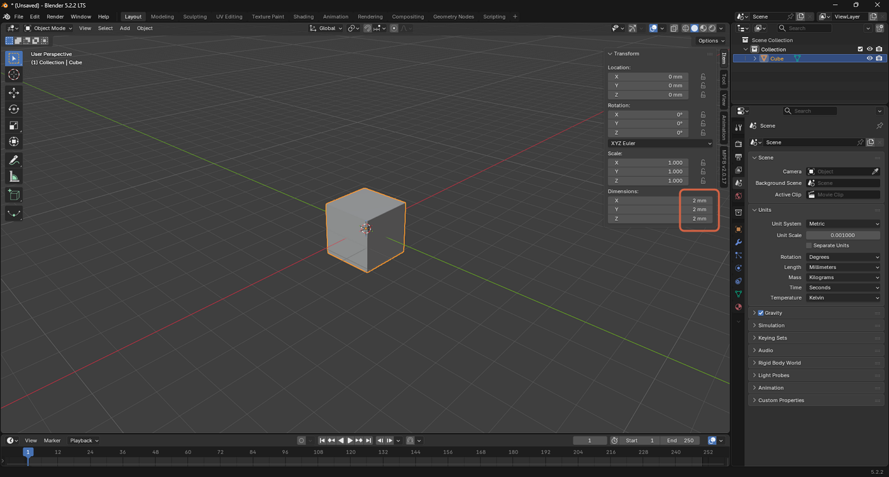
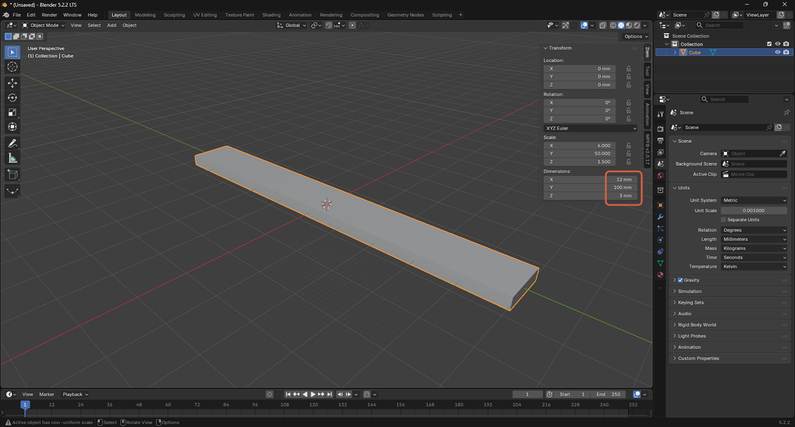

# Resizing an Object Using Dimensions

> **Note:** This document was generated by Claude Code and has not been reviewed by a human. Please use it as a reference only.

Blender lets you set an object's exact size by typing values directly into the **Dimensions** fields, instead of dragging or typing a scale factor.

> **Note:** See [this video](https://youtu.be/8_0RptMbhe0?si=lq3f7VX-mt7znVUY) for a demonstration.

## Step 1: Open the Dimensions Panel

Press `N` to open the viewport sidebar's **Transform** panel, then locate **Dimensions**.

## Step 2: Change the Dimensions

Type new values into the **Dimensions** fields for X, Y, and Z.

> **Note:** Changing dimensions unevenly (not by the same ratio on every axis) gives the object a non-uniform **Scale**, shown in the status bar as "Active object has non-uniform scale." Some tools and modifiers behave unexpectedly with non-uniform scale — apply the scale (**Object** → **Apply** → **Scale**) if this causes issues.
