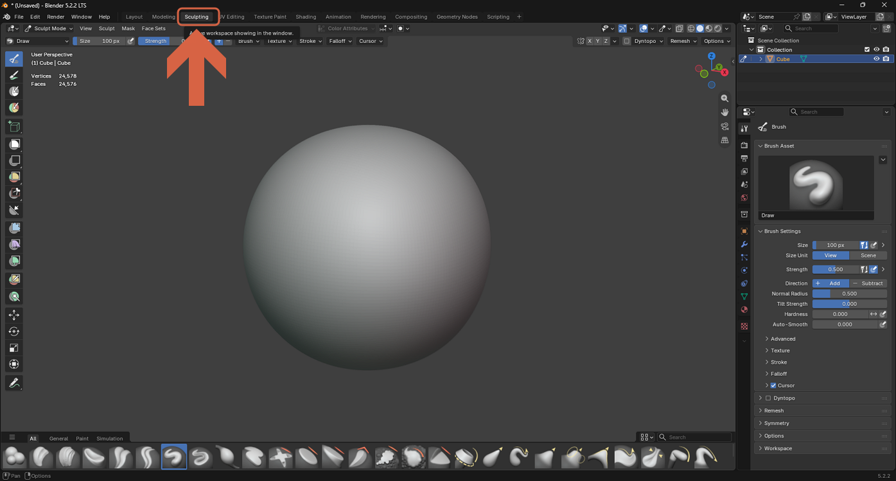
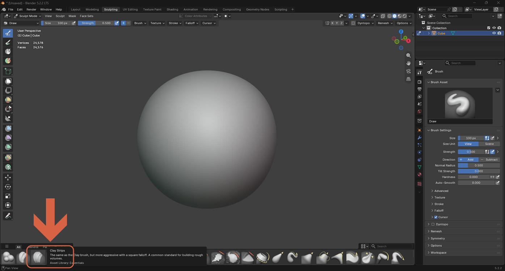
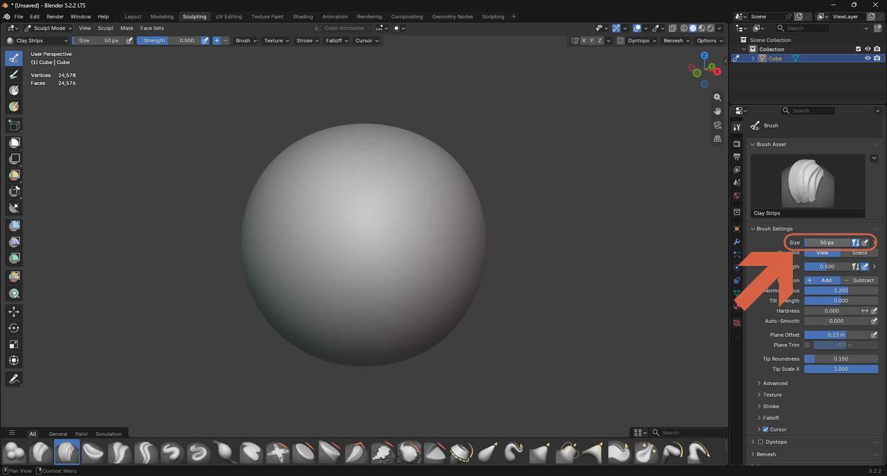
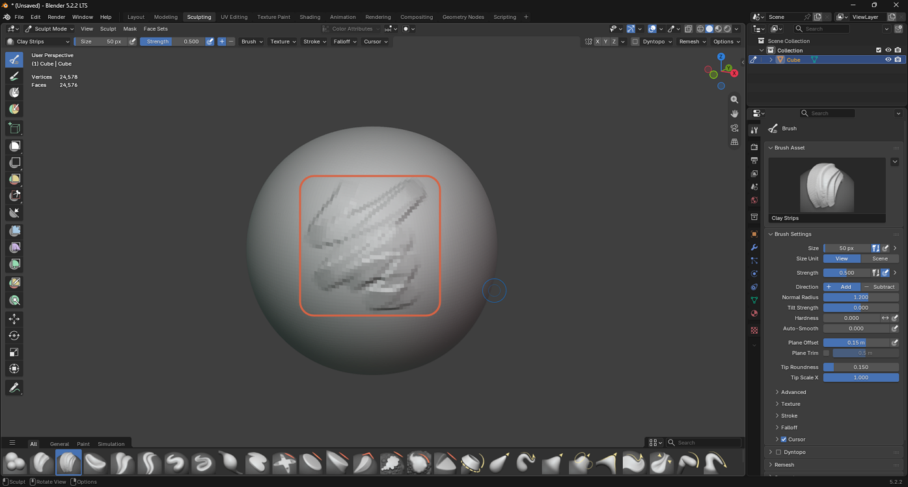
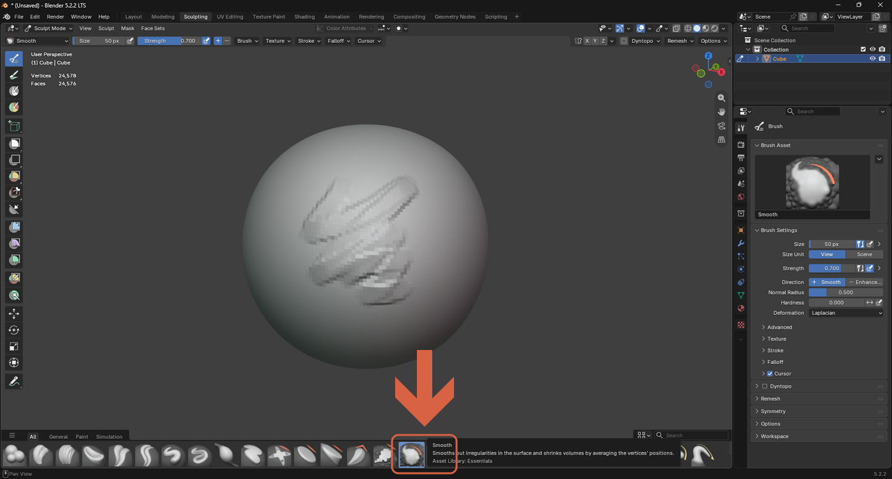
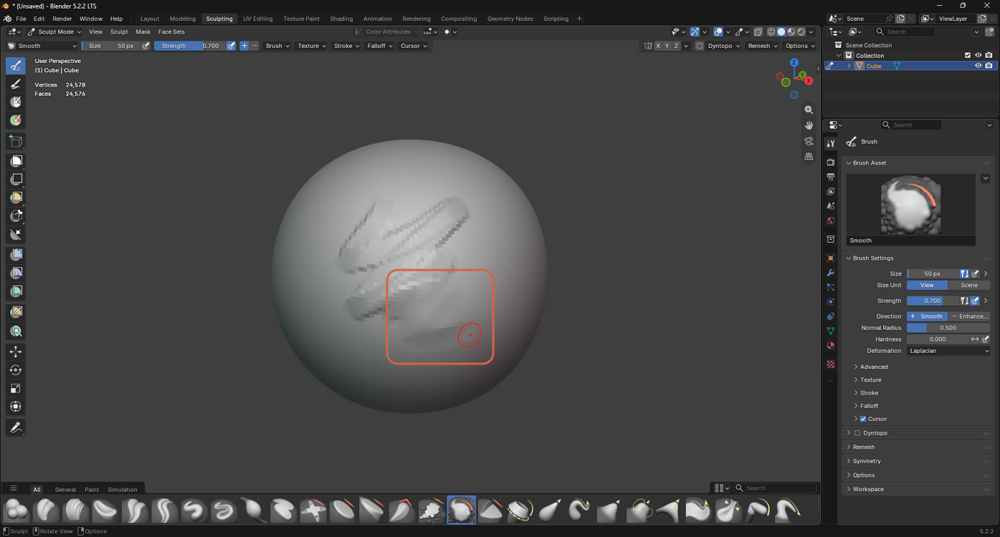
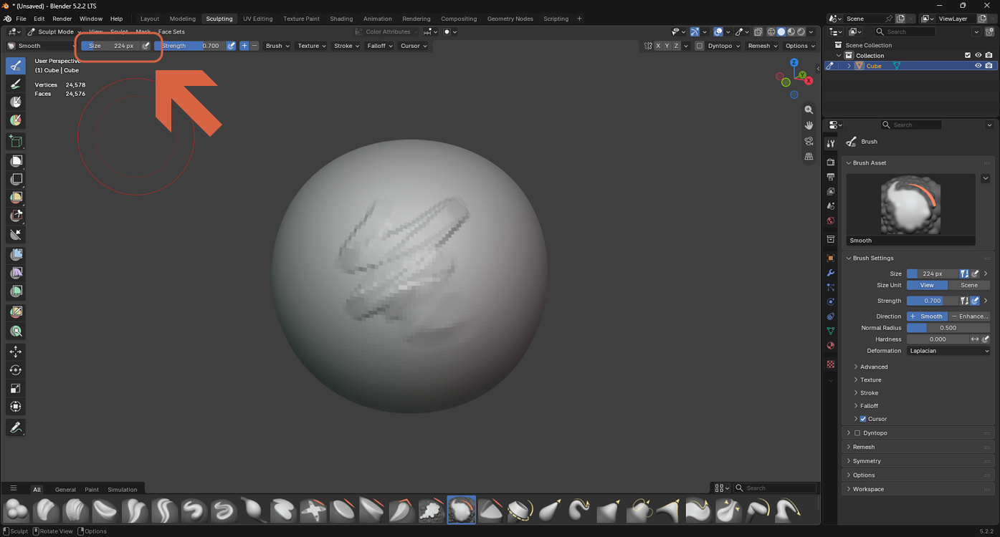
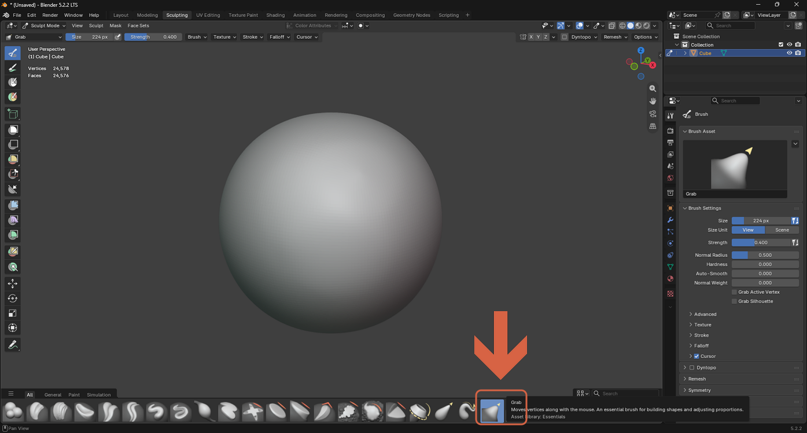
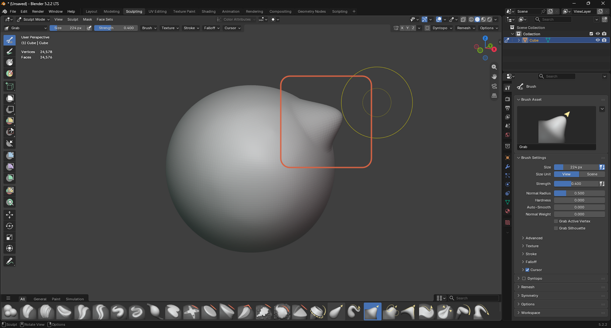

# Sculpting with Clay Strips, Smooth, and Grab

> **Note:** This document was generated by Claude Code and has not been reviewed by a human. Please use it as a reference only.

Sculpt Mode reshapes a mesh by pushing and pulling its surface with brushes, similar to digital clay. A dense mesh — such as a sphere with a high Subdivision Surface level applied — gives brushes enough detail to work with.

## Step 1: Switch to the Sculpting Workspace

Click the **Sculpting** tab at the top of the window.

## Clay Strips: Build Up Volume

Select **Clay Strips** from the brush shelf at the bottom of the viewport — a more aggressive version of the Clay brush, useful for building up rough volumes.

Adjust **Size** in the Brush Settings panel to control how wide each stroke is.

Drag across the surface to add raised material.

## Smooth: Reduce Irregularities

Select **Smooth** to average nearby vertices' positions, smoothing out rough or jagged areas.

Drag over the area you want to soften.

Increase **Size** for a broader smoothing effect.

## Grab: Reposition Volume

Select **Grab** to move a whole area of vertices with the mouse, useful for adjusting overall shapes and proportions.

Drag to pull the surface into a new shape.

