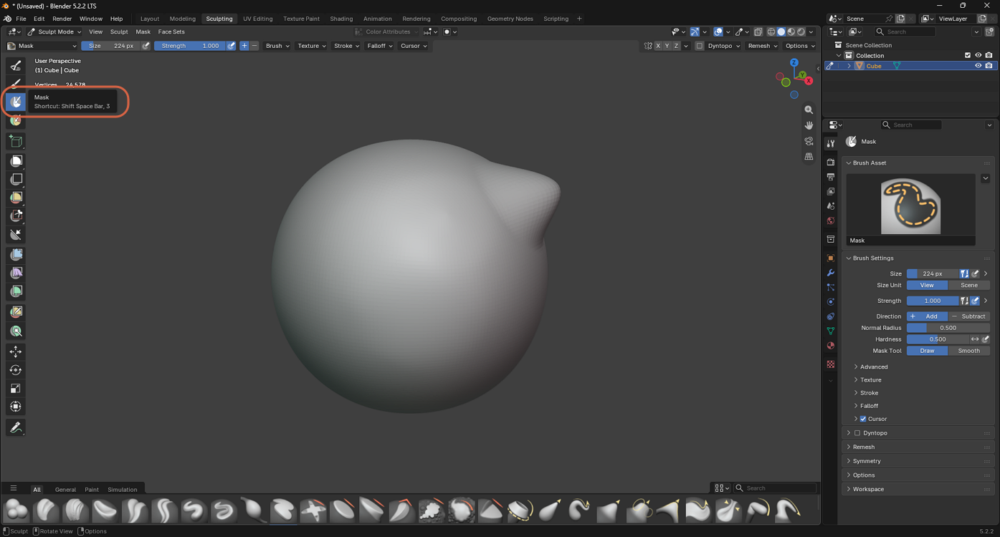
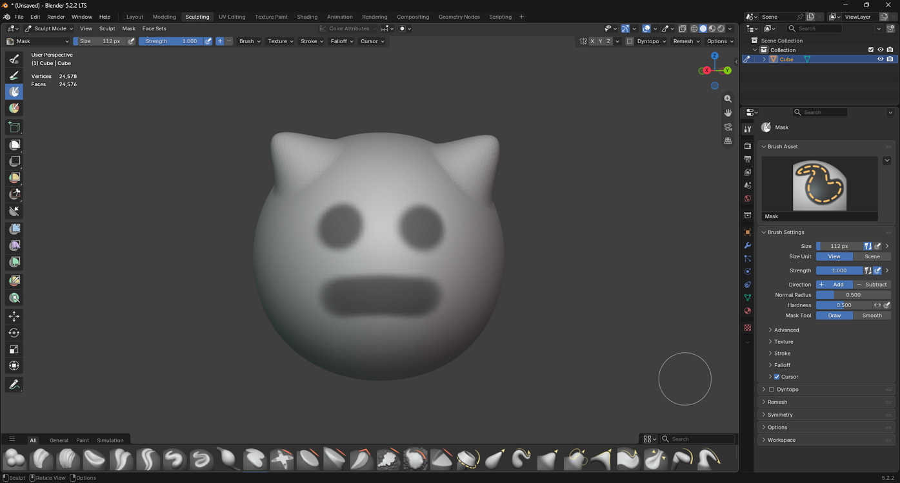
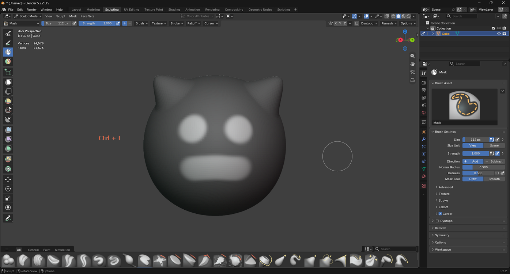
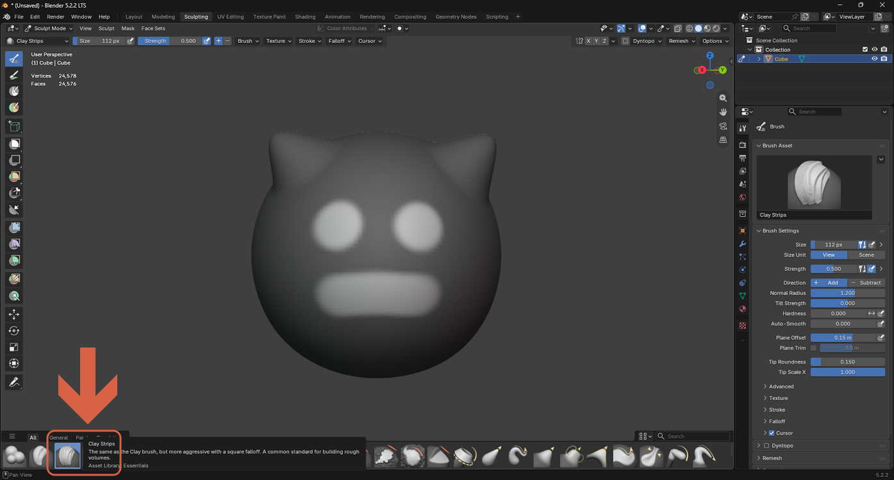
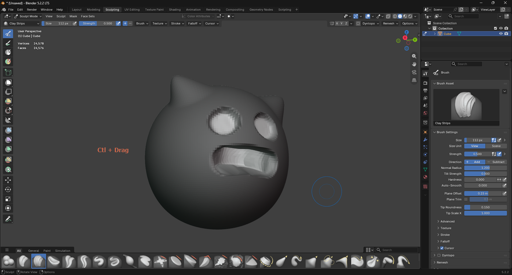
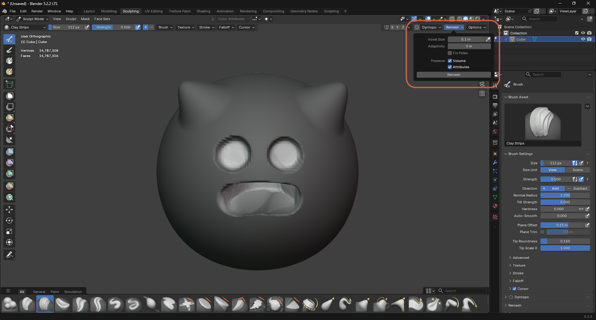
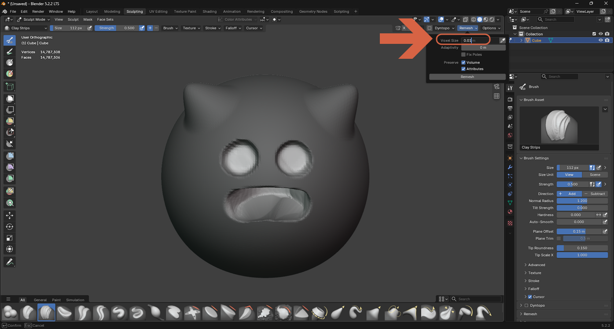
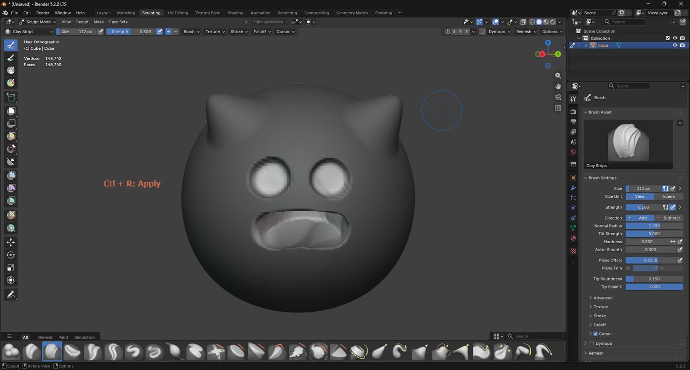
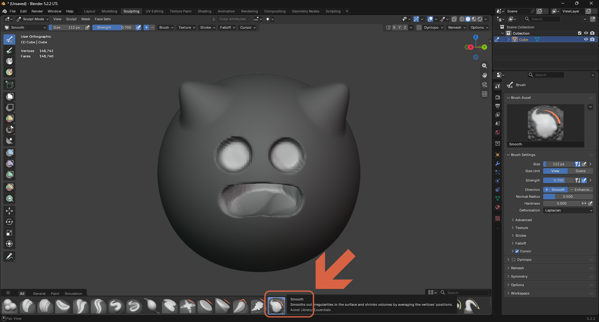
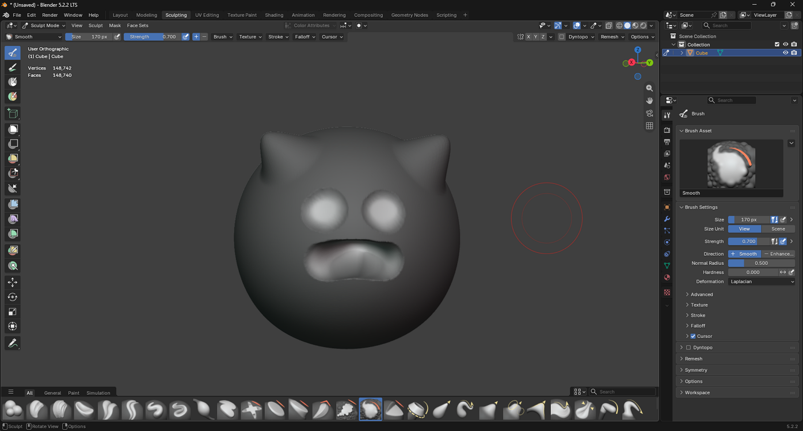

# Sculpting with a Mask

> **Note:** This document was generated by Claude Code and has not been reviewed by a human. Please use it as a reference only.

A **Mask** protects part of the mesh from other sculpt brushes, so you can edit one area — like the eyes and mouth of this face — without disturbing the rest.

## Step 1: Paint a Mask

Select **Mask** from the brush shelf (or press `3`).

Drag over the areas you want to protect.

## Step 2: Invert the Mask

Press `Ctrl+I` to invert the mask, so the areas you just painted become editable and everything else becomes protected instead.

## Step 3: Sculpt Within the Unmasked Area

Select **Clay Strips** again.

Hold `Ctrl` while dragging to carve inward instead of building up material. The mask keeps the surrounding face untouched.

## Step 4: Remesh for Clean Topology

Open the **Remesh** panel and set **Voxel Size**, then click **Remesh** to rebuild the mesh with clean, evenly distributed geometry.

## Step 5: Smooth the Result

Select **Smooth**, increase its **Size**, then drag over any remaining rough areas.

